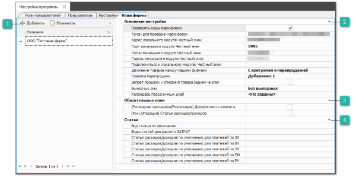
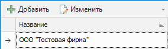
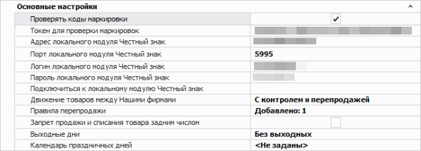
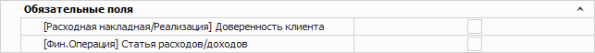
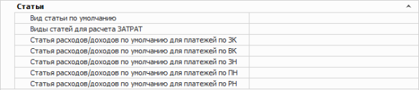

Раздел **Наши фирмы** позволяет создавать и редактировать карточки контрагентов с типом **Наша фирма**, а также устанавливать расширенные настройки для каждой организации.

 **Список Наших фирм**

Позволяет добавить новую, удалить или редактировать существующую позицию в списке. Как правило, создается одна фирма, и от ее лица осуществляется работа в программе. Но возможен вариант работы в программе от лица нескольких фирм.

 **Основные настройки**

Содержит настройки:

- **Проверять коды маркировки** – позволяет включить/отключить возможность проверки кодов маркировки при продаже товара в системе ГИС МТ;

- **Токен для проверки маркировок** – позволяет указать сгенерированный токен из личного кабинета ГИС МТ;

- **Адрес локального модуля Честный знак** – позволяет указать IP-адрес компьютера, на котором установлен локальный модуль Честный знак (задается при установке локального модуля ЧЗ). Значение необходимо вводить без префиксов «https//:» и «http//:»;

- **Порт локального модуля Честный знак** – позволяет указать порт локального модуля. По умолчанию значение **5995**;

- **Логин локального модуля честный знак** – позволяет указать «Имя профиля» локального модуля «Честный знак» (задается при установке локального модуля ЧЗ);

- **Пароль локального модуля Честный знак** – позволяет указать «Пароль» локального модуля «Честный знак» (задается при установке локального модуля ЧЗ);

- **Подключиться к локальному модулю Честный знак** – позволяет произвести инициализацию локального модуля «Честный знак»;

::: info Примечание

Опции подключения к локальному модулю «Честный знак» доступны, если включена опция **Проверять коды маркировки**.

:::
::: warning Внимание!

В случае проблем с установкой и запуском локального модуля «Честный знак» необходимо обратиться в техническую поддержку сервиса «Честный знак».

:::

- **Движение товаров между нашими фирмами** – задает настройки по контролю передвижения товара между **Нашими фирмами**. Содержит значения:

    - **С контролем и перепродажей** – разрешена реализация товара, оприходованного другой фирмой, в соответствии с настроенными правилами перепродажи, установленными в настройке **Правила перепродажи**;

    ::: info Примечание

    При выборе значения **С контролем и перепродажей** в настройке **Движение товаров между Нашими фирмами** рекомендуется установить значение **Всегда подставлять активную НФ в** настройке **Разделять позиции по НФ при создании документа из проценки** (раздел **Управление** **► Настройки программы ► Настройки ► Документы**)При отсутствии правил перепродажи, настройка **Движение товаров между Нашими фирмами** действует аналогично выбранному значению **С контролем**.Для подключения модуля перепродаж обратитесь в отдел продаж **Компании Tradesoft**.

    :::

    - **Без контроля** – разрешена реализация товара, оприходованного другой фирмой;
    
    - **С контролем** – запрещена реализация товара, оприходованного другой фирмой;

::: info Примечание

Если настройка **Движение товаров между Нашими фирмами** принимает значение **С контролем**, то** рекомендуется также использовать настройку **Разделять позиции по НФ при создании документа из проценки** (раздел **Управление** **► Настройки программы ► Настройки ► Документы** в значении **Автовыбор НФ**.

:::

- **Правила перепродажи** – задает правила для перепродажи, если в настройке **Движение товаров между Нашими фирмами** выбрано значение **С контролем и перепродажей**:

    - **Наша фирма (на которой товар)** – позволяет выбирать фирму, товары которой можно продавать с текущей фирмы. При значении **Любая НФ** фирма сможет продавать товары всех фирм, которые есть в базе;

    ::: warning Внимание!

    Неверно составленные правила удаляются при закрытии настроек.

    :::

    - **Наценка, %** – задает наценку на товар при его перепродаже между фирмами. Наценка рассчитывается от **Цены закупа** в разделе **Товары и цены ► Прайс-лист наличия**. По умолчанию указано значение 2%;

    - **НДС** – указывает, будет ли выделяться НДС в перепродажных документах: **Расходная накладная** и **Приходная накладная**;

::: info Примечание

Параметр **Правила перепродажи** доступен, если в параметре **Движение товаров между нашими фирмами** стоит значение **С контролем и перепродажей**

:::

- **Запрет продажи и списания товара задним числом** – устанавливает запрет продажи товара, если товар оприходован позже даты создания **Расходной накладной** и **Списания товара**;

- **Выходные дни** – задаются выходные дни для **Нашей фирмы**. Используется при расчете даты в поле **Исполнения заказа** в документе **Заказ клиента**, а также могут быть использованы при подсчете отсрочки платежей;

- **Календарь праздничных дней** – отмечаются праздничные дни, которые будут использоваться при подсчете отсрочки платежа для **Расходных накладных**, при расчете **Баланса просроченного** и построении отчетов о дебиторской/кредиторской задолженности.

::: note Заметка

Выходные и праздничные дни могут использоваться для расчета **Отсрочки платежа** в **Расходных накладных**. Данное поведение регулируется настройкой **Подсчет дней отсрочки платежей** в меню **Управление ►** **Настройки программы ► Настройки ►** **CRM** **► Контрагенты**.Если значение настройки выбрано **Использовать рабочие дни**, то праздничные и выходные дни не участвуют при подсчете отсрочки.

:::

 **Обязательные поля**

Блок содержит настройки, для задания необходимости заполнения некоторых полей в определенных документах, созданных на **Нашу фирму**:

- **[Расходная накладная/Реализация] Доверенность клиента** – определяет необходимость заполнения поля **Доверенность** в **Расходных накладных** и **Отгрузках на реализацию**. В случае, если доверенность не указана или является просроченной, проводка документа невозможна;

::: note Заметка

Доверенности создаются в справочнике **Доверенности клиентов**.

:::

- **[Фин. Операция] Статья расходов/доходов** – определяет необходимость заполнения поля **Статья доходов/расходов** в финансовых документах (**ПКО**, **РКО**, **ПП** и **ППвх**). Наличие статей в платежах дает возможность фильтровать финансовые операции в отчетах. Определить статьи по умолчанию для некоторых документов, на основании которых создается платеж, можно в блоке **Статьи** данных настроек.

 **Статьи**

Блок содержит настройки:

- **Вид статьи по умолчанию** – задается вид статьи по умолчанию для новых статей, созданных через справочник **Статьи расходов/доходов**;

- **Вид статей для расчета Затрат** – определяет список видов статей расходов из справочника **Статей расходов/доходов**, по которым будут вычисляться **Затраты** в **Отчете о прибыли**. Указанные в этой опции статьи необходимо выбирать при создании исходящих платежных документов (**РКО** или **ПП**), которые относятся к дополнительным расходам (например, оплата канцелярских принадлежностей, аренда офиса и т.д.). Кроме оплаты товаров поставщику и накладных расходов в **Приходной накладной**, так как эти затраты уже попадают в себестоимость товара в **Отчете о прибыли**;

- **Статья расходов/доходов по умолчанию для платежей по ВК** – статья расходов/доходов, которая будет автоматически подставляться в платежные документы, создаваемые на основании документа **Возврат клиента** либо через диалог о погашении долга по документу;

- **Статья расходов/доходов по умолчанию для платежей по ЗК** – статья расходов/доходов, которая будет автоматически подставляться в платежные документы, создаваемые на основании документа **Заказа клиента** либо через диалог о погашении долга по документу;

- **Статья расходов/доходов по умолчанию для платежей по ЗН** – статья расходов/доходов, которая будет автоматически подставляться в платежные документы, создаваемые на основании документа **Заказ-Наряд** либо через диалог о погашении долга по документу;

- **Статья расходов/доходов по умолчанию для платежей по ПН** – статья расходов/доходов, которая будет автоматически подставляться в платежные документы, создаваемые на основании документа **Приходная накладная** либо через диалог о погашении долга по документу;

- **Статья расходов/доходов по умолчанию для платежей по РН** – статья расходов/доходов, которая будет автоматически подставляться в платежные документы, создаваемые на основании документа **Расходная накладная** либо через диалог о погашении долга по документу.

