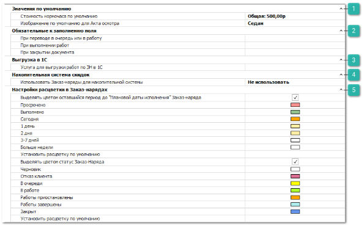

В группе **Автосервис** представлены блоки настроек:

 **Значения по умолчанию**

Блок позволяет настроить выбор значений, которые по умолчанию подставляются в документ **Заказ-наряд**:

- **Стоимость нормочаса по умолчанию –** в поле указывается стоимость из справочника, которая будет подставляться при добавлении новой работы в колонку **Стоимость нормочаса** на вкладке **Работы** в документе **Заказ**-**Наряд**;

- **Изображение по умолчанию для Акта осмотра –** настройка, определяющая системное изображение, которое будет использоваться по умолчанию на вкладке **Обращение клиент**а при создании нового **Заказ-наряда**.

 **Обязательные к заполнению поля**

Блок позволяет определить обязательные к заполнению полей при работе с **Заказ-нарядом**:

- **При переводе в очередь или в работу** – укажите обязательные поля для заполнения при переводе документа **Заказ-Наряд** в состояние **В очередь** или **В работе**;

- **При выполнении работ** – укажите обязательные поля для заполнения при переводе документа **Заказ-Наряд** в состояние **Работы завершены**;

- **При закрытии документа** – укажите обязательные поля для заполнения при переводе документа **Заказ-Наряд** в состояние **Закрыт**.

 **Выгрузка в 1С**

Блок содержит настройку выгрузки документа **Заказ-наряд** в 1С:

- **Услуга для выгрузки работ по ЗН в 1С** – настройка предназначена для определения услуги из справочника **Виды ремонта**, которая будет загружена в 1С на общую стоимость работ по каждому документу **Заказ-наряд**.

 **Накопительная  система скидок**

` `Блок содержит настройку использования **Заказ-наряда** для накопительной системы скидок:

- **Использовать Заказ-наряды для накопительной системы** – указывается, учитывать или нет в работе накопительной системы данные из **Заказ-нарядов**. Доступные значения:

    - **Не использовать** – при расчете категории клиента не будут учитываться документы **Заказ-Наряд**;

    - **Только товары** – будут учитываться только оплаченные товары из **Заказ-Нарядов**;

    - **Товары и работы** – будут учитываться оплаченные товары и работы из **Заказ-Нарядов**.

 **Настройка расцветки в Заказ-нарядах**

Блок настроек позволяет задать цвета для раскраски фона ячейки **Плановая дата исполнения** в списке документов **Заказ-наряд** и настройки, позволяющие задать цвета для раскраски фона ячейки **Статус Заказ-Наряда** в списке документов **Заказ-наряд**:

- **Выделять цветом оставшийся период до** "**Плановой даты исполнения**" **Заказ-Наряда** – активирует механизм расцветки в списке документов **Заказ-Нарядов**, в зависимости от количества оставшихся часов до **Плановой даты исполнения** документа (окрашивается только ячейка со сроком);

- **Просрочено**, **Выполнено**, **Сегодня**, **1 день**, **2 дня**, **3-7 дней**, **Больше недели** – определяют цвет в списке документов, если до **Плановой даты исполнения Заказ-наряда** осталось менее указанного срока либо срок уже вышел;

- **Выделять цветом статус Заказ-Наряда** – активирует механизм расцветки ячейки со статусом в списке документов **Заказ-Нарядов**;

- **Черновик, Отказ клиента, В очереди, В работе, Работы приостановлены, Работы завершены, Закрыт** – определяют цвет ячейки со статусом в списке документов **Заказ-Наряда**;

- **Установить расцветку по умолчанию** – настройка предназначена для автоматического изменения фонов ячеек на предустановленные в программе.

