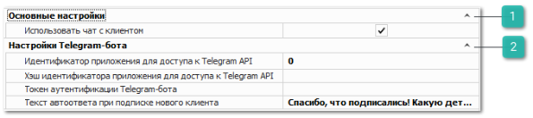

Содержатся настройки для подключения Telegram-бота и чата с клиентами на основе Telegram-бота.

 **Основные настройки**

- **Использовать чат с клиентом** – позволяет **разрешить/запретить** использование чата с клиентами. При включенной настройке добавляются:

    - кнопка **Чат** в нижнее меню;

    - раздел **Чат** в меню **CRM**.

 **Настройки Telegram-бота**

- **Идентификатор приложения для доступа к Telegram API** – значение из поля **App api\_id**, которое было получено на сайте my.telegram.org при создании Telegram-бота;

- **Хэш идентификатора приложения для доступа к Telegram API** – значение из поля **App api\_hash**, которое было получено на сайте my.telegram.org при создании Telegram-бота;

- **Токен аутентификации Telegram-бота** – **Api Token** из поля **Use this token to access the HTTP API**, который был получен при создании Telegram-бота.

- **Текст автоответа при подписке нового клиента** – задает текст сообщения, которое будет автоматически присылаться, когда клиент подпишется на Telegram-бота и передаст свои контакты.

::: warning Внимание!

Для применения настроек рекомендуется перезайти в программу.

:::
::: info Примечание

Для работы сервиса отправки сообщений через Telegram-бот необходимо:

- подключение дополнительной услуги. За подключением услуги обратитесь в отдел продаж Компании Tradesoft;

- созданный и настроенный Telegram-бот;

- установленный и подключенный сервер приложения.

Подробнее о работе модуля читайте в [руководстве пользователя](https://product-doc.tradesoft.ru/ai/telegram/index.htm).

:::

