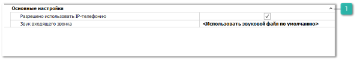

Группа **IP-телефония** содержит настройки активации телефонии в программе Parts.Intellect. 

 **Основные настройки**

Блок содержит настройки:

- **Разрешено использовать IP-телефонию** – позволяет разрешить/запретить использование модуля;

- **Звук входящего звонка** – позволяет заменить звуковой файл, используемый по умолчанию, для входящих звонков, который будет доступен с рабочих мест всех сотрудников, использующих IP-телефонию. 

::: info Примечание

Для замены звукового файла, необходимо выбрать файл с расширением \*.mp3 или \*.wav.

:::

::: info Примечание

Для применения настроек блока, необходимо выполнить перезапуск программы.

:::

