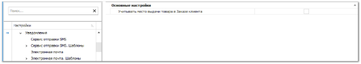
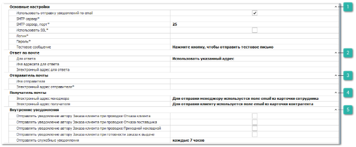
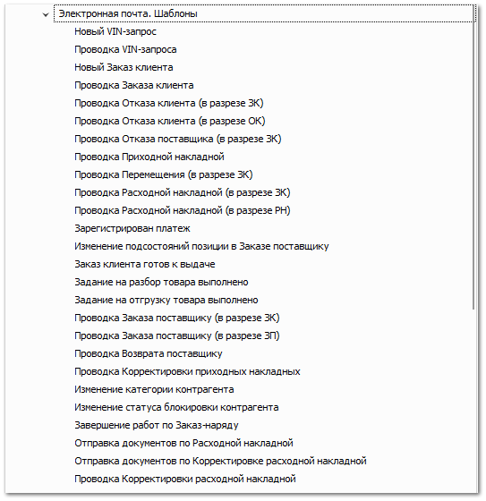
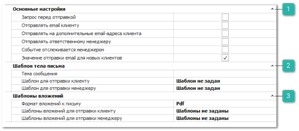

В группе **Уведомления** содержится общая настройка для механизма отправки email и SMS уведомлений из программы и настройку, которая касается обоих типов уведомлений:

- **Учитывать место выдачи товара в Заказе клиента** – при включении данной опции уведомление клиентов о приходе товара осуществляется только в случае, если товар пришел на склад/торговую точку, которая указана в качестве **Места выдачи** товара в параметрах **Заказа клиента**. Также уведомление отправляется, если товар был перемещен на склад/торговую точку выдачи товара. Если товар оприходован на другой склад, то уведомление не отправляется.

Группа **Электронная почта** – содержит блоки настроек для отправки email уведомлений программой для менеджеров и клиентов:

 **Основные настройки**

Блок содержит настройки для активации отправки уведомлений по email, а также настройки почтового сервера, с которого будут отправляться письма:

- **Использовать отправку уведомлений по** **email** – при отключении опции, программа не будет производить отправку уведомлений;

- **SMTP-сервер (сервер исходящей почты)** – адрес сервера, через который будет происходить отправка писем, например, smtp.gmail.com. В зависимости от настроек SMTP сервера электронные адреса из секций **Ответ** и **Отправитель** могут быть проигнорированы (например, служба gmail не допускает изменения данных полей);

- **SMTP-сервер, порт** – порт SMTP сервера. При использовании защищенного соединения SSL не рекомендуется указывать порт 465, вместо него рекомендуется использовать порт 587;

- **Использовать SSL** – использовать защищенное соединение SSL для связи с SMTP сервером;

- **Логин и пароль** – данные от учетной записи на почтовом сервере (электронный адрес и пароль);

- **Тестовое сообщение** – содержит команду для отправки тестового сообщения. Данная команда позволяет определить работоспособность системы по отправке писем.

 **Ответ по почте**

Блок содержит настройки:

- **Для ответа** – адрес на который будет приходить ответ от получателя уведомления. Доступные значения:

    - **Использовать указанный адрес** – будет использоваться адрес из поля **Электронный адрес для ответа**;

    - **Использовать электронный адрес менеджера** – используется электронный адрес менеджера клиента.

- **Имя адресата для ответа** – имя адресата для поля Reply to письма;

- **Электронный адрес для ответа** – электронный адрес, на который будет приходить ответ от получателя уведомления, при заданном значении **Использовать указанный адрес** в настройке **Для ответа**.

 **Отправитель почты**

Блок содержит настройки:

- **Имя отправителя** – имя отправителя письма (поле From);

- **Электронный адрес отправителя** – адрес отправителя письма (поле From).

 **Получатель почты**

Блок содержит настройки:

- **Электронный адрес менеджера** – для отправки уведомлений менеджеру используется значение поля email из карточки сотрудника;

- **Электронный адрес получателя** – для отправки уведомлений клиентам используется значение поля email из карточки контрагента.

 **Внутренние уведомления**

Блок содержит настройки:

- **Отправлять уведомление автору Заказа клиента при проводке Отказа клиента** – отправка уведомления автору документа **Заказ клиент**а, при проводке связанного **Отказа клиента** по позициям. При отправке используется шаблон, заданный в поле **Шаблон для отправки менеджеру** в настройках уведомления **Проводка Отказа клиента (в разрезе ЗК)**;

- **Отправлять уведомление автору Заказа клиента при проводке Приходной накладной** – отправка уведомления автору документа **Заказ клиент**а, при проводке связанной **Приходной накладной** по позициям. При отправке используется шаблон, заданный в поле **Шаблон для отправки менеджеру** в настройках уведомления **Проводка Приходной накладной**.

::: info Примечание

Если для уведомления активна отправка автору заказа клиента и ответственному менеджеру, то система отправит два уведомления. Если автор заказа клиента совпадает с ответственным менеджером клиента, то уведомление уйдет только один раз.Просмотреть уведомления, которые отправила программа можно в разделе меню **CRM** **► Журнал уведомлений**.

:::

- **Отправлять уведомление автору Заказа клиента при проводке Отказа поставщика** – отправка уведомления автору документа **Заказ клиента**, при проводке связанного **Отказа поставщика** по позициям. При отправке используется шаблон, заданный в поле **Шаблон для отправки менеджеру** в настройках уведомления **Проводка Отказа поставщика**;

- **Отправлять уведомление автору Заказа клиента при готовности заказа к выдаче** – отправка уведомления автору документа **Заказ клиента**, если заказа находится в статусе **Ожидает выдачи, n дней**.** При отправке используется шаблон, заданный в поле **Шаблон для отправки менеджеру** в настройках уведомления **Заказ клиента готов к выдаче**;

- **Отправлять служебные уведомления** – интервал отправки уведомлений администратору базы данных.

Группа **Электронная почта. Шаблоны** – содержит перечень доступных шаблонов email-уведомлений и настройки для каждого из них:

- **Новый VIN-запрос** – при создании нового документа **VIN-запрос**;

- **Проводка VIN-запроса** – при проводке документа **VIN-запрос**;

- **Новый Заказ клиента** – при создании нового документа **Заказ клиента**;

- **Проводка Заказа клиента**– при проведении документа **Заказ клиента**;

- **Проводка Отказа клиента (в разрезе ЗК)** – при проведении документа **Отказ клиента** на основании **Заказа клиента**;

- **Проводка Отказа клиента (в разрезе ОК)** – при проведении документа **Отказ клиента**;

- **Проводка Отказа поставщика (в разрезе ЗК)** – при проведении документа **Отказ поставщика**;

- **Проводка Приходной накладной** – при проведении документа **Приходная накладная**;

- **Проводка Перемещения (в разрезе ЗК)** – проведение документа **Перемещение**;

- **Проводка Расходной накладной (в разрезе ЗК)** – проведение документа **Расходная накладная** созданной на основании **Заказа клиента**;

- **Проводка Расходной накладной (в разрезе РН)** – проведение документа **Расходная накладная**.

- **Зарегистрирован платеж** – при проведении финансового документа **ПКО ь**или **Платежное поручение входящее**;

- **Изменение подсостояний позиции в Заказе поставщику** – при смене подсостояния у позиции документа **Заказ поставщику**;

- **Заказ клиента готов к выдаче** – отправка уведомления, когда все позиции в **Заказе клиента** буду в состоянии **Резерв**, т.е. на складе;

- **Задание на разбор товара выполнено** – при установке состояния **Выполнено** для документа **Задание на разбор товара**;

- **Задание на отгрузку товара выполнено** – при установке состояния **Выполнено** для документа **Задание на отгрузку товара**;

- **Проводка Заказа поставщику (в разрезе ЗК)** – проведение документа **Заказ поставщику**, связанного с заказом клиента;

- **Проводка Заказа поставщику (в разрезе ЗП)** – проведение документа **Заказ поставщику**;

- **Проводка Возврата поставщику** – при проведении документа **Возврат поставщику**;

- **Проводка Корректировки приходных накладных** – проведение документа **Корректировка приходной накладной**;

- **Изменение категории контрагента** – при смене категории у клиента;

- **Изменение статуса блокировки контрагента** – при изменении состояний блокировки контрагента;

::: info Примечание

При активной опции **Учитывать место выдачи товара** в **Заказе клиента** в разделе меню **Управление ►** **Настройки программы ► Настройки** группа **Уведомления**.

Уведомление о готовности заказа клиента к выдаче будет уходить только в случае, если товар был оприходован либо перемещен на склад/торговую точку, которая указана в качестве **Места выдачи** товара в параметрах **Заказа клиента**.

:::

- **Завершение работ по Заказ-Наряду** – при установке состояния **Работы завершены** по документу **Заказ-Наряд**;

- **Отправка документов по Расходной накладной** – отправка печатных форм документов по **Расходной накладной**. Отправка уведомления по данному событию происходит при выполнении команды **Сервис ► Отправить документы** в **меню Продажи ► Расходные накладные**;

- **Отправка документов по Корректировке расходной накладной** – отправка печатных форм документов по **Корректировке расходной накладной**. Отправка уведомления по данному событию происходит при выполнении команды **Связаться ► Отправить документы** в **меню Продажи ► Корректировки расходных накладных**;

- **Проводка Корректировки расходной накладной** – проведение документа **Корректировка расходной накладной**.

Настройки шаблонов группы **Электронная почта** аналогичны друг другу. Рассмотрим значение настроек для шаблонов уведомлений на примере уведомления **Заказ клиента готов к выдаче**:

 **Основные настройки**

Блок содержит настройки:

- **Запрос перед отправкой** – запрос подтверждения у пользователя перед отправкой уведомления. Запрос применяется только при действиях в программе **Parts.Intellect**. Уведомления со стороны **Parts.Resource** отправляются без запросов;

- **Отправлять** **email** **клиенту** – регулирует отправку уведомления клиентам;

- **Отправлять на дополнительные email адреса клиента** – отправка осуществляется так же на адреса, указанные в поле **Дополнительные email** на вкладке **Реквизиты** карточки контрагента;

- **Отправлять ответственному менеджеру** – регулирует отправку уведомления на электронный адрес сотрудника, указанного в качестве **Ответственного менеджера** в карточке контрагента;

- **Событие отслеживается менеджером** – при активной опции в случае, когда у клиента выключена отправка данного уведомления, в журнале уведомлений добавляется запись о том, что сообщение не отправлено. Менеджер может сделать это самостоятельно и затем изменить статус сообщения;

- **Значение отправки** **email** **для новых клиентов** – определяет состояние флага **Отправлять уведомление** на вкладке **Уведомления** для новых клиентов в карточке контрагента.

 **Шаблон тела письма**

Блок содержит настройки:

- **Тема сообщения** – тема письма. В дополнение к простому тексту, в тему можно вставлять макросы, которые автоматически вставят соответствующие значения из шаблона для тела письма. Доступные значения: {ReportName}, {ReportAlias}, {ReportAuthor}, {ReportDescription};

- **Шаблон для отправки клиенту** – форма печатного шаблона для формирования тела текста письма, которое будет отправлено клиенту (по умолчанию все шаблоны расположены в каталоге C:\ProgramData\Tradesoft\Parts.Intellect\Шаблоны);

- **Шаблон для отправки менеджеру** – форма печатного шаблона для формирования тела письма, которое будет отправлено менеджеру.

 **Шаблоны вложений**

Блок содержит настройки:

- **Формат вложений к письму** – формат файлов, в котором будут формироваться вложения к письму;

- **Шаблон вложений для отправки клиенту** – позволяет выбрать несколько форм шаблонов для отправки во вложении к письму для клиента (по умолчанию все шаблоны расположены в каталоге C:\ProgramData\Tradesoft\Parts.Intellect\Шаблоны);

- **Шаблон вложений для отправки менеджеру** – позволяет выбрать несколько форм шаблонов для отправки во вложении к письму для менеджера.

::: warning Внимание!

Для каждого контрагента можно указать индивидуальные настройки по каждому типу уведомления в карточке контрагента (раздел меню **CRM ► Клиенты** вкладка **Уведомления**).

В карточке контрагента можно задать индивидуальные **Шаблоны тела письма** и **Шаблоны вложений**. А также указать уникальные **Email адреса получателя** (через разделитель ";") и регулировать получение уведомления контрагентом через флаг **Отправлять уведомление**.

:::