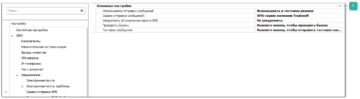
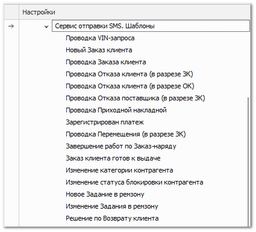
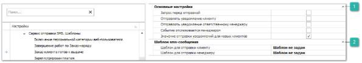
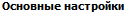
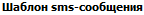

Группа **Сервис отправки** **SMS** содержит блоки настроек для отправки уведомлений по SMS и Telegram, менеджерам и клиентам:

 **Основные настройки**

Блок содержит настройки:

- **Использовать отправку сообщений** – выберите режим отправки сообщений:

    - **Не использовать** – сообщения клиентам и менеджерам отправляться не будут;

    - **Использовать в тестовом режиме** – вместо реальной отправки сообщений, будет происходить только запись в **Журнал уведомлений** с текстом сообщения (рекомендуется использовать во время настройки системы);

    - **Использовать** – клиентам и менеджерам будут отправляться сообщения согласно настройкам.

- **Сервис отправки сообщений** – выбор сервиса отправки сообщений из справочника **Сервисы отправки сообщений**;

::: info Примечание

Если сервис отправки не выбран, будет использоваться SMS-сервис компании Tradesoft.

Доступен выбор отправки сообщений в приложении Telegram. Для работы сервиса отправки уведомлений через **Telegram Bot** необходимо подключение дополнительной услуги, а также наличие установленного и подключенного **Сервера Parts.Intellect**.

Установку сервера можно выполнить на этапе установки программы Parts.Intellect.

:::

- **Тестовое сообщение** – содержит команду **Тестовое SMS**. Для отправки тестового сообщения укажите номер для отправки SMS. Тестовое сообщение уменьшит количество SMS на балансе.

Если в параметре **Сервис отправки сообщений** выбран **SMS-сервис компании Tradesoft**, то доступны следующие настройки:

- **Уведомлять об окончании пакета с SMS** – порог SMS, преодолев который администратор получает письмо о приближении к окончанию оплаченного пакета SMS. Тем самым снижается риск "незаметного" окончания пакета и прекращения отправки SMS-уведомлений клиентам. Опция может принимать значение **Не уведомлять**, либо конкретное значение порога (50,100,200).

- **Проверить баланс** – содержит команду для проверки баланса SMS сообщений.

Если в параметре **Сервис отправки сообщений** выбран **Telegram Bot**, то доступны дополнительные настройки:

- **Текст автоответа при отключенном чате** – задает текст, который будут видеть клиенты при отправке сообщений в Telegram-бот. Текст отображается, если настройка **Использовать чат с клиентом** отключена;

- **Резервный способ отправки сообщений** – задает резервный способ отправки сообщений, если клиент не подписан на Telegram-бота или отправка сообщений в Telegram завершилась с ошибкой.

Данные для подключения Telegram-бота вносятся в разделе **Настройки** **► CRM** **► Чат с клиентом**.

::: info Примечание

Для работы сервиса отправки уведомлений и сообщений через Telegram-бот необходимо:

- подключение дополнительной услуги. За подключением услуги обратитесь в отдел продаж Компании Tradesoft;

- созданный и настроенный Telegram-бот;

- установленный и подключенный **Сервер Parts.Intellect**.

:::

Если в параметре **Сервис отправки сообщений** выбрано значение **Прочие сервисы**, то доступны следующие настройки:

- **Сервис отправки сообщений** – в поле можно выбрать сервисы отправки сообщений, которые уже подключены и есть в базе программы Parts.Intellect. В окне **Сервисы отправки сообщений** можно добавить новые сервисы.

::: info Примечание

Просмотреть уведомления, которые отправила программа можно в разделе меню **CRM** **► Журнал уведомлений**.

:::

Группа настроек **Сервис отправки** **SMS. Шаблоны** – содержит перечень доступных шаблонов SMS уведомлений и настройки для каждого из них:

- **Проводка VIN-запроса** – при проведении документа **VIN-запрос**;

- **Новый Заказ клиента** – при создании нового документа **Заказ клиента**;

- **Проводка Заказа клиента**– при проведении документа **Заказ клиента**;

- **Проводка Отказа клиента (в разрезе ЗК)** – при проведении документа **Отказ клиента** на основании **Заказа клиента**;

- **Проводка Отказа клиента (в разрезе ОК)** – при проведении документа **Отказ клиента**;

- **Проводка Отказа поставщика (в разрезе ЗК)** – при проведении документа **Отказ поставщика**;

- **Проводка Приходной накладной** – при проведении документа **Приходная накладная**;

- **Зарегистрирован платеж** – при проведении финансового документа **ПКО** или **Платежное поручение входящее**;

- **Завершение работ по Заказ-Наряду** – при установке состояния **Работы завершены** по документу **Заказ-Наряд**;

- **Заказ клиента готов к выдаче** – отправка уведомления, когда все позиции в **Заказе клиента** буду в состоянии **Резерв**, т.е. на складе;

- **Изменение категории контрагента** – при смене категории у клиента;

- **Изменение статуса блокировки контрагента** – при изменении состояний блокировки контрагента;

- **Проводка Перемещения (в разрезе ЗК)** – проведение документа **Перемещение**;

- **Новое Задание в ремзону** – при создании нового задания;

- **Изменения задания в ремзону** – при изменении данных по заданию;

- **Решение по Возврату клиента** – при отправке SMS-уведомления при помощи команды "Уведомить клиента".

Настройки шаблонов группы **Сервис отправки** **SMS** аналогичны друг другу. Рассмотрим значение настроек для шаблонов уведомлений на примере уведомления **Заказ клиента готов к выдаче**:

 **Основные настройки**

Блок содержит настройки:

- **Запрос перед отправкой** – запрос подтверждения у пользователя перед отправкой уведомления;

- **Отправлять уведомление клиенту** – регулирует отправку уведомления клиенту;

- **Отправлять уведомление ответственному менеджеру** – регулирует отправку уведомления на мобильный телефон сотрудника, указанного в качестве **Ответственного менеджера** в карточке контрагента;

- **Событие отслеживается менеджером** – при активной опции, когда у клиента выключена отправка уведомления, в журнале уведомлений добавляется запись, что сообщение не отправлено. Менеджер может отправить его самостоятельно и затем изменить статус сообщения;

- **Значение отправки уведомлений для новых клиентов** – определяет состояние флага **Отправлять уведомление** на вкладке **Уведомления** для новых клиентов в карточке контрагента.

 **Шаблоны SMS-сообщений**

Блок содержит настройки: 

- **Шаблон для отправки клиенту** – форма печатного шаблона для формирования текста SMS сообщения, которое будет отправлено клиенту (по умолчанию все шаблоны расположены в каталоге C:\ProgramData\Tradesoft\Parts.Intellect\Шаблоны);

- **Шаблон для отправки менеджеру** – форма печатного шаблона для формирования текста SMS сообщения, которое будет отправлено менеджеру.

::: info Примечание 

Максимальное количество символов в одном SMS-сообщении при использовании кириллицы – 70, латиницы – 160. Если количество символов сообщения, формируемого по шаблону, превышает допустимое для одного SMS-сообщения, то сообщение разбивается на сегменты.Максимальное количество символов в сегментированном сообщении:

|Количество сегментов|Количество символов||
||Кириллица|Латиница|
|1|70|160|
|2|134|306|
|3|201|459|
|4|268|612|

:::

::: warning Внимание!

Для каждого контрагента можно указать индивидуальные настройки по каждому типу уведомления в карточке контрагента (раздел меню **CRM ► Клиенты** вкладка **Уведомления)**.В карточке контрагента можно задать индивидуальные **Шаблоны тела письма** и **Шаблоны вложений**, а также регулировать получение уведомления контрагентом через флаг **Отправлять уведомление**.

:::

