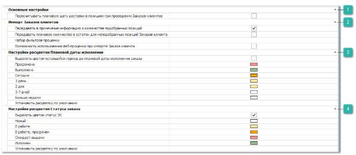

Группа **Заказы клиентов** содержит блоки настроек:

 **Основные настройки**

Блок содержит настройку которая позволяет задать правила пересчета **Плановой даты доставки** относительно текущей даты при проведении документа по позициям:

- **Пересчитывать плановую дату доставки в позициях при проведении заказов клиента** – если опция включена, то при проведении документа по позициям будет пересчитывается значение **Плановая дата доставки** относительно текущей даты (на компьютере пользователя или системного времени сервера базы данных) и **Времени доставки** по позиции, с учетом выходных дней, заданных для **Нашей фирмы** в меню **Управление ► Настройки программы ► Наши фирмы** настройка **Выходные дни**.

Например, если доставка осуществляется в течении 2 дней и создали документ 1-го числа, то плановая дата доставки сформируется на 3-е число. Но при проведении этого документа 11-го числа, плановая дата доставки пересчитается на 13-е число. Если опция выключена, то после проведения документа плановые даты доставки по позициям не пересчитываются.

::: note Заметка

Самое позднее значение **Плановой даты доставки** у позиции **Заказа клиента**, автоматически подставляется в поле **Исполнение заказа**. По умолчанию **Плановая дата доставки** рассчитывается на основе системной даты документа плюс срок доставки из **Проценки**, учитывая выходные дни, заданные для **Нашей фирмы**.

:::

 **Импорт заказов клиентов**

Блок содержит настройки для проценки позиций при импорте позиций заказов клиентов из файла через команду **Импорт с проценкой** и через bat-файл:

- **Передавать в примечание информацию о количестве подобранных позиций** – при включении опции для позиций документа **Заказ клиента** в колонку "Примечание" будет записываться информация о количестве подобранного товара и информация о количестве товара, которое не удалось подобрать. Если импортируемая позиция была разделена, примечание о найденном количестве будет продублировано для каждой разделенной позиции;

::: info Примечание

Если при выполнении импорта в файле размечена колонка **Примечание** и указанная опция выше включена, то в примечание в первую очередь передается информация о подобранных товарах, затем через точку с запятой (;) информация из файла.

:::

- **Передавать плановое количество в остаток для неподобранных позиций заказов клиента** – при включенной опции после импорта **Заказа клиента** с проценкой в колонку **Количество** по позиции для подобранных и неподобранных позиций будет передаваться значение количества из файла. По умолчанию опция выключена – в количество передаются значения количества у подобранных позиций при проценке.

- **Набор фильтров проценки** – указывается фильтр проценки, который будет использоваться при подборе предложений в импорте заказов;

- **Возможность использования веб-проценки** – при проценке позиций из файла будет использоваться источник **Веб прайс-листы**;

::: info Примечание

Для работы функционала требуется подключение услуги **Веб-проценка** по необходимым поставщикам, а также **Анализ прайс-листа** по этим поставщикам.Условия подключения можно узнать у наших менеджеров (контактные данные можно найти по адресу [www.tradesoft.ru/about/contacts](http://www.tradesoft.ru/about/contacts/)).

:::

 **Настройки расцветки Плановой даты исполнения**

Блок содержит настройки, позволяющие задать цвета для раскраски фона ячейки **Плановая дата исполнения** в списке документов **Заказы клиента**:

- **Выделять цветом оставшийся период до Плановой даты исполнения** – активирует механизм расцветки колонки **Плановая дата исполнения** в списке документов **Заказы клиента**, в зависимости от количества оставшихся дней до даты исполнения документа. По умолчанию настройка отключена;

- **Просрочено, Выполнено, Сегодня, 1 день, 2 дня, 3-7 дней, Больше недели** – определяет цвет в списке документов, если до **Исполнения заказа** осталось менее указанного срока или он вышел;

- **Установить расцветку по умолчанию** – настройка предназначена для автоматического изменения фонов ячеек на предустановленные в программе.

::: info Примечание

Значение наиболее поздней **Плановой даты доставки** среди позиций документа предается в свойство документа **Плановая дата исполнения**, если позиция не находится в состоянии **Возврат от клиента**, **Отказ клиента**, **Расходная накладная**, **Заказ-наряд** или **Корректировка расходной накладной**. Таким образом подразумевается, что весь заказ может быть полностью исполнен, когда будет доставлена последняя деталь из заказа.

По умолчанию **Плановая дата доставки** рассчитывается на основе системной даты документа (на компьютере пользователя или времени на сервере базы данных) плюс **Время доставки** по позиции, учитывая выходные дни, заданные для **Нашей фирмы**. И может быть изменена вручную пользователем (после ручного изменения значение в колонке **Время доставки** сбрасывается) либо автоматически пересчитаться при активной настройке **Пересчитывать плановую дату доставки в позициях при проведении заказов клиента** (см. выше).

:::

 **Настройки расцветки Статуса заказа**

Блок содержит настройки, позволяющие задать цвета для раскраски фона ячейки **Статус заказа** в списке документов **Заказы клиента**:

- **Выделять цветом статус ЗК** – активирует механизм расцветки колонки **Статус заказа** в списке документов **Заказы клиента**, в зависимости от указанного статуса заказа документа;

- **Новый**, **В работе**, **В работе, просрочен**, **Ожидает выдачи**, **Исполнен** – определяет цвет в списке документов, если статус настройки совпадает со статусом в колонке **Статус заказа**;

- **Установить расцветку по умолчанию** – настройка предназначена для автоматического изменения фонов ячеек на предустановленные в программе.

