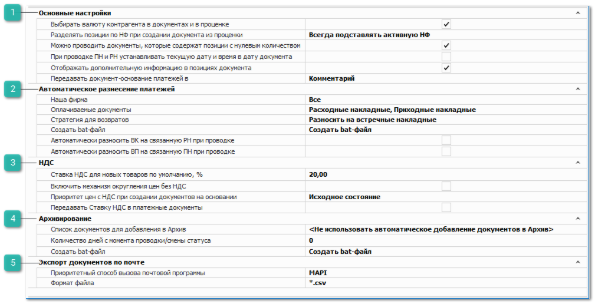

В группе **Документы** представлены блоки настроек:

 **Основные настройки**

Блок содержит настройки, регулирующие проведение документов, разделение позиций, отображение дополнительной информации в позициях документа:

- **Выбирать валюту контрагента в документах и в проценке** – активирует автоматическую подстановку валюты из карточки контрагента в поля **Валюта** создаваемых документов и при проценке.

::: warning Внимание!

Подстановка валюты контрагента не будет производится для раздела **Продажи ► Быстрая продажа**.

:::

- **Разделять позиции по НФ при создании документа из проценки** – определяет значение **Нашей фирмы** по умолчанию в документах, созданных из **Проценки** (раздел **Продажи ► Проценка**). Для пользователей, ведущих учет товаров по нескольким **Нашим фирмам**. Доступные значения настройки:

    - **Всегда подставлять активную НФ** – в создаваемые из **Проценки** документы в поле **Наша фирма** подставляется текущая **Активная наша фирма** (из раздела **Управление ► Настройки пользователя ► Основные**). Значение текущей активной фирмы подставляется для товаров "под заказ" и "из наличия", независимо от фактического наличия товара на активной **Нашей фирме** при этом создается один документ для всех выбранных в проценке товаров.

    ::: note Заметка

    Для списания товара, оприходованного на фирму отличную от **Нашей фирмы** в документе, необходимо отключить настройку **Контролировать движение товара по Нашей фирме** из раздела **Управление ► Настройки программы ► Наши фирмы**.

    Для того, чтобы создавать **Расходные накладные** на активную Нашу фирму из любого источника (при создании из раздела **Продажи ► Мастер создания ► Расходная накладная** и на основании других документов) необходимо активировать настройку **Использовать активную НФ пользователя при создании РН на основании и в мастере** из раздела **Управление ► Настройки программы ► Роли пользователей ► Разрешения для роли пользователей ► Документы ► Расходные накладные**.

    :::

    - **Автовыбор НФ** – из проценки могут быть созданы документы на несколько Наших фирм, которые будут определяться из подобранного системой прихода/остатка по товару и отражаться в созданных документах и в колонке **Наша фирма** в окне **Выбранные позиции** в **Проценке**. Действие настройки распространяется на следующие документы: **VIN-запрос**, **Заказ клиента**, **Отгрузка на реализацию**, **Расходная накладная**, **Заказ-наряд**, **Резервирование**, **Перемещение**, **Списание товаров**.

::: note Заметка

Алгоритм подбора **Нашей фирмы** (в значении настройки **Автовыбор НФ**):

- при выборе товара в наличии из общего окна **Результаты поиска** в **Проценке** подбирается доступная пользователю Наша фирма, на которой есть свободный остаток товара. В приоритете **Активная наша фирма** пользователя (из раздела **Управление ► Настройки пользователя ► Основные**. В случае отсутствия товара на активной фирме подбирается другая доступная фирма из списка. Список фирм сортируется по дате прихода запрашиваемого товара. 

Сортировка по дате прихода производится по значению настройки **Способ списания товара "ЛИФО" / "ФИФО"** из раздела **Управление ► Настройки программы ► Настройки**, группа **Склад и закупки ► Движение товара**;

- при выборе товара из выпадающего списка в колонке **Направление/Склад** из окна **Результаты поиска** списание товара будет произведено с выбранной **Нашей фирмы** и **Места хранения**, если они доступны пользователю (доступность определяется настройками в разделе **Управление ► Настройки программы ► Роли пользователей ► Разрешения для роли пользователей ► Словари ► Склады/Торговые точки** и **Справочники ► Контрагенты ► Доступные Наши фирмы**).
Для партионной СЦО фирма, на которую оприходован товар отображается в отдельной колонке **Наша фирма**.

- для товаров "под заказ" всегда устанавливается **Активная наша фирма** пользователя.

:::

- **Можно проводить документы, которые содержат позиции с нулевым количеством** – разрешает либо запрещает проводить документы, в которых хотя бы одна позиция с количеством, равным нулю;

::: note Заметка

Данная опция не учитывается при переводе документов "Перемещение" в состояния "Товары отгружены" и "Товары приняты". Проводка с нулевым количеством для них запрещена.

:::

- **При проводке ПН и РН устанавливать текущую даты и время в дату документа** – при активном значении настройки во время проводки документов **Приходная накладная** или **Расходная накладная** программа подменит дату и время, установленную в момент создания документа, на дату и время совершения проводки документа. Данное поведение применяется только при первой проводке документа. Последующие перепроводки документа не сразу обновляют дату и время, а предлагают это сделать в диалоге (с возможностью отказаться);

::: note Заметка

Для определения даты и времени программа использует данные компьютера пользователя или время компьютера, где расположена база данных, при активной настройке **Использовать локальное время сервера БД** в разделе меню **Управление ► Настройки программы ► Настройки** блок **Системные настройки**.

:::

- **Отображать дополнительную информацию в позициях документа** – в колонке **Состояние** **позиции** документов будет отображаться дополнительная информация (клиент, поставщик, склад и т.д., в зависимости от состояния);

::: note Пример

Для следующих документов можно увидеть детализацию в поле **Состояние**:

- Документ **Заказ клиента**:

    - **Заказ поставщику** – дополняется наименованием поставщика, которому заказан товар.

    - **Отказ поставщика** – дополняется наименованием поставщика, который дал отказ по позиции.

    - **Резерв** – дополняется складом, на котором размещен зарезервированный товар, а также информацией о замене, если в **Приходной накладной** была оформлена замена товара.

    - **Возврат**– дополняется складом, на который был оформлен возврат.

- Документ **Заказ поставщику**:

    - **Заказ поставщику** – дополняется наименованием клиента, для которого заказан товар.

    - **Резерв** – дополняется наименованием клиента, для которого зарезервирован товар, и складом, на котором размещен зарезервированный товар.

- Документ **Приходная накладная**:

    - **Резерв** – дополняется складом, на котором размещен зарезервированный товар, а также информацией о замене, если в **Приходной накладной** была оформлена замена товара.

- Документ **Расходная накладная**:

    - **Расход** – дополняется складом, с которого списан товар, а также информацией о замене, если в **Приходной накладной** была оформлена замена товара.

- Документа **Возврат от клиента**:

- **Возврат клиента**– дополняется складом, на который был оформлен возврат клиента.

:::

- **Передавать документ-основание платежей в** – указывается свойство платежного документа, в которое необходимо передавать комментарий вида "*Расход №87 / 30.10.2013 10:14 / Розничный клиент / 1 306,99 р*". Возможные варианты значения опции:

    - **Комментарий** – информация о документе-основании будет передаваться в поле **Комментарий** платежного документа;

    - **Назначение платежа** – информация о документе-основании будет передаваться в поле **Назначение платежа** платежного документа.

 **Автоматическое разнесение платежей**

Блок содержит настройки для автоматического разнесения поступивших оплат в программе и параметры автоматического погашения долга при создании возвратных документов:

- **Наша фирма** – указывается по каким **Нашим фирмам** необходимо осуществлять автоматическое разнесение платежей;

- **Оплачиваемые документы** – в опции необходимо указать типы документов, на которые должны разноситься платежи;

- **Стратегия для возвратов** – если в опции **Оплачиваемые документы** выбран тип документов **Возврат от клиента**, то в опции **Стратегия для возвратов** необходимо выбрать требуемый способ разнесения: либо только **Разносить на встречные накладные**, либо **Разносить на встречные платежи**;

- **Создать bat-файл** – содержит команду для создания bat-файла, при запуске которого будет включаться механизм автоматического разнесения платежей по документам;

- **Автоматически разносить ВК на связанную РН** – сумма долга по **Расходной накладной** будет автоматически закрыта суммой по документу **Возврат клиента**;

- **Автоматически разносить ВП на связанный ПН** – сумма долга по **Приходной накладной** будет автоматически закрыта суммой по документу **Возврат поставщику**.

 **НДС**

Блок содержит настройки:

- **Ставка НДС для новых товаров по умолчанию, %** – ставка НДС по умолчанию для всех новых карточек товаров. При добавлении товара в документ, ставка, указанная в карточке, автоматически переносится в документ для выбранной позиции;

- **Включить механизм округления цен без НДС –** настройка для округления **Цены продажи без НДС** в документах **VIN-запрос**, **Заказ клиента**, **Резерв** и **Расходная** **накладная**. При включении данной опции открывается доступ к команде **Округление цены без НДС** для позиций документов **VIN-запрос**, **Заказ клиента**, **Резерв и Расходная накладная**. При нажатии на команду программа произведет округление **Цены продажи без НДС** до сотых с кратностью 5.

::: note Пример

Цена продажи *120,68* *руб.*, после округления станет *120,70 руб.,* а *120,66* *руб.* станет *120,65 руб.*

Если при проведении документа обнаружатся позиции, несоответствующие данным критериям округления, то при проведении документа пользователю будет выведено диалоговое окно с возможностью выбора: **Округлить и провести документ**, **не округлять** и **Провести документ**, **отмена проводки документа**.

:::

::: note Заметка

Округление **Цены продажи** в проценке задается для валюты в разделе **Финансы** **► Валюты и Курсы**.

Для раздела **Продажи ► Быстрая продажа** производится автоматическое округление **Цены продажи** товаров. При включении механизма производится скрытие и отключение настройки **Применить округление цены после скидки** в разделе **Управление ► Настройки пользователя** на вкладке **Быстрая продажа**.

:::

- **Передавать ставку НДС в платежные документы** – при включении опции значение ставки из настройки **Ставка НДС, %** будет установлено в новых платежных документах. При выключенной опции значение НДС в платежах – 0%. Для вступления настройки в силу требуется перезапустить программу.

::: info Примечание

Опцию рекомендуется установить организациям-плательщикам НДС.

:::

- **Приоритет цен с НДС при создании документов на основании** – значение настройки влияет на передачу значения колонки **Приоритет цен с НДС** в позициях документа, при копировании позиций из документа в документ или при создании документа на основании. Доступные значения:

    - **Исходное состояние** – значение опции копируется из позиции родительского документа;

    - **с НДС** – для позиций нового документа галка в колонке **Приоритет цен с НДС** всегда будет установлена, независимо от значения в исходном документе;

    - **без НДС** – для позиций нового документа галка в колонке **Приоритет цен с НДС** всегда будет снята, независимо от значения в исходном документе.

::: note Заметка

Опция в позициях документа **Приоритет цен с НДС** отвечает за определение ключевой цены, на основании которой будет высчитывается вторая цена, при переключении в параметрах документа значения **Выделять НДС**:

- если опция **Приоритет цен с НДС** включена у позиции, то при включении переключателя **Выделять НДС** значение в колонке **Цена с НДС** не изменится, а **Цена без НДС** рассчитается на ее основании;

- если опция **Приоритет цен с НДС** выключена у позиции, то при включении переключателя **Выделять НДС** значение в колонке **Цена без НДС** не изменится, а **Цена с НДС** рассчитается на основании нее.

Изменить значение опции по позициям документа можно с помощью команды на панели инструментов над позициями документа **Приоритет цен с НДС**: **Установить** или **Снять**.

:::

 **Архивирование**

Блок содержит настройки перемещения документов в **Архив** программы:

- **Список документов для добавления в Архив** – определяет перечень типов документов, для перемещения в архив;

::: note Заметка

Ручное перемещение выбранных типов документов в **Архив** можно выполнить в разделе меню **Управление ► Журналы** **► Архив документов** с помощью команды **Добавить в Архив выполненные документы**. Команда расположена на панели инструментов (в пункте **Действие**).

:::

- **Количество дней с момента проводки/смены статуса –** устанавливает срок переноса документов (определяются настройкой **Список документов для помещения в архив**) в физический архив, с даты их последнего проведения;

- **Создать bat-файл** – содержит команду для создания bat-файла, при запуске которого будут отбираться и перемещаться документы в архив.

 **Экспорт документов по почте**

Блок содержит настройки для выбора способа вызова почтовой программы и расширения для файлов, при выполнении **Экспорта заказов поставщику**:

- **Приоритетный способ вызова почтовой программы** – определяет способ открытия и передачи письма из базы данных в почтовую программу (Outlook, The Bat и т.п.), установленную локально на компьютере пользователя. Доступные значения:

    - **MAPI** – значение по умолчанию, если данный способ не работает (не открывается почтовая программа, не передается в нее письмо и т.д.), то необходимо пробовать следующий вариант;

    - **.EML-файл** – в этом случае программа **Parts.Intellect** будет создавать временный файл-письмо и открывать его почтовой программой, которая используется на компьютере по умолчанию;

    - протокол **mailto** – программы для отправки почты могут некорректно обрабатывать вложения. Он рекомендуется только в том случае, если первые два варианта не подошли.

::: note Заметка

Для корректной работы отправки писем необходимо заполненное значения поля **От (From).** Данное поле заполняется автоматически из настройки **Электронный адрес отправителя в** разделе **Управление ► Настройки программы ► Настройки ►** **CRM ► Уведомления**, блок **Основные настройки отправки** **email**.

:::

- **Формат файла** – выбор расширения для файлов, при выполнении **Экспорта заказа поставщику** по электронной почте в списке документов **Заказы поставщикам** и при отправке писем из **Мастеров создания документов**.

