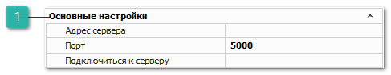

Группа содержит настройки подключения **Сервера** **Parts.Intellect**:

 **Основные настройки**

Блок содержит настройки:

- **Адрес сервера** – поле для указания IP-адреса компьютера, на котором установлен сервер Parts.Intellect;

::: warning Внимание!

Установить сервер необходимо на компьютер, на котором установлена база данных и SQL-сервер.

Установка сервера выполняется на этапе установки программы Parts.Intellect.

Минимальные технические характеристики для компьютера, на который устанавливается сервер приведены разделе **Общие аппаратные требования к рабочим местам**.

:::
- **Порт** – поле для указания порта сервера (по умолчанию 5000);

- **Подключиться к серверу** – кнопка для выполнения подключения к серверу.

::: warning Внимание!

Не нажимать на кнопку более одного раза. Повторное подключение к серверу**  Parts.Intellect рекомендуется выполнять только по запросу техподдержки. При этом все программы Parts.Intellect, кроме той в которой выполняется подключение, должны быть выключены.

:::

После того, как сервер установлен и подключен для выполнения части работ пользовательское приложение  Parts.Intellect отправляет запрос на сервер, а тот в свою очередь отправляет запрос базе данных. Сервер получает информацию от базы данных, производит расчеты и передает ответ пользователю. При этом пользовательское приложение Parts.Intellect, отправляет запросы в базу данных по функционалу, который не выполняется на сервере.

Запросы на сервере выполняются в порядке очереди. Каждый запрос выполняется с учетом разрешений, пользователя, отправившего запрос.

После отправки запроса на сервер, пользователь может продолжать работу в программе Parts.Intellect без ожидания результата расчета.

::: info Примечание

Состояние работоспособности **Сервера Parts.Intellect** можно увидеть на панели в перечне индикаторов состояний. При корректной работе индикатор отображается зеленым цветом.

:::

