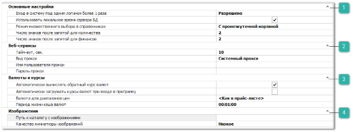

Группа **Системные настройки** содержит блоки настроек:

 **Основные настройки** 

Блок содержит настройки авторизации, работы со справочниками, а также правила округления:

- **Вход в систему под одним логином более 1 раза** – опция контролирует вход в базу данных под одной учетной записью более одного раза. Доступные значения:

    - **Разрешено** – вход в базу под одной учетной записью более одного раза разрешен;

    - **Предупреждать** – при повторном входе будет выдано предупреждение с возможностью повторного входа;

    - **Запрещено** – повторный вход в базы данных под одной и той же учетной записью запрещен.

::: info Примечание

Для пользователя с ролью *Admin* всегда действует режим **Предупреждать**.

:::

- **Использовать локальное время сервера БД** – устанавливает источник текущей даты и времени для всех операций в программе (создание документов, вычисление курсов и т.п.). Если опция отключена, то время создания записи в базе данных будет зависеть от локального времени на компьютере пользователя, где вносятся изменения;

- **Режим множественного выбора в справочниках** – активирует режим множественного выбора записей из справочников при добавлении в документы или мастера:

    - **Простой** – режим позволяет выбрать несколько записей из справочника и тут же добавить их в документ/мастер;

    - **С промежуточной корзиной** – программа позволяет сначала выбирать записи из справочника и помещать их в промежуточную корзину (в том числе из разных разделов справочника), а уже затем добавлять их в документ/мастер.

- **Число знаков после запятой для количества** – число знаков после запятой для единицы измерения количества. По умолчанию 0. Если задать отличное от 0 значение, то в программе появится возможность работать с дробными значениями для количества товара (например, продажа масла на разлив не целыми литрами);

- **Число знаков после запятой для финансов** – количество знаков после запятой для единицы измерения финансов. Применяется в документах и проценке. По умолчанию 2.

 **Веб-сервис**

Содержит настройки proxy-сервера, а также настройку времени ожидания ответа от веб-сервиса:

- **Тайм-аут, сек** – максимальное время ожидания ответа от веб-сервиса для получения результатов;

- **Вид прокси** – тип proxy-сервера:

    - **системный** – используются системные настройки proxy-сервера;

    - **прокси с авторизацией** – используются индивидуальные настройки;

    - **авторизация текущего пользователя** – будут использоваться настройки пользователя, заданные в настройках подключению браузера Internet Explorer.

- **Имя пользователя прокси** – имя пользователя для proxy с авторизацией;

- **Пароль прокси**  – пароль пользователя для proxy с авторизацией.

::: info Примечание

Если вы не знаете данных **proxy-сервера** в вашей сети, то обратитесь к вашему системному администратору для получения более подробной информации.

:::

 **Валюты и курсы**

Содержит настройки работы с различными валютами и курсами в системе:

- **Автоматически вычислять обратный курс валют** – активирует автоматическое вычисление обратного курса валют на основании прямого. Например, при наличии курса валюты "А" к валюте "Б", курс "Б" к "А" будет вычисляться автоматически;

- **Автоматически загружать курсы валют при входе в программу** – активирует механизм автоматической загрузки курсов валют при входе в базу данных. Загрузка курсов производится только для валют, по которым задан **Источник обновления**;

- **Валюта для диапазонов цен** – определяет, в какой валюте оперировать ценами и диапазонами цен при подборе маркетингов в **Проценке**:

    - если установлено значение *<Как в прайс-листе>*, то программа считает, что диапазоны цен в маркетингах заданы в валюте прайс-листа, для которого подбираются маркетинги (если все прайс-листы в одной валюте (например, рубль), то это значение опции подходит для работы);

    - если в настройке выбрана конкретная валюта для диапазонов цен, то все **Цены закупа** по позициям результатов поиска проценки предварительно конвертируются к этой валюте для подбора маркетингов с подходящими диапазонами.

- **Период жизни кэша валют** – указывается время "жизни" кэша с курсами валют в программе Parts.Intellect;

::: info Примечание

Для изменения времени кэша валют на сайте используется параметр **CurrencyCacheExpirationTimeInSeconds** в файле конфигурации веб-службы **Tradesoft.Parts.Intellect.WebService.exe.config**.

:::

 **Изображения** 

Содержит настройки использования изображений в программе:

- **Путь к каталогу с изображениями** – путь к каталогу на компьютере, в котором будут сохраняться изображения для **Товаров**, **Автомобилей**, **Контрагентов**, **Марок**, **Моделей**, **VIN**-**запросов**, **Заказ**-**нарядов**, **Производителей**. В случае переноса каталога в другое место, данный путь требуется изменить.

::: warning Внимание!

В указанном каталоге должна быть создана папка **Ware**. Изображения необходимо размещать в этой папке с именем в формате **Oid’\_имя файла** (например 123\_пример.jpg). В противном случае изображения не отобразятся в системе.

:::

- **Качество миниатюры изображений** – укажите степень сжатия для миниатюр изображений товаров. По умолчанию установлено значение **Низкое**, в этом случае миниатюры быстро формируются, но имеют низкое качество преобразования из оригинала. Если качество изображения не устраивает, его можно повысить ценой падения быстродействия;

