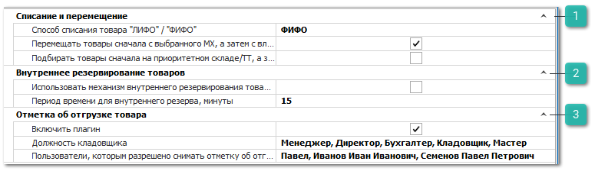

В группе **Движение товара**  представлены блоки настроек:

 **Списание и перемещение**

Блок содержит настройки способа списания и порядка перемещения товаров:

- **Способ списания товара** "**ЛИФО**"**/**"**ФИФО**" – выбирается порядок списания товара со склада, в зависимости от времени его прихода:

    - **ФИФО** – первый пришел – первый ушел (списание с начала);

    - **ЛИФО** – последний пришел – первый ушел (списание с конца).

- **Строгое списание по партиям** (доступна только на **Партионной** схеме ценообразования) – при включенной опции, в документах списания и/или резервирования товаров из наличия появляется возможность выбрать **Партию** товара для списания/резерва в одноименной колонке. Если по позиции указана конкретная партия для списания и в ней недостаточно товара, то проводка документа будет блокирована. Если в колонке **Партия** указано значение *<Автоматически>*, то программа спишет товар в нужном количестве со всех партий с учетом значения настройки **Способ списания товара** "**ЛИФО**"**/**"**ФИФО**";

- **Перемещать товары сначала с выбранного МХ, а затем с вложенных в него МХ** (мест хранения) – если опция включена, то при перемещении товара между складами программа в первую очередь будет подбирать товары с указанного по позиции **Старого склада/Места хранения**, а затем с мест хранения, входящих в него. При выключенной опции, подбор будет осуществляться единовременно с выбранного склада/места хранения и входящих в него мест. Подбор товара осуществляется в соответствии с заданной настройкой **Способ списания товара** "**ЛИФО**"**/**"**ФИФО**";

- **Подбирать товары сначала на приоритетном складе/ТТ, а затем на вложенных в него МХ** – если опция включена, то при списании товара программа в первую очередь будет подбирать товары с указанного по позиции **Приоритетного склада для списания**, затем со всех вложенных в него мест хранения. Если же опция выключена, то программа будет единовременно подбирать для списания товары с выбранного **Приоритетного склада для списания** и вложенных в него мест хранения. Подбор товара осуществляется в соответствии с заданной настройкой **Способ списания товара** "**ЛИФО**"**/**"**ФИФО**". Опция используется при списании/резервировании товара через документы: **Расходная накладная**, **Возврат поставщику**, **Заказ клиента**, **Заказ-Наряд**, **Резервирование**, **Отгрузка на реализацию**, **Списание товаров**.

::: info Примечание

Помимо данных настроек, в момент подбора товаров на перемещение или списания, учитывается так же доступность склада/места хранения для пользователя в текущий момент времени.

- Доступные пользователю склады/места хранения для перемещения и списания товары определяются настройками **Список складов/ТТ, доступных для перемещения товара** и **Список складов/ТТ, доступных для списания товара** в меню **Управление ►** **Настройки программы ► Роли пользователей ► Словари ► Склады/Торговые точки**;

- В момент проведения документа списания выбранное место хранения может находиться на **Инвентаризации**, а значит, списание товара с него в этот момент будет недоступно. Учитывая заданные настройки, программа может произвести списание товара с другого доступного места хранения товара;

- В разрешениях пользователя (**Управление ► Настройки программы ► Роли пользователей**) есть возможность установить вывод уведомления при резервировании/списании товара из наличия в момент проведения документа. Для типов документов **Заказ клиента**, **Расходная накладная** и **Заказ-Наряд** доступна опция **Списание/резервирование товаров со складов/МХ, отличных от приоритетного**, которая активирует при проводке документа проверку доступного количества товара на складе, установленном в качестве **Приоритетного склада для списания** по позиции.

Если количество товара из наличия в заказе недостаточно, то программа выдаст уведомление в зависимости от значения данной настройки.

:::

 **Внутреннее резервирование товаров**

Блок настроек для активации и настройки внутреннего резервирования товаров:

- **Использовать механизм внутреннего резервирования товаров** – опция отвечает за включение механизма внутреннего резервирования товаров в **Проценке**, **Быстрой продаже**, **Мастере расходной накладной**, **Мастере отгрузки на реализацию**, **Мастере возврата поставщику** и **Мастере перемещения**;

- **Период времени для внутреннего резерва, минуты** – количество минут, на которое товар резервируется за пользователем базы, при включенном механизме внутреннего резервирования. Пользователь может продлить время резерва, нажав на кнопку "+" в колонке **Внутренний резерв**.

Например:

::: note Пример

*Пользователь1* работает с *Клиентом1* и добавляет для него товары: *Т1*, *Т2*, которые на складе есть только в количестве по 1 шт. каждый. Пока *Пользователь1* набирает заказ, к *Пользователю2* подходит *Клиент2* и просит тот же товар *Т1*. Ему продают этот товар (который был в количестве 1 шт.), а когда *Пользователь1* закончил подбор товара для *Клиента1*, то при проводке **Расходной накладной** оказывается, что товара *Т1* уже недостаточно на складах. Благодаря механизму внутреннего резервирования товара, если *Пользователь1* добавил в список выбранных товаров в проценке из наличия товар *Т1*, то *Пользователь2* уже не сможет выбрать *этот же товар*, так как он находится в резерве за *Пользователем1*.

:::

Если механизм внутреннего резервирования включен, то после добавления товара из наличия в список выбранных позиций в проценке (**Быстрой продаже** или **Мастерах**), он резервируется за менеджером на период указанный в опции **Период времени для внутреннего резерва, минуты**.

Время окончания резерва выводится в колонке **Внутренний резерв** списка позиций. Для продления внутреннего резерва позиции достаточно нажать на кнопку "**+**" в колонке со временем внутреннего резерва.

Резерв снимается по окончанию времени, при удалении позиции из списка выбранных, при закрытии окна либо при проводке документа с зарезервированной позицией.

 **Отметка об отгрузке товара**

Блок содержит настройки для работы функционала, позволяющего кладовщику отмечать в системе собранные **Расходные накладные**:

- **Включить плагин** – включает использование функционала в программе и добавляет две дополнительные колонки **Кладовщик** и **Дата** **отгрузки** в список документов **Расходные накладные**, и дополнительную команду над документом **Снять отметку об отгрузке**. Поле **Дата** **отгрузки** заполняется после установки отметки **Кладовщиком**;

::: info Примечание

Интерфейс кладовщика, в котором можно устанавливать отметки об отгрузке для **Расходных накладных**, устанавливается в **Настройках пользователя** в поле **Интерфейс пользователя,** значение **Отметка об отгрузке товара**.

:::

- **Должность кладовщика** – указывается должность кладовщика (одна или несколько) из справочника **Должностей** (сотрудник закрепляется в карточке **Пользователя** базы данных в разделе меню **Управление ► Настройки программы ► Пользователи**);

- **Пользователи, которым разрешено снимать отметку об отгрузке товара** – указывается пользователи, которым будет доступна команда **Снять отметку об отгрузке** в списке **Расходных накладных**.

