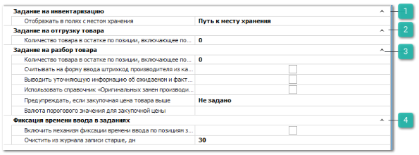

# Задания на склад
В группе **Задания на склад** представлены блоки настроек для документов: Задание на инвентаризацию, **Задание на отгрузку товара**, **Задание на разбор товара**, **Фиксация времени ввода в заданиях**. 

 **Задание на инвентаризацию**

Блок содержит настройку:

- **Отображать в полях с местом хранения** – регулирует отображение информации о местах хранения товара на форме ввода документа **Задания на инвентаризацию**. Доступные значения:

    - **Путь к месту хранения** – будет отображать полный путь до места хранения товара;

    - **Идентификатор места хранения** – будет отображаться только идентификатор места хранения, если он задан в справочнике **Склады/Торговые точки**.

 **Задание на отгрузку товара**

Блок содержит настройки:

- **Количество товара в остатке по позиции**, **включающее поштучный прием** – настройка определяет порог по остатку товара в **Задании на отгрузку товара** для поштучного ввода. Если введен 0, то поштучный ввод не применяется для данного типа заданий. Если, например, введено 5, то при ожидаемом количестве товар по товару 5 и менее, включается поштучный ввод. Где на каждый выбор/сканирование товара программа автоматически прибавляет 1 шт. товара и предлагает ввод следующего товара;

- **Печать этикеток для груза** – настройка регулирует доступность команды **Печать этикеток для груза** в разделе **Задание на отгрузку товара**. Этикетки печатаются с учетом указанного пользователем количества мест для груза. Команда доступна только для документов в состоянии **Выполнено**.

 **Задание на разбор товара**

Блок содержит настройки:

- **Количество товара в остатке по позиции, включающее поштучный прием** – определяет порог по количеству товара в **Задании на разбор товара** для поштучного ввода. Если введен 0, то поштучный ввод не применяется для данного типа заданий. Если, например, введено 5, то при ожидаемом количестве по товару 5 и менее, включается поштучный ввод. Где на каждый выбор/сканирование товара программа автоматически прибавляет 1 шт. товара и предлагает ввод следующего товара;

- **Считывать на форму ввода штрихкод производителя из карточки товара для выбранной позиции** – в форму ввода будет автоматически подставляться **Штрихкод производителя** из карточки товара в справочнике, если он заполнен;

- **Выводить уточняющую информацию об ожидаемом и фактическом количестве выбранной позиции** – при активной опции в **Задании на разбор товара** выводятся две дополнительные колонки **Количество ожидаемое** (количество которое передается из **Мастера приходной накладной**) и **Количество фактическое** (количество, указанное в форме ввода);

- **Использовать справочник** "**Оригинальных замен производителей**" **для поиска по актуальному артикулу** – при вводе товара в задании будет использоваться поиск соответствий для позиций по справочнику **Оригинальные замены** **производителей**;

- **Предупреждать, если закупочная цена товара выше** – для опции задается предельное значение закупочной цены, если цена позиции выше или равна введенной в настройке, то рядом с полем **Цена** выводится соответствующая иконка с текстом предупреждения "Высокая стоимость товара";

- **Валюта порогового значения для закупочной цены** – указывается валюта, в которой считается пороговое значение цены закупа (обязательная настройка для работы опции, указанной выше). Если не задан курс валют, пользователю выведется диалог с предложением задать курс.

 **Фиксация времени ввода в заданиях**

Блок содержит настройки:

- **Включить механизм фиксации времени ввода по позициям задания** – включает механизм, позволяющий фиксировать и отображать **Время ввода** по позициям заданий;

- **Очистить из журнала записи старше, дн** – информация о времени ввода по позициям будет удалена из базы через заданный промежуток времени.

::: info Примечание

Отображение колонки **Время ввода** в документах заданий регулируется разрешением для пользователя **Видна колонка** "**Время ввода**" для каждого типа задания в разделе меню **Управление ► Настройки программы ► Роли пользователей**.

:::

