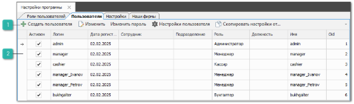
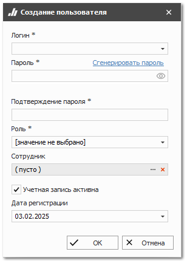
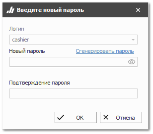
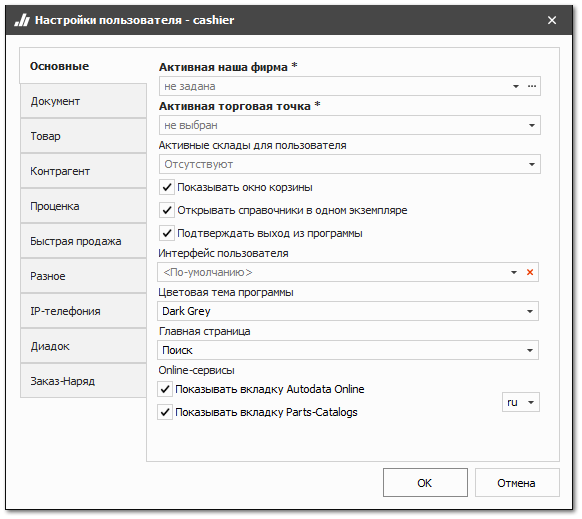
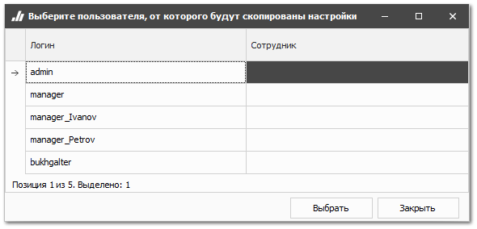
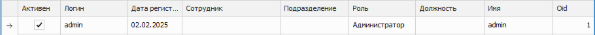

Вкладка **Пользователи** позволяет создавать и редактировать пользователей программы.

::: warning Внимание!

Учетные записи с ролью **Администратор** рекомендуется использовать только для настройки программы и управления пользователями. Для работы в базе данных лучше использовать другие роли.Email администратора определяется сотрудником, привязанным к пользователю с ролью **Администратор**.

:::

Вкладка содержит следующие элементы:

 **Панель действий**

Панель действий содержит следующие команды:

- **Создать пользователя** – позволяет открыть форму создания нового пользователя;

- **Изменить** – позволяет открыть форму редактирования пользователя.

::: note Заметка

Поля **Логин** и **Пароль** недоступны для редактирования по команде **Изменить**.

:::

- **Изменить пароль** – позволяет изменить пароль пользователя;

- **Настройки пользователя** – позволяет вызвать окно персональных настроек выбранного пользователя;

- **Скопировать настройки от...** – позволяет скопировать от другого пользователя разрешения, настройки пользователя и настройки интерфейса программы.

 **Табличная часть**

Табличная часть содержит пользователей программы:

- **Активен** – выводит статус активности пользователя;

::: note Заметка

Если пользователь неактивен, то ему недоступна авторизация в программе.Статус активности изменяется на форме редактирования пользователя.

:::

- **Логин** – выводит логин пользователя;

- **Дата регистрации** – выводит дату регистрации пользователя;

- **Сотрудник** – выводит сотрудника, назначенного для пользователя (справочник **Сотрудники**);

- **Подразделение** – выводит подразделение пользователя (справочник **Подразделения**);

- **Роль** – выводит роль пользователя;

- **Должность** – выводит должность сотрудника (справочник **Должности**);

- **Имя** – выводит логин пользователя или ФИО сотрудника;

- **Oid** – выводит уникальный идентификатор пользователя.

