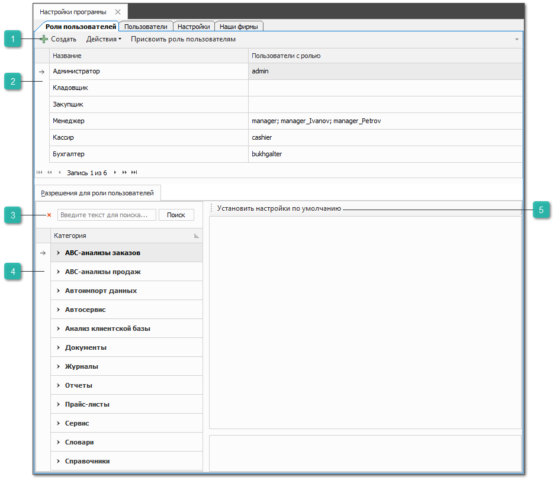
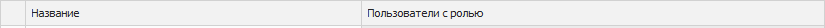
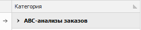
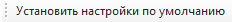

Раздел **Роли пользователей** позволяет создавать роли пользователей, а также регулировать доступы с помощью разрешений. Роль пользователя определяет доступные разделы, а также набор разрешений в программе.

::: warning Внимание!

Учетные записи с ролью **Администратор** рекомендуется использовать только для настройки программы и управления пользователями. Для работы в базе данных лучше использовать роли с меньшими правами доступа.

:::

 **Панель действий**

Содержит следующие команды:

- **Создать** – позволяет создать новую роль;

- **Действия** – содержит список команда:

    - **Удалить** – позволяет удалить роль;

    - **Переименовать** – позволяет переименовать роль;

    - **Копировать** – позволяет дублировать роль с сохранением настроенных разрешений;

::: note Замечание
	
При копировании необходимо задать название для новой создаваемой роли.

:::

- **Присвоить роль пользователям** – позволяет присвоить роль одному или нескольким пользователям.

::: warning Внимание!

Каждому пользователю можно присвоить только одну роль.

:::

 **Табличная часть**

Табличная часть содержит созданные роли пользователей:

- **Название** – отображает название роли;

- **Пользователи с ролью** – отображает пользователей с данной ролью. При наличии нескольких пользователей они отображаются через точку с запятой.

 **Поиск**

Позволяет осуществить поиск по названиям разделов разрешений.

::: warning Внимание!

Поиск по названиям разрешений внутри разделов НЕ производится.

:::

 **Разрешения для роли пользователей**

Блок содержит перечень разделов с разрешениями для пользователя. Разрешения разделенны на категории в зависимости от их применения в программе.

 **Установить настройки по умолчанию**

Позволяет сбросить разрешения для выбранной роли пользователя в состояние по умолчанию.

::: details В программе установлены настройки и разрешения для ролей по умолчанию.

||Кладовщик|Закупщик|Менеджер|Кассир|Бухгалтер|
|-|--------|--------|--------|------|---------|
|Недоступны разделы/отчеты|- Заказы клиентов (документ) - Счета и кассы; - Резервирования; - Отмены резервирования; - Заказ-наряды; - Отчет о прибыли; - Отчет о прибыли в разрезе прихода; - Отчет о прибыли по менеджерам; - Отчет о прибыли по менеджерам в разрезе расходных накладных; - Сводный отчет о прибыли по менеджерам; - Анализ заказов; - Заказы клиентов (отчет); - Отчет о выполненных заказах; - Отчет по выполненным Заказ-нарядам; - Реестр Заказ-нарядов; - Дашборд; - Расходные кассовые ордера; - Приходные кассовые ордера; - Возврат по банковской карте; - Оплата по банковской карте; - Платежные поручения; - Платежные поручения входящие; - Перемещения денежных средств; - Валюты и курсы; - Статьи расходов/доходов; - Журнал слип-чеков; - Журнал учета чеков; - Журнал сессий пользователей; - Журнал звонков; - Журнал действий; - Задачи; - Журнал уведомлений; - Журнал финансовых транзакций; - VIN-запросы; - Автомобили; - Автоимпорт заказов клиентов; - Общий журнал; - Журнал блокировок; - Отказы клиентов; - ABC-анализ; - RFM-анализ; - ABC-анализ заказов; - ABC-анализы продаж; - Веб-прайс-листы поставщиков; - Прайс-листы поставщиков; - Маркетинги для заказных позиций; - Генерация обобщенного прайс-листа; - Сравнение и актуализация прайс-листов; - Автоимпорт прайс-листов; - Применяемость товаров; - Аналоги; - Черные аналоги; - Бригады; - Виды ремонта; - Группы комплексов; - Группы работ; - Задания в ремзону; - Изображения типовых автомобилей; - Комплексы; - Посты; - Работы; - Стоимости нормочасов; - Акт сверки; - Выработка по исполнителям; - Движение денег; - Движение товара по поставщикам; - Детализация балансов; - Ежедневный отчет по кассе; - Заказы поставщикам в разрезе прайс-листов; - Запрашиваемые товары; - Назначение платежей; - Неудовлетворённый спрос; - Обороты по контрагенту; - Оплаченный товар за период; - Отклонение плановых цен продажи от фактических; - Отчет о предстоящей дебиторской задолженности; - Отчет о продажах по торговой точке; - Отчет о расходе от поставщика; - Отчет о текущей дебиторской задолженности; - Отчет по журналу учета чеков; - Отчет по изменениям карточек контрагентов; - Отчет по изменениям карточек товаров; - Отчет по поставщику; - Отчет по работам; - Печатная форма ТОРГ-29; - Платежи по документам - Реестр исходящих счетов-фактур - Реестр накладных и платежей - Сколько заработано за день - Статистика запросов проценки - Виды задач - Виды топлива - Города - Диапазоны цен - Должности - Источники обращений - Состояния задач - Способы оплаты - Способы доставки - Статусы клиента - Страны - Типы КПП - Типы кузова - Типы привода - Типы рулевого управления - Типы тормозов - Учетные записи email - Учетные записи FTP - Формы собственности - Категории клиентов - Марки - Модели - Модификации - Подразделения - Сборочные группы - Сотрудники - Счетчики номеров документов - Доверенности клиентов - Доверенности на сотрудников - Отчет о кредиторской задолженности - Оборотно-сальдовая ведомость по контрагентам| - Счета и кассы; - Резервирования; - Отмены резервирования; - Заказ-наряды; - Отчет о прибыли; - Отчет о прибыли в разрезе прихода; - Отчет о прибыли по менеджерам; - Отчет о прибыли по менеджерам в разрезе расходных накладных; - Сводный отчет о прибыли по менеджерам; - Отчет по выполненным Заказ-нарядам; - Реестр Заказ-нарядов; - Дашборд; - Автоимпорт заказов клиентов; - Автоимпорт приходных документов; - Расходные кассовые ордера; - Приходные кассовые ордера; - Возврат по банковской карте; - Оплата по банковской карте; - Платежные поручения; - Платежные поручения входящие; - Перемещения денежных средств; - Статьи расходов/доходов; - Журнал слип-чеков; - Журнал учета чеков; - Журнал сессий пользователей; - Журнал звонков; - Журнал действий; - Задачи; - Журнал уведомлений; - Журнал финансовых транзакций; - VIN-запросы; - Автомобили; - Общий журнал; - Журнал блокировок; - Отказы клиентов; - ABC-анализ; - RFM-анализ; - Генерация обобщенного прайс-листа; - Применяемость товаров; - Бригады; - Виды ремонта; - Группы комплексов; - Группы работ; - Задания в ремзону; - Изображения типовых автомобилей; - Комплексы; - Посты; - Работы; - Стоимости нормочасов; - Выработка по исполнителям; - Движение денег; - Детализация балансов; - Ежедневный отчет по кассе; - Назначение платежей; - Оборотно-сальдовая ведомость по контрагентам; - Обороты по контрагенту; - Отчет о кредиторской задолженности; - Отчет о предстоящей дебиторской задолженности; - Отчет о продажах по торговой точке; - Отчет о текущей дебиторской задолженности; - Отчет по журналу учета чеков; - Отчет по изменениям карточек контрагентов; - Отчет по изменениям карточек товаров; - Отчет по работам; - Печатная форма ТОРГ-29; - Платежи по документам; - Реестр исходящих счетов-фактур; - Сколько заработано за день; - Статистика запросов проценки; - Виды задач; - Виды топлива; - Города; - Диапазоны цен; - Должности; - Источники обращений; - Состояния задач; - Способы оплаты; - Статусы клиента; - Страны; - Типы КПП; - Типы кузова; - Типы привода; - Типы рулевого управления; - Типы тормозов; - Формы собственности; - Категории клиентов; - Марки; - Модели; - Модификации; - Подразделения; - Сборочные группы; - Сотрудники; - Счетчики номеров документов; - VIN-запросы; - Отказы клиентов; - Расходные накладные; - Возвраты от клиентов; - Доверенности клиентов; - Доверенности на сотрудников; - Задания на инвентаризацию; - Задания на отгрузку товара; - Задания на разбор товара; - Корректировки расходных накладных; - Перемещения товаров; - Списания товаров; - Журнал внутренних резервов; - Экспорт прайс-листа; - Отгрузки на реализацию; - Возвраты поставщикам;| - Выработка по исполнителям; - Дашборд; - Движение денег; - Движение товара по поставщикам; - Ежедневный отчет по кассе; - Отчет о прибыли; - Отчет о прибыли в разрезе прихода; - Отчет о прибыли по менеджерам; - Отчет о прибыли по менеджерам в разрезе расходных накладных; - Сводный отчет о прибыли по менеджерам;| - Акт сверки; - Анализ заказов; - Ведомость неликвидов; - Выработка по исполнителям; - Дашборд; - Движение денег; - Движение и наличие товара; - Движение товара по поставщикам; - Детализация балансов; - Заказы клиентов; - Заказы поставщикам в разрезе прайс-листов; - Запрашиваемые товары; - Назначение платежей; - Оборотно-сальдовая ведомость по контрагентам; - Обороты по контрагенту; - Оплаченный товар за период; - Отклонение плановых цен продажи от фактических; - Отчет о выполненных заказах; - Отчет о кредиторской задолженности; - Отчет о перемещении товара; - Отчет о предстоящей дебиторской задолженности; - Отчет о прибыли; - Отчет о прибыли в разрезе прихода; - Отчет о прибыли по менеджерам; - Отчет о прибыли по менеджерам в разрезе расходных накладных; - Отчет о продажах по торговой точке; - Отчет о расходе от поставщика; - Отчет о текущей дебиторской задолженности; - Отчет по выполненным Заказ-нарядам; - Отчет по изменениям карточек контрагентов; - Отчет по изменениям карточек товаров; - Отчет по поставщику; - Отчет по работам; - Печатная форма ТОРГ-29; - Расширенный отчет об остатках; - Расширенный отчет об остатках (по состояниям); - Реестр Заказ-нарядов; - Реестр исходящих счетов-фактур; - Реестр накладных и платежей; - Сводный отчет о прибыли по менеджерам; - Товар в заказе поставщику; - Экспорт прайс-листа;| - Ведомость неликвидов; - Движение и наличие товара; - Движение товара по поставщикам; - Запрашиваемые товары; - Неудовлетворённый спрос; - Обороты по контрагенту; - Оплаченный товар за период; - Отклонение плановых цен продажи от фактических; - Отчет о выполненных заказах; - Отчет о перемещении товара; - Отчет о расходе от поставщика; - Отчет по изменениям карточек контрагентов; - Отчет по изменениям карточек товаров; - Отчет по поставщику; - Расширенный отчет об остатках; - Расширенный отчет об остатках (по состояниям); - Статистика запросов проценки; - Товар в заказе поставщику; - Экспорт прайс-листа.|
|Недоступно создание| - Заказы клиентов; - VIN-запросы; - Отказы клиентов; - Расходные накладные; - Заказы поставщикам; - Отказы поставщиков; - Приходные кассовые ордера; - Расходные кассовые ордера; - Чат на основе Telegram-бота| - VIN-запрос; - Возвраты от клиентов; - Заказы клиентов; - Задания на инвентаризацию; - Задания на отгрузку товара; - Задания на разбор товара; - Корректировки приходных накладных; - Перемещения товаров; - Приходные кассовые ордера; - Приходные накладные; - Расходные кассовые ордера; - Расходные накладные; - Чат на основе Telegram-бота|| - Чат на основе Telegram-бота| - Чат на основе Telegram-бота|
|Недоступно проведение и отмена проведения| - Расходные накладные; - Заказы поставщикам; - Отказы поставщиков;| - Заказы клиентов; - Приходные накладные; - Расходные накладные;||||

:::

::: details Читайте также

- [Настройки пользователя](../../nastrojki_polzovatelya/vkladka_osnovnye.md)

- [Справочник Сотрудники](../../spravochniki/sotrudniki.md)

- [Добавление нового пользователя в системе](../../../../guide/initial/dobavlenie_novogo_polzovatelja_v_sisteme.md)

:::