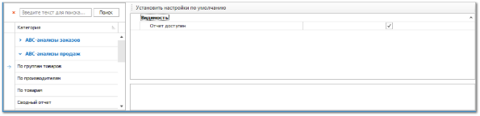

Группа разрешений для доступа к различным видам **ABC-анализа продаж** в программе. В группе для каждого вида анализа содержится единственный тип разрешения – **Видимость**.

Блок **Видимость** содержит единственный параметр **Отчет доступен**, который определяет видимость пункта анализа в **Главном меню** программы.

