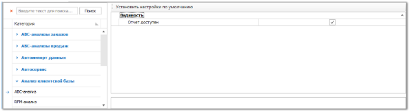
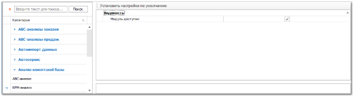

Группа разрешения для доступа к инструментам для анализа контрагентов **RFM-анализ**.

Блок **Видимость** содержит единственный параметр **Отчет доступен**, который определяет видимость пункта анализа в **Главном меню** программы.

Группа разрешения для доступа к инструментам для анализа контрагентов **RFM-анализ**.

Блок **Видимость** содержит единственный параметр **Модуль доступен**, который определяет видимость пункта анализа в **Главном меню** программы.

