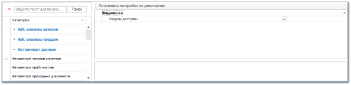

Группа разрешений для доступа к модулям **Автоимпорта прайс-листов**, **Автоимпорта приходных документов** и **Автоимпорта заказов клиентов**. В группе для каждого вида модуля содержится единственный тип разрешения – **Видимость**.

Блок **Видимость** содержит единственный параметр **Модуль доступен**, который определяет видимость пункта модулей в **Главном меню** программы.

