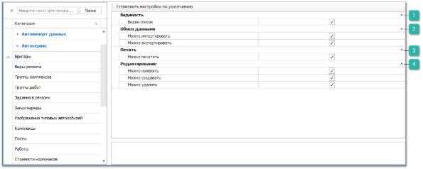

# Автосервис (разрешения)

Данная группа содержит перечень разрешений для доступа к функциям и содержимому модуля **Автосервис**.

В данной категории разрешения для всех справочников, кроме справочников **Задания в ремзону** и **Заказ-наряды**.

 **Видимость**

Позволяет определить доступ пользователя к просмотру записей в справочнике. При установленной галке **Виден список**, справочник будет доступен для просмотра пользователю как пункт главного меню, так и при вызове справочника в других окнах программы.

 **Обмен данными**

Позволяет определить доступность пользователю экспорта и импорта данных из справочника. Доступные значения: **Можно импортировать** и **Можно экспортировать**.

::: info Примечание

При отключении опции **Можно экспортировать** применяется запрет на массовое копирование записей (выделение множества записей в таблицах `CTRL+A` и их последующее копирование `CTRL+C`).

:::

 **Печать** 

Позволяет определить доступность печати данных из справочника, при наличии кнопки **Печать** в панели управления и доступных печатных форм.

 **Редактирование**

Позволяет определить доступность следующих разрешений:

- **Можно изменять** - определяет возможность пользователю изменять существующие записи в справочниках;

- **Можно создавать** - определяет возможность добавлять новые записи словари;

- **Можно удалять** - определяет доступ пользователя на удаления записей в справочниках.