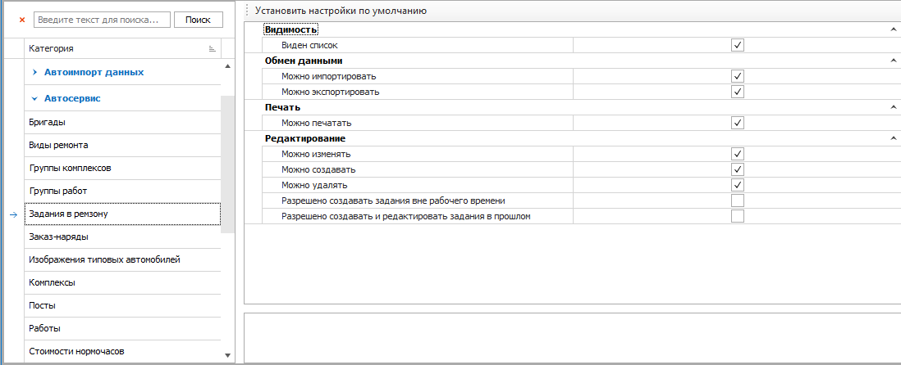
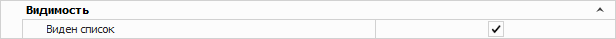
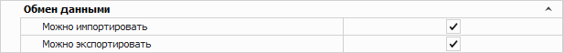
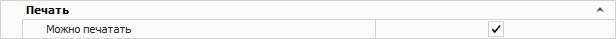
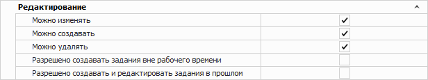

Раздел содержит следующие блоки опций:

- [Видимость](#видимость);

- [Обмен данными](#обмен-данными);

- [Печать](#печать);

- [Редактирование](#редактирование).

## Видимость

Блок содержит разрешение:

- **Виден список** – позволяет определить доступ пользователя к просмотру записей в справочнике. При установленной галке Виден список, справочник будет доступен для просмотра пользователю как пункт главного меню, так и при вызове справочника в других окнах программы.

## Обмен данными

Блок содержит разрешения:

- **Можно импортировать** – позволяет определить доступность пользователю импорта данных из справочника;

- **Можно экспортировать** – позволяет определить доступность пользователю экспорта данных из справочника.

## Печать

Блок содержит разрешение:

- **Можно печатать** – позволяет определить доступность печати данных из справочника, при наличии кнопки Печать в панели управления и доступных печатных форм.

## Редактирование

Блок содержит разрешения:

- **Можно изменять** – определяет возможность пользователю изменять существующие записи в справочниках;

- **Можно создавать** – определяет возможность добавлять новые записи словари;

- **Можно удалять** – определяет доступ пользователя на удаления записей в справочниках;

- **Разрешено создавать задания вне рабочего времени** – позволяет создавать задания вне рабочего времени поста;

- **Разрешено создавать и редактировать задания в прошлом** – позволяет создавать задания в ремзону вчерашним днем и редактировать их. Иначе доступна возможность создавать задания только сегодняшним днем или позже.

::: details Читайте также

- [Настройки программы - Роли пользователей - Автосервис](./README.md)

- [Справочник Посты](../../../../avtoservis/spravochniki/posty.md)

- [Документы Задания в ремзону](../../../../avtoservis/zadaniya_v_remzonu.md)

:::