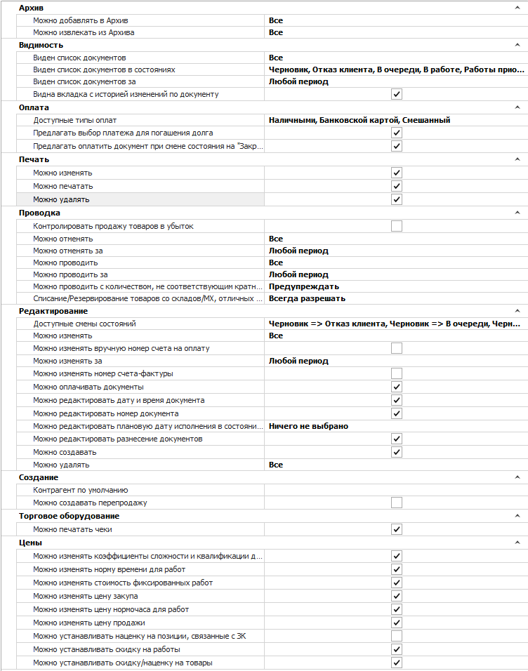
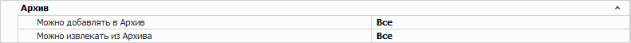
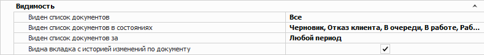
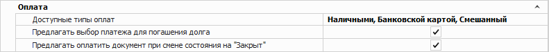
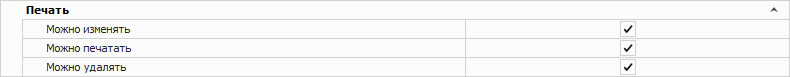
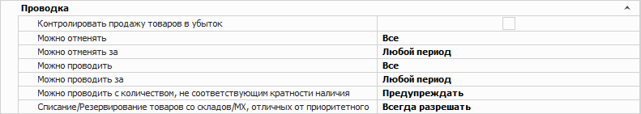
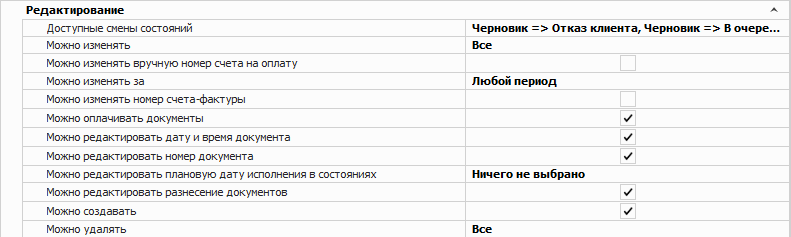
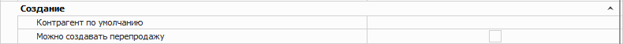
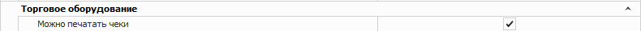
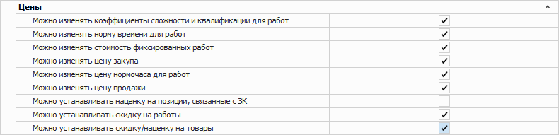

Группа разрешений для документов **Заказ-наряд**. В данной категории содержатся следующие блоки опций:

- [Архив](#архив)

- [Видимость](#видимость)

- [Оплата](#оплата)

- [Печать](#печать)

- [Проводка](#проводка)

- [Редактирование](#редактирование)

- [Создание](#создание)

- [Торговое оборудование](#торговое-оборудование)

- [Цены](#цены)

## Архив

Позволяет определить для пользователя возможность архивировать данный вид документа и извлекать из архива.

Доступные значения:

- **Можно добавлять в Архив**;

- **Можно извлекать из Архива**.

## Видимость

Позволяет определить доступ пользователя на просмотр списка документов данного типа.

Доступные значения:

- **Виден список документов** – пользователю доступен для просмотра весь список документов;

- **Виден список документов в состояниях** – позволяет ограничить пользователю просмотр документов в определенных состояниях;

- **Виден список документов за** – пользователю можно установить ограничение для доступа к документам только за определенный период;

- **Видна вкладка с историей изменений по документу** – видимость вкладки **История по документу** в **Заказ-наряде**.

## Оплата

Позволяет определить следующие ограничения:

- **Доступные типы оплат** – определяет список типов оплат, которые будут предложены пользователю при проведении документа;

- **Предлагать выбор платежа для погашения долга** – при проведении документа программа проверит наличие не разнесенных платежных документов, которые можно связать с текущим заказом, и предложит данные платежи для оплаты документа;

- **Предлагать оплатить документ при проводке** – при проведении документа будет осуществляться автоматический вызов интерфейса оплаты.

## Печать

Позволяет задать ограничения на печать и изменение печатных форм для документа.

Доступные значения:

- **Можно изменять** – определяет доступность команд: **Изменить**, **Копировать**, **Импорт** и **Переименовать** в окне **Мастера печати**;

- **Можно печатать** – определяет доступность вывода печатных форм по документу при наличии кнопки Печать в панели управления и доступных печатных форм;

- **Можно удалять** – определяет доступность команды **Удалить** в окне **Мастера печати**.

## Проводка

Позволяет настроить разрешения на выполнение действия Провести и Отменить проводку над документом. 

Доступные значения:

- **Контролировать продажу товаров в убыток** – при проведении документа, если цена продажи будет ниже цены закупа для позиций в связанных Приходных накладных, то программы выдаст соответствующее уведомление;

- **Можно отменять** – доступность на отмену проводки документов данного вида, в зависимости от автора: Все, Только свои, Только авторов своих подразделений, Только авторов и ответственных менеджеров своих подразделений, Запрещено;

- **Можно отменять за** – определяет временной период, за который можно отменять проводку документов;

- **Можно проводить** – доступность на проведение документов данного вида, в зависимости от автора: Все, Только свои, Только авторов своих подразделений, Только авторов и ответственных менеджеров своих подразделений, Запрещено;

- **Можно проводить за** – определяет временной период, за который можно проводить документы;

- **Можно проводить с количеством, не соответствующим кратности наличия** – определяет способ проверки количества заказываемого товара из наличия на кратность в рамках всего документа:

    - **Предупреждать** – значение по умолчанию. При несоответствии кратности поле Кол-во подсвечивается желтым цветом, а при проводке документа выходит диалоговое окно с доступными действиями:

        ::: info Примечание

        Если товар добавлен в документ несколькими строками, то проверка на кратность будет проводиться по сумме количества товара во всех строках. Подсветка будет применена ко всем строкам товара.

        :::

        - **изменить количество товара вручную** – отмена проводки и возврат к инспектору документа для исправления данных вручную;

        ::: info Примечание

        В документе будет применена фильтрация по позициям с некорректной кратностью. При указании корректного значения кратности, позиции также будут отфильтрованы. При этом фильтрация может быть сброшена вручную или при повторном проведении документа.

        :::

        - **продолжить без изменений** – проводка документа без изменений;

    - **Запрещено** – при несоответствии кратности поле Кол-во подсвечивается желтым цветом, а при проводке документа выходит диалоговое окно с доступными действиями:

        ::: info Примечание

        Если товар добавлен в документ несколькими строками, то проверка на кратность будет проводиться по сумме количества товара во всех строках. Подсветка будет применена ко всем строкам товара.

        :::

        - **изменить количество товара вручную** – отмена проводки и возврат к инспектору документа для исправления данных вручную;

    ::: info Примечание

    В документе будет применена фильтрация по позициям с некорректной кратностью. При указании корректного значения кратности, позиции также будут отфильтрованы. При этом фильтрация может быть сброшена вручную или при повторном проведении документа.

    :::

    - **Разрешено** – проверка на кратность не выполняется. Документ может быть проведен в любом виде;

- **Списание/резервирование товаров со складов/МХ, отличных от приоритетного** – при проводке документа программа проверит доступное количество товара на складе, установленном в качестве Приоритетного склада для списания по позиции. Если количество товара для списания недостаточно на приоритетном складе, то программа выдаст уведомление в зависимости от настройки:

    - **Всегда разрешать** – при отсутствии достаточного количества товара на приоритетном складе, недостающий товар спишется с другого доступного для пользователя склада;

    - **Спросить** – выйдет диалоговое окно с запросом на отмену проводки документа или списания с других доступных складов;

    - **Всегда запрещать** – если на приоритетном складе нет достаточного количества товара, то программа не даст провести документ.

::: info Примечание

Списание осуществляется по действующему в системе принципу ФИФО/ЛИФО среди доступных складов. Выбрать принцип списания можно в разделе Управление ► Настройки программы ► Настройки ► группа Склад и закупки ► Движение товара настройка Способ списания товара ЛИФО/ФИФО.

:::

## Редактирование

Позволяет определить следующие ограничения:

- **Доступные мены состояний** – выберите доступные пользователю типы изменений состояний для документа **Заказ-наряд**;

- **Можно изменять** – определяет возможность пользователю изменять существующие документы;

- **Можно изменять вручную номер счета на оплату** – позволяет пользователю вручную задавать и/или менять значение поля **Номер счета на оплату** в параметрах документа;

- **Можно изменять вручную номер счета-фактуры** – изменение номера счета-фактуры в параметрах документа;

::: info Примечание

Настройки автоматической нумерации счетов на оплату расположены в разделе меню **Управление ► Справочники ► Счетчик номеров документов**.

:::

- **Можно изменять за** – возможность пользователю изменять существующие документы за определенный период;

- **Можно оплачивать документы** – определяет доступность пользователю создавать на основании **Заказ-нарядов** платежные документы;

- **Можно редактировать дату и время документа** – возможность изменять дату и время создания в параметрах документа;

- **Можно редактировать номер документа** – возможность изменять номер в параметрах документа;

- **Можно редактировать плановую дату исполнения в состояниях** – определяет состояния **Заказ-нарядов**, при которых можно изменять значение поля **Плановая дата исполнения** в основных параметрах документа;

- **Можно создавать** – определяет возможность добавлять новые документы данного вида;

- **Можно удалять** – определяет доступ пользователя на удаления документов в зависимости от автора.

## Создание

- **Контрагент по умолчанию** – задает контрагента, который будет подставляться автоматически при создании нового документа **Заказ-наряд**.

- **Можно создавать перепродажу** – задает возможность создания перепродажи. После включения настройки доступна команда **Создать перепродажу** на панели инструментов в разделе **Автосервис ► Заказ-наряды**. 

::: info Примечание

Для добавления команды **Создать перепродажу** рекомендуется перезайти в программу Parts.Intellect и сбросить панель команд инструментов. Для сброса панели инструментов команд нажмите на кнопку  в правом углу панели инструментов и выберите команду **Добавить или удалить кнопки ► Действие ► Сброс панели**.

:::

## Торговое оборудование

- **Можно печатать чеки** – позволяет задать доступ пользователю к печати чеков по документу и его позициям.

## Цены

Позволяет определить доступ пользователя на изменение разного типа цен:

- **Можно изменять коэффициент сложности и квалификации для работ** – при включенном разрешении пользователю доступна возможность устанавливать значения коэффициентов сложности для работ при редактировании уже добавленной работы в документ;

- **Можно изменять норму времени для работ** – доступность пользователю редактировать норму времени при редактировании уже добавленной работы в документ;

- **Можно изменять стоимость фиксированных работ** – возможность редактировать фиксированную цену при редактировании уже добавленной работы в документ;

- **Можно изменять цену закупа** – изменение закупочной цены на товар прямо в документе;

- **Можно изменять цену нормочаса для работ** – возможность редактировать стоимость нормочаса при редактировании уже добавленной работы в документ;

- **Можно изменять цену продажи** – изменение цены продажи на товар в документе;

- **Можно устанавливать наценку на позиции, связанные с ЗК** – разрешает применение для позиций команды **Наценка/Скидка** с изменением цены продажи для позиций, связанных с **Заказами клиентов**;

- **Можно устанавливать скидку на работы** – разрешение устанавливать скидку при редактировании работы, либо с помощью команды **Скидка, %** на панели инструментов вкладки **Работы** документа **Заказ-наряд**;

- **Можно устанавливать скиду/наценку на товары** – разрешение устанавливать скидку и/или **Наценку** на товары с помощью команды **Наценка/Скидка** на панели инструментов вкладки **Товары** документа **Заказ-наряд**.

::: details Читайте также

- [Документы Заказ-наряды](../../../../avtoservis/zakaz-naryady.md)

- [Журнал Архив документов](../../../../upravlenie/zhurnaly/arkhiv_dokumentov.md)

- [Интерфейс оплаты](../../../../../work/vzaimoraschety/interfejs_oplaty.md)

- [Основные команды для работы с записями в таблицах](../../../../obshchie_printsipy/osnovnye_komandy_dlja_raboty_s_zapisjami_v_tablitsah.md)

- [Настройки программы - Настройки - Склад и закупки (Движение товара - Способ списания товаров ЛИФО/ФИФО)](../../nastrojki/sklad_i_zakupki/dvizhenie_tovara.md)

- [Справочник Счетчики номеров документов](../../../spravochniki/schetchiki_nomerov_dokumentov.md)

:::