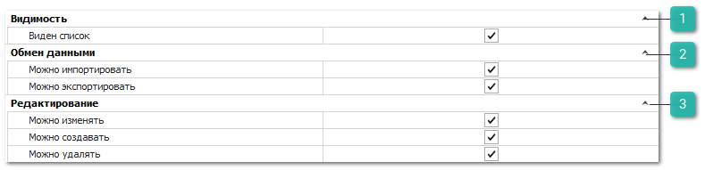

Группа разрешений для доступа к документам **Доверенности клиентов**.

 **Видимость**

Содержит настройку **Виден список**, которая позволяет определить доступ пользователя на просмотр списка документов данного типа.

 **Обмен данными**

Позволяет определить доступность пользователю экспорта и импорта данных из документа. Доступные разрешения: 

- **Можно импортировать**,** 

- **Можно экспортировать**.

::: info Примечание

При отключении опции **Можно экспортировать** применяется запрет на массовое копирование записей (выделение множества записей в таблицах "CTRL+A" и их последующее копирование (CTRL+C)).

:::

 **Редактирование**

Позволяет установить следующие разрешения:

- **Можно изменять** – определяет возможность пользователю изменять существующие документы;

- **Можно создавать** – определяет возможность добавлять новые документы данного вида;

- **Можно удалять –** определяет доступ пользователя на удаления документов в зависимости от автора.
