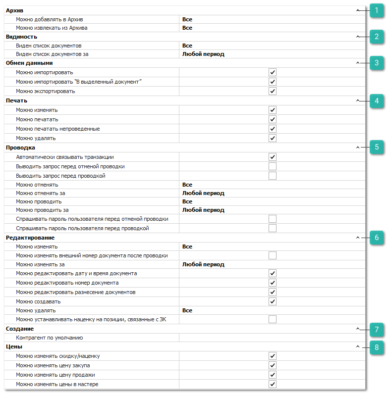
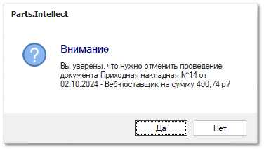

Группа разрешений для доступа к документам **Приходные накладные**.

 **Архив**

Позволяет определить возможность для пользователя архивировать данный вид документа и извлекать из архива. Доступные разрешения: 

- **Можно добавлять в Архив** - ограничение доступа на работу с архивом. Доступные значения:

    - **Все** – пользователю доступно добавление в архив;

    - **Только** **свои** – пользователю доступно добавление в архив документов, в которых он является автором, и документы, где указан клиент, для которого пользователь является ответственным менеджером.

    - **Только** **авторов своих подразделений** – пользователю доступно добавление в архив документов, где он является автором, и документы, где авторами являются сотрудники его подразделений.

    - **Только авторов и ответственных менеджеров своих подразделений** – пользователю доступно добавление в архив документов, где автором, или ответственным менеджером по клиенту, является он или сотрудники его подразделений.

    - **Запрещено** – добавление в архив всех документов запрещено. 

- **Можно извлекать из Архива** - ограничение доступа на работу с архивом. Доступные значения:

    - **Все** – пользователю доступно извлечение из архива;

    - **Только** **свои** – пользователю доступно извлечение из архива документов, в которых он является автором, и документы, где указан клиент, для которого пользователь является ответственным менеджером.

    - **Только** **авторов своих подразделений** – пользователю доступно извлечение из архива документов, где он является автором, и документы, где авторами являются сотрудники его подразделений.

    - **Только авторов и ответственных менеджеров своих подразделений** – пользователю доступно извлечение из архива документов, где автором, или ответственным менеджером по клиенту, является он или сотрудники его подразделений.

    - **Запрещено** – извлечение из архива всех документов запрещено. 

 **Видимость**

Позволяет определить доступ пользователя на просмотр списка документов данного типа. Доступные разрешения:

- **Виден список документов** – ограничение доступа на просмотр списка документов. Доступные значения:

    - **Все** – пользователю доступны все документы;

    - **Только** **свои** – пользователю доступны документы, в которых он является автором, и документы, где указан клиент, для которого пользователь является ответственным менеджером;

    - **Только** **авторов своих подразделений** – пользователю доступны все документы, где он является автором, и документы, где авторами являются сотрудники его подразделений;

    - **Только авторов и ответственных менеджеров своих подразделений** – пользователю доступны все документы, где автором, или ответственным менеджером по клиенту, является он или сотрудники его подразделений;

    ::: note Заметка

    При указаний значения **Только авторов и ответственных менеджеров своих подразделений** в настройке **Виден список документов** связанные документы продолжают отображаться на вкладке **Документы** карточки контрагента, но становятся недоступны для редактирования.

    :::

    - **Запрещено** – видимость всех документов запрещена.

::: note Заметка

Основное и дополнительные подразделения задаются в карточке сотрудника в меню **Управление ► Справочники ► Сотрудники**.

:::

- **Виден список документов за** – пользователю можно установить ограничение для доступа к документам только за определенный период.

 **Обмен данными**

Позволяет определить доступность пользователю экспорта и импорта данных из документа. Доступные разрешения: 

- **Можно импортировать**;

- **Можно импортировать "В выделенный документ"**;

- **Можно экспортировать**.

::: info Примечание

При отключении опции **Можно экспортировать** применяется запрет на массовое копирование записей (выделение множества записей в таблицах "CTRL+A" и их последующее копирование (CTRL+C)).

:::

 **Печать**

Позволяет установить ограничения на печать и изменение печатных форм для документа. Доступные разрешения:

- **Можно изменять** – определяет доступность команд: **Изменить**, **Копировать**, **Импорт** и **Переименовать** в окне **Мастера печати**;

- **Можно печатать** – определяет доступность вывода печатных форм по документу при наличии кнопки **Печать** в панели управления и доступных печатных форм;

- **Можно печатать непроведенные** – разрешает вывод печатных форм по документу независимо от значения признака документа **Проведен**;

- **Можно удалять** – определяет доступность команды **Удалить** в окне **Мастера печати**.

 **Проводка**

Позволяет установить разрешения на выполнение действий **Провести** и **Отменить проводку** над документом, а также дополнительные связанные действия. Доступные разрешения:

- **Автоматически связывать транзакции** – пытается определить цепочку всех подчиненных и последующих документов, связанных с текущим (если документ создавался не на основании);

- **Выводить запрос перед отменой проводки** – при отмене проводки документа выйдет окно с запросом на подтверждение отмены проводки;

- **Выводить запрос перед проводкой** – при проводке документа выйдет окно с запросом на подтверждение проведения;

- **Можно отменять** – доступность на отмену проводки документов данного вида, в зависимости от автора: **Все**, **Только свои**, **Только авторов своих подразделений**, **Только авторов и ответственных менеджеров своих подразделений**, **Запрещено**;

- **Можно отменять за** – определяет временной период, за который можно отменять проводку документов;

- **Можно проводить** – доступность на проведение документов данного вида, в зависимости от автора: **Все**, **Только свои**, **Только авторов своих подразделений**, **Только авторов и ответственных менеджеров своих подразделений**, **Запрещено**;

- **Можно проводить за** – определяет временной период, за который можно проводить документы;

- **Спрашивать пароль пользователя перед отменой проводки** – при выполнении отмены проводки документа пользователю потребуется ввести свой пароль от базы данных;

- **Спрашивать пароль пользователя перед проводкой** – при выполнении проведения документа пользователю потребуется ввести свой пароль от базы данных.

 **Редактирование**

Позволяет установить следующие разрешения:

- **Можно изменять** – определяет возможность пользователю изменять существующие документы;

- **Можно изменить внешний номер документа после проводки** – разрешает изменять поле **Внешний номер** даже после проводки документа;

- **Можно изменять за** – определяет возможность пользователю изменять существующие документы за определенный период;

- **Можно редактировать дату и время документа** – определяет возможность изменять дату и время создания в параметрах документа;

- **Можно редактировать номер документа** – определяет возможность изменять номер в параметрах документа;

- **Можно редактировать разнесение документов** – определяет возможность изменения отбора документов, добавления/удаления документов для разнесения (вкладка **Разнесение документа**);

- **Можно создавать** – определяет возможность добавлять новые документы данного вида;

- **Можно удалять –** определяет доступ пользователя на удаления документов в зависимости от автора;

- **Можно устанавливать наценку на позиции, связанные с ЗК** – разрешает для позиций вызов команды Наценка/Скидка для изменения цены продажи позиций, связанных с **Заказами клиентов**.

::: info Примечание

По документу в общем может быть запрещено изменение цены продажи (**Можно изменять цену продажи** в блоке **Цены**, тогда, независимо от разрешения в опции **Можно устанавливать наценку на позиции, связанные с ЗК**, изменение цены продажи будет недоступно.

:::

 **Создание**

Позволяет задать значение **Контрагент по умолчанию**, который будет подставляться автоматически при создании нового документа данного вида.

 **Цены**

Позволяют определить доступ пользователя на изменение разного типа цен:

- **Можно изменять скидку/наценку** – возможность указывать и изменять значение поля **Скидка, %** в параметрах документа;

- **Можно изменять цену закупа –** изменение закупочной цены на товар в документе;

- **Можно изменять цену продажи** – изменение цены продажи на товар в документе;

- **Можно изменять цены в мастере** – позволяет контролировать разрешение для пользователя по изменению цены закупа и продажи в **Мастере Приходной накладной**.
