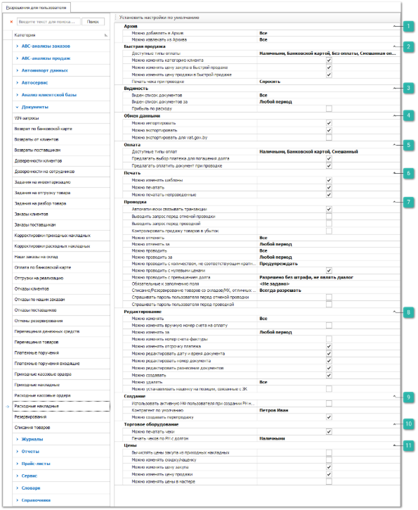
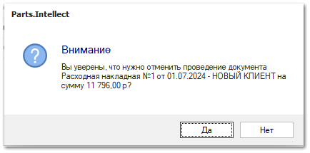
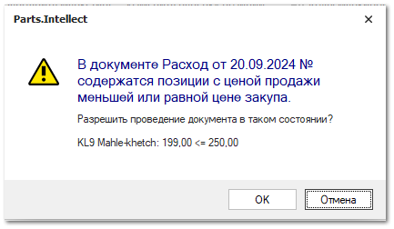
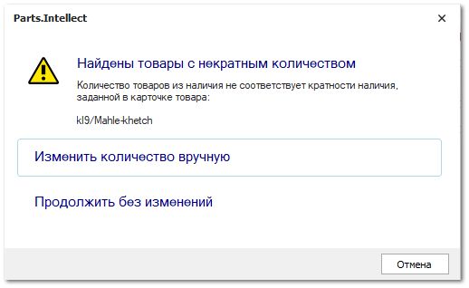

# Расходные накладные
Группа разрешений для доступа к документам **Расходные накладные**.

 **Архив**

Позволяет определить возможность для пользователя архивировать данный вид документа и извлекать из архива. Доступные разрешения: 

**Можно добавлять в Архив** - ограничение доступа на работу с архивом. Доступные значения:

**Все** – пользователю доступно добавление в архив;

**Только** **свои** – пользователю доступно добавление в архив документов, в которых он является автором, и документы, где указан клиент, для которого пользователь является ответственным менеджером.

**Только** **авторов своих подразделений** – пользователю доступно добавление в архив документов, где он является автором, и документы, где авторами являются сотрудники его подразделений.

**Только авторов и ответственных менеджеров своих подразделений** – пользователю доступно добавление в архив документов, где автором, или ответственным менеджером по клиенту, является он или сотрудники его подразделений.

**Запрещено** – добавление в архив всех документов запрещено. 

**Можно извлекать из Архива** - ограничение доступа на работу с архивом. Доступные значения:

**Все** – пользователю доступно извлечение из архива;

**Только** **свои** – пользователю доступно извлечение из архива документов, в которых он является автором, и документы, где указан клиент, для которого пользователь является ответственным менеджером.

**Только** **авторов своих подразделений** – пользователю доступно извлечение из архива документов, где он является автором, и документы, где авторами являются сотрудники его подразделений.

**Только авторов и ответственных менеджеров своих подразделений** – пользователю доступно извлечение из архива документов, где автором, или ответственным менеджером по клиенту, является он или сотрудники его подразделений.

**Запрещено** – извлечение из архива всех документов запрещено. 

 **Быстрая продажа**

Позволяет задать значения параметров для модуля **Быстрая продажа**:

**Доступные типы оплат** – доступные типы оплат для создания платежей при оформлении документов в модуле **Быстрая продажа**;

::: note Заметка

Для отображения типа оплаты **Смешанный** необходимо включить типы оплат: **Наличными** и **Банковской картой**.

:::

**Можно изменять категорию клиента** – разрешение на изменение значения поля **Категория клиента** в окне **Быстрой продажи**, иначе категория подставляется из карточки контрагента;

**Можно изменять цену закупа в Быстрой продаже** – разрешение на изменение **Цены закупа** товара в **Быстрой продаже**;

**Можно изменять цену продажи в Быстрой продаже** – разрешение на изменение **Цены продажи** товара в **Быстрой продаже**;

::: note Заметка

При отключении разрешений **Можно изменять цену закупа в Быстрой продаже** и **Можно изменять цену продажи в Быстрой продаже**, в разделе **Управление** ► **Настройки пользователя** на вкладке **Быстрая продажа** скрывается опция **Отображать команду "Наценка/Скидка"**.

:::

**Печать чеков при проводке** – разрешение, определяющее поведение для печати чеков при проводке документов:

**Не печатать** – при проводке документа **Расходная накладная** не будет осуществляться печать чеков;

**Спросить** – при проводке **Расходной накладной** появится диалог с запросом о печати чека;

**Печатать итоговый** – при проведении **Расходной накладной** будет всегда печататься итоговый (общий) чек на всю сумму документа. Данный способ не используется при использовании ККТ с ФФД 1.05;

**Печатать детальный** – при проведении **Расходной накладной** будет всегда печататься детализированный чек с позициями документа.

 **Видимость**

Позволяет определить доступ пользователя на просмотр списка документов данного типа. Доступные разрешения:

**Виден список документов** – ограничение доступа на просмотр списка документов. Доступные значения:

**Все** – пользователю доступны все документы;

**Только** **свои** – пользователю доступны документы, в которых он является автором, и документы, где указан клиент, для которого пользователь является ответственным менеджером;

**Только** **авторов своих подразделений** – пользователю доступны все документы, где он является автором, и документы, где авторами являются сотрудники его подразделений;

**Только авторов и ответственных менеджеров своих подразделений** – пользователю доступны все документы, где автором, или ответственным менеджером по клиенту, является он или сотрудники его подразделений;

::: note Заметка

При указаний значения **Только авторов и ответственных менеджеров своих подразделений** в настройке **Виден список документов** связанные документы продолжают отображаться на вкладке **Документы** карточки контрагента, но становятся недоступны для редактирования.

:::

1  **Запрещено** – видимость всех документов запрещена.

::: note Заметка

Основное и дополнительные подразделения задаются в карточке сотрудника в меню **Управление ► Справочники ► Сотрудники**.

:::

**Виден список документов за** – пользователю можно установить ограничение для доступа к документам только за определенный период.

**Прибыль по расходу** – позволяет задать ограничение пользователю на видимость колонки **Прибыль** в списке **Расходных накладных**.

 **Обмен данными**

Позволяет определить доступность пользователю экспорта и импорта данных из документа. Доступные разрешения: 

**Можно импортировать**,** 

**Можно экспортировать**;

::: info Примечание

При отключении опции **Можно экспортировать** применяется запрет на массовое копирование записей (выделение множества записей в таблицах "CTRL+A" и их последующее копирование (CTRL+C)).

:::

**Можно экспортировать для vat.gov.by** – позволяет выгрузить XML-документ, содержащий информацию о **Счете-фактуре**. 

::: info Примечание

Данный вид экспорта актуален только пользователей из Республики Беларусь.

:::

 **Оплата**

Позволяет задать значения параметров:

**Доступные типы оплат** – определяет список типов оплат, которые будут предложены пользователю при внесении оплаты/ предоплаты по документу **Расходная накладная**;

**Предлагать выбор платежа для погашения долга** – при проведении документа программа проверит наличие не разнесенных платежных документов, которые можно связать с текущим заказом, и предложит данные платежи для оплаты документа;

**Предлагать оплатить документ при проводке** – при проведении документа будет осуществляться автоматический вызов интерфейса оплаты.

 **Печать**

Позволяет установить ограничения на печать и изменение печатных форм для документа. Доступные разрешения:

**Можно изменять шаблоны** – доступность изменения печатных форм для документа (кнопка **Изменить** в окне печати);

**Можно печатать** – определяет доступность вывода печатных форм по документу при наличии кнопки **Печать** в панели управления и доступных печатных форм;

**Можно печатать непроведенные** – разрешает вывод печатных форм по документу независимо от значения признака документа **Проведен.**

 **Проводка**

Позволяет установить разрешения на выполнение действий **Провести** и **Отменить проводку** над документом, а также дополнительные связанные действия. Доступные разрешения:

**Автоматически связывать транзакции** – пытается определить цепочку всех подчиненных и последующих документов, связанных с текущим (если документ создавался не на основании);

**Выводить запрос перед отменой проводки** – при отмене проводки документа выйдет окно с запросом на подтверждение отмены проводки;

**Выводить запрос перед проводкой** – при проводке документа выйдет окно с запросом на подтверждение проведения;

**Контролировать продажу товаров в убыток** – при проведении документа, если цена продажи будет ниже цены закупа для позиций в связанных **Приходных накладных**, то программа выдаст уведомление;

**Можно отменять** – доступность на отмену проводки документов данного вида, в зависимости от автора**: Все, Только свои, Только авторов своих подразделений, Только авторов и ответственных менеджеров своих подразделений, Запрещено**;

**Можно отменять за** – определяет временной период, за который можно отменять проводку документов;

**Можно проводить** – доступность на проведение документов данного вида, в зависимости от автора**: Все, Только свои, Только авторов своих подразделений, Только авторов и ответственных менеджеров своих подразделений, Запрещено**;

**Можно проводить за** – определяет временной период, за который можно проводить документы;

**Можно проводить с количеством, не соответствующим кратности наличия** – определяет способ проверки количества заказываемого товара из наличия на кратность в рамках всего документа:

**Предупреждать** – значение по умолчанию. При несоответствии кратности поле **Кол-во** подсвечивается желтым цветом, а при проводке документа выходит диалоговое окно с доступными действиями:

::: note Заметка

Если товар добавлен в документ несколькими строками, то проверка на кратность будет проводиться по сумме количества товара во всех строках. Подсветка будет применена ко всем строкам товара.

:::

1  **изменить количество вручную** – отмена проводки и возврат к инспектору документа для исправления данных вручную;

::: note Заметка

В документе будет применена фильтрация по позициям с некорректной кратностью. При указании корректного значения кратности позиции также будут отфильтрованы. При этом фильтрация может быть сброшена вручную или при повторном проведении документа.

:::

1  **продолжить без изменений** – проводка документа без изменений;
1  **Запрещено** – при несоответствии кратности поле **Кол-во** подсвечивается желтым цветом, а при проводке документа выходит диалоговое окно с доступными действиями:

::: note Заметка

Если товар добавлен в документ несколькими строками, то проверка на кратность будет проводиться по сумме количества товара во всех строках. Подсветка будет применена ко всем строкам товара.

:::

1  **изменить количество товара вручную** – отмена проводки и возврат к инспектору документа для исправления данных вручную;

::: note Заметка

В документе будет применена фильтрация по позициям с некорректной кратностью. При указании корректного значения кратности позиции также будут отфильтрованы. При этом фильтрация может быть сброшена вручную или при повторном проведении документа.

:::

1  **Разрешено** – проверка на кратность не выполняется. Документ может быть проведен в любом виде;

**Можно проводить с нулевыми ценами** **–** разрешает проводить расходную накладную с нулевыми ценами продажи по позициям;

**Можно проводить с превышением долга** – контролирует наличие задолженности у клиента с учетом, установленного **Лимита фактического** в карточке клиента. Доступные значения опции:

**Запрещено** (значение по умолчанию) – если лимит нарушен, то проведение документа по контрагенту будет запрещено, о чем выйдет соответствующее уведомление;

**Разрешено только со штрафом, являть диалог** – документ проводится только с назначением штрафа. Размер штрафа определяется как процент наценки на весь документ или на цену каждого товара в документе;

**Разрешено без штрафа, являть диалог** – разрешается проводить документ с назначением штрафа или без него. Действие, которое необходимо произвести, выбирается на форме диалога, который возникает при проводке документа;

**Разрешено без штрафа, не являть диалог** – документ проведется, независимо от долга контрагента и установленных лимитов.

::: note Заметка

Способ начисления и размер штрафа определяется настройками **Способ начисления штрафа** и **Размер штрафа за наличие просроченной задолженности или выхода за лимиты балансов, %** в разделе **Управление** **►** **Настройки программы** **►** **Настройки**, блок **CRM** **► Контрагенты**.Более подробно об использовании лимитов контрагентов можно прочитать разделе **Лимиты балансов контрагента**.

:::

**Обязательные к заполнению поля** – задается обязательность поля **№ счета-фактуры**;

**Списание/резервирование товаров со складов/МХ, отличных от приоритетного** – при проводке документа программа проверит доступное количество товара на складе, установленном в качестве **Приоритетного склада для списания** по позиции. Если количество товара для списания недостаточно, то программа выдаст уведомление в зависимости от настройки:

**Всегда разрешать –** при отсутствии достаточного количества товара на приоритетном складе, недостающий товар спишется с другого доступного для пользователя склада;

**Спросить** – выйдет диалоговое окно с запросом на отмену проводки документа или списания с других доступных складов;

**Всегда запрещать** – если на приоритетном складе нет достаточного количества товара, то программа не даст провести документ.

::: note Заметка

Списание осуществляется по действующему в системе принципу **ФИФО/ЛИФО** среди доступных складов. Выбрать принцип списания можно в разделе **Управление ► Настройки программы ► Настройки ►** группа **Склад и закупки ► Движение товара** настройка **Способ списания товара ЛИФО/ФИФО**.

:::

**Спрашивать пароль пользователя перед отменой проводки** – при выполнении отмены проводки документа пользователю потребуется ввести свой пароль от базы данных;

**Спрашивать пароль пользователя перед проводкой** – при выполнении проведения документа пользователю потребуется ввести свой пароль от базы данных.

 **Редактирование**

Дополнительные пункты блока позволяют задать опции:

**Можно изменять вручную номер счета на оплату** – позволяет пользователю задавать и/или редактировать значение поля **Номер счета на оплату** в параметрах документа;

**Можно изменять номер счета-фактуры** – позволяет пользователю задавать и/или редактировать значение поля **Номер счета-фактуры** в параметрах документа;

::: note Заметка

Настройки автоматической нумерации счетов на оплату расположены в разделе меню **Управление ► Справочники ► Счетчик номеров документов**.

:::

**Можно изменять отсрочку платежа** – возможность изменять значение поля **Отсрочка платежа** в карточке контрагента;

**Можно устанавливать наценку на позиции, связанные с ЗК** –  разрешает применение для позиций команды **Наценка/Скидка** с изменением цены продажи для позиций, связанных с **Заказами клиентов**;

 **Создание**

Дополнительный пункт блока позволяет задать опцию:

**Использовать активную НФ пользователя при создании РН на основании и в мастере** – если опция включена, то при создании **Расходной накладной** на основании других документов, либо через **Мастер расходной накладной**, программа подставит текущую установленную **Нашу фирму** на панели **Главного меню** пользователя в документ, вместо подбора значения из связанных транзакций;

**Контрагент по умолчанию** – задает контрагента, который будет подставляться автоматически при создании нового документа **Расходная накладная**;

**Можно создавать перепродажу** – задает возможность создания перепродажи. После включения настройки доступна команда **Создать перепродажу** на панели команд в разделе **Продажи ► Расходные накладные**.

::: info Примечание

Для добавления команды **Создать перепродажу** рекомендуется перезайти в программу Parts.Intellect и сбросить панель команд. Для сброса панели команд нажмите на кнопку  в правом углу и выберите команду **Добавить или удалить кнопки ► Действие ► Сброс панели**.Для создания документов с **Активной нашей фирмой** по умолчанию из раздела **Продажи** **► Проценка** необходимо установить настройку **Разделять позиции по НФ при создании документа из проценки** (раздел **Управление** **► Настройки программы ► Настройки ► Документы**) в значение **Всегда подставлять активную НФ**. Стоит учесть значение настройки **Контролировать движение товара по нашей фирме** в разделе меню **Управление ► Настройки программы ► Наши фирмы**, при активации которой запрещается списание товара по **Расходной накладной**, оформленной на другую **Нашу фирму**.

:::

 **Торговое оборудование**

**Можно печатать чеки** – настройка для доступа пользователя к печати чеков по документу и его позициям;

**Печать чеков по РН с долгом** – настройка позволяет разрешить/запретить пользователю печать чека с долгом по документу **Расходная накладная**. Доступные значения для настройки: **Запретить**, **Наличными**, **Банковской картой**, **Безналичными**, **В зачет аванса**. Значение по умолчанию – **Запретить**. Значения отличные от **Запретить** определяют какой тип оплаты будет присваиваться неоплаченному остатку по документу при выполнении действия **Печать чека** – **С детализацией**.

 **Цены**

Дополнительные пункты блока позволяют задать опции:

**Вычислять цены закупа из приходных накладных** – при создании расходной накладной на основании других документов или из **Мастера Расходной накладной**, используются цены закупа из связанных приходов по транзакциям, происходит дробление позиций в зависимости от закупочных цен;

**Можно изменять скидку/наценку** – позволяет регулировать доступ для пользователя на изменение поля **Скидка, %** в параметрах документа **Расходная накладная** и **Быстрая продажа.**

