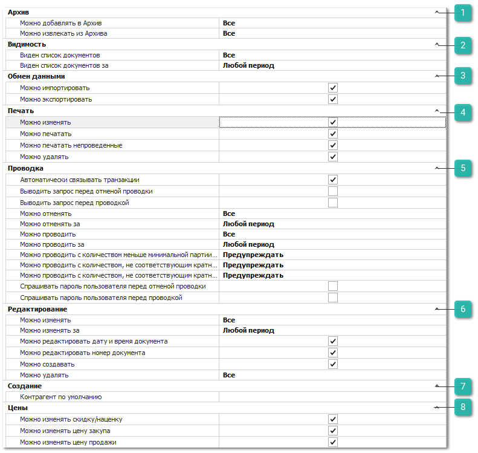
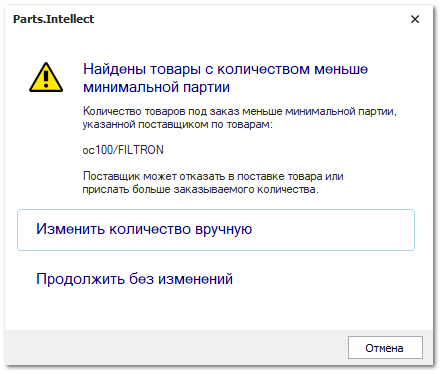
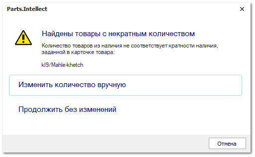
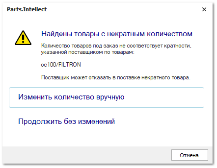

Группа разрешений для доступа к документам **VIN-запросы**.

 **Архив**

Позволяет определить возможность для пользователя архивировать данный вид документа и извлекать из архива. Доступные разрешения: 

- **Можно добавлять в Архив** - ограничение доступа на работу с архивом. Доступные значения:

   - **Все** – пользователю доступно добавление в архив;

   - **Только** **свои** – пользователю доступно добавление в архив документов, в которых он является автором, и документы, где указан клиент, для которого пользователь является ответственным менеджером.

   - **Только** **авторов своих подразделений** – пользователю доступно добавление в архив документов, где он является автором, и документы, где авторами являются сотрудники его подразделений.

   - **Только авторов и ответственных менеджеров своих подразделений** – пользователю доступно добавление в архив документов, где автором, или ответственным менеджером по клиенту, является он или сотрудники его подразделений.

   - **Запрещено** – добавление в архив всех документов запрещено. 

- **Можно извлекать из Архива** - ограничение доступа на работу с архивом. Доступные значения:

   - **Все** – пользователю доступно извлечение из архива;

   - **Только свои** – пользователю доступно извлечение из архива документов, в которых он является автором, и документы, где указан клиент, для которого пользователь является ответственным менеджером.

   - **Только авторов своих подразделений** – пользователю доступно извлечение из архива документов, где он является автором, и документы, где авторами являются сотрудники его подразделений.

   - **Только авторов и ответственных менеджеров своих подразделений** – пользователю доступно извлечение из архива документов, где автором, или ответственным менеджером по клиенту, является он или сотрудники его подразделений.

   - **Запрещено** – извлечение из архива всех документов запрещено. 

 **Видимость**

Позволяет определить доступ пользователя на просмотр списка документов данного типа. Доступные разрешения:

- **Виден список документов** – ограничение доступа на просмотр списка документов. Доступные значения:

   - **Все** – пользователю доступны все документы;

   - **Только свои** – пользователю доступны документы, в которых он является автором, и документы, где указан клиент, для которого пользователь является ответственным менеджером.

   - **Только авторов своих подразделений** – пользователю доступны все документы, где он является автором, и документы, где авторами являются сотрудники его подразделений.

   - **Только авторов и ответственных менеджеров своих подразделений** – пользователю доступны все документы, где автором, или ответственным менеджером по клиенту, является он или сотрудники его подразделений.

   ::: note Заметка

   При указаний значения **Только авторов и ответственных менеджеров своих подразделений** в настройке **Виден список документов** связанные документы продолжают отображаться на вкладке **Документы** карточки контрагента, но становятся недоступны для редактирования.

   :::

   - **Запрещено** – видимость всех документов запрещена.

   ::: note Заметка

   Основное и дополнительные подразделения задаются в карточке сотрудника в меню **Управление ► Справочники ► Сотрудники**.

   :::

- **Виден список документов за** – пользователю можно установить ограничение для доступа к документам только за определенный период.

 **Обмен данными**

Позволяет определить доступность пользователю экспорта и импорта данных из документа. Доступные разрешения: 

- **Можно импортировать**;

- **Можно экспортировать**.

::: info Примечание

При отключении опции **Можно экспортировать** применяется запрет на массовое копирование записей (выделение множества записей в таблицах "CTRL+A" и их последующее копирование (CTRL+C)).

:::

 **Печать**

Позволяет установить ограничения на печать и изменение печатных форм для документа. Доступные разрешения:

- **Можно изменять шаблоны** – доступность изменения печатных форм для документа (кнопка **Изменить** в окне печати);

- **Можно печатать** – определяет доступность вывода печатных форм по документу при наличии кнопки **Печать** в панели управления и доступных печатных форм;

- **Можно печатать непроведенные** – разрешает вывод печатных форм по документу независимо от значения признака документа **Проведен**;

- **Можно удалять** – определяет доступность команды **Удалить** в окне **Мастера печати**.

 **Проводка**

Позволяет установить разрешения на выполнение действий **Провести** и **Отменить проводку** над документом, а также дополнительные связанные действия. Доступные разрешения:

- **Автоматически связывать транзакции** – пытается определить цепочку всех подчиненных и последующих документов, связанных с текущим (если документ создавался не на основании);

- **Выводить запрос перед отменой проводки** – при отмене проводки документа выйдет окно с запросом на подтверждение отмены проводки;

- **Выводить запрос перед проведением** – при проводке документа выйдет окно с запросом на подтверждение проведения;

- **Можно отменять** – доступность на отмену проводки документов данного вида, в зависимости от автора: **Все**, **Только свои**, **Только авторов своих подразделений**, **Только авторов и ответственных менеджеров своих подразделений**, **Запрещено**;

- **Можно отменять за** – определяет временной период, за который можно отменять проводку документов;

- **Можно проводить** – доступность на проведение документов данного вида, в зависимости от автора: **Все**, **Только свои**, **Только авторов своих подразделений**, **Только авторов и ответственных менеджеров своих подразделений**, **Запрещено**;

- **Можно проводить за** – определяет временной период, за который можно проводить документы;

- **Можно проводить с количеством меньше минимальной партии от поставщика** – определяет способ проверки количества заказываемого на склад товара на соответствие ограничению на минимальное количество заказываемых единиц позиции от поставщика:

   - **Предупреждать** – значение по умолчанию. При количестве меньше минимальной партии поле **Кол-во** подсвечивается желтым цветом, а при проводке документа отображается диалоговое окно с доступными действиями:

      

      ::: note Заметка

      Если товар добавлен в документ несколькими строками, то проверка будет проводиться по сумме количества товара во всех строках. Подсветка будет применена ко всем строкам товара.

      :::

      - **изменить количество вручную** – произойдет отмена проводки и возврат к инспектору документа для исправления данных вручную;

      ::: note Заметка

      В документе будет применена фильтрация по позициям с недостаточным количеством. При указании подходящего количества позиции также будут отфильтрованы. При этом фильтрация может быть сброшена вручную или при повторном проведении документа.

      :::

      - **продолжить без изменений** – проводка документа без изменений количества;

   - **Запрещено** – при количестве меньше минимальной партии поле **Кол-во** подсвечивается желтым цветом, а при проводке документа выходит диалоговое окно с доступными действиями:

      ::: note Заметка

      Если товар добавлен в документ несколькими строками, то проверка будет проводиться по сумме количества товара во всех строках. Подсветка будет применена ко всем строкам товара.

      :::

      - **изменить количество вручную** – произойдет отмена проводки и возврат к инспектору документа для исправления данных вручную;

      ::: note Заметка

      В документе будет применена фильтрация по позициям с недостаточным количеством. При указании подходящего количества позиции также будут отфильтрованы. При этом фильтрация может быть сброшена вручную или при повторном проведении документа.

      :::

   - **Разрешено** – проверка на кратность не выполняется. Документ может быть проведен в любом виде;

- **Можно проводить с количеством, не соответствующим кратности наличия** – определяет способ проверки количества заказываемого товара из наличия на кратность в рамках всего документа:

   - **Предупреждать** – значение по умолчанию. При несоответствии кратности поле **Кол-во** подсвечивается желтым цветом, а при проводке документа выходит диалоговое окно с доступными действиями:

      

      ::: note Заметка

      Если товар добавлен в документ несколькими строками, то проверка на кратность будет проводиться по сумме количества товара во всех строках. Подсветка будет применена ко всем строкам товара.

      :::

      - **изменить количество вручную** – отмена проводки и возврат к инспектору документа для исправления данных вручную;

      ::: note Заметка

      В документе будет применена фильтрация по позициям с некорректной кратностью. При указании корректного значения кратности позиции также будут отфильтрованы. При этом фильтрация может быть сброшена вручную или при повторном проведении документа.

      :::

      - **продолжить без изменений** – проводка документа без изменений;

   - **Запрещено** – при несоответствии кратности поле **Кол-во** подсвечивается желтым цветом, а при проводке документа выходит диалоговое окно с доступными действиями:

      ::: note Заметка

      Если товар добавлен в документ несколькими строками, то проверка на кратность будет проводиться по сумме количества товара во всех строках. Подсветка будет применена ко всем строкам товара.

      :::

      - **изменить количество товара вручную** – отмена проводки и возврат к инспектору документа для исправления данных вручную;

   ::: note Заметка

   В документе будет применена фильтрация по позициям с некорректной кратностью. При указании корректного значения кратности позиции также будут отфильтрованы. При этом фильтрация может быть сброшена вручную или при повторном проведении документа.

   :::

   - **Разрешено** – проверка на кратность не выполняется. Документ может быть проведен в любом виде;

- **Можно проводить с количеством, не соответствующим кратности от поставщика** – определяет способ проверки количества заказываемого товара от поставщика на кратность в рамках всего документа:

   - **Предупреждать** – значение по умолчанию. При несоответствии кратности поле **Кол-во** подсвечивается желтым цветом, а при проводке документа выходит диалоговое окно с доступными действиями:

      

      ::: note Заметка

      Если товар добавлен в документ несколькими строками, то проверка на кратность будет проводиться по сумме количества товара во всех строках. Подсветка будет применена ко всем строкам товара.

      :::

      - **изменить количество товара вручную** – отмена проводки и возврат к инспектору документа для исправления данных вручную;

      ::: note Заметка

      В документе будет применена фильтрация по позициям с некорректной кратностью. При указании корректного значения кратности, позиции также будут отфильтрованы. При этом фильтрация может быть сброшена вручную или при повторном проведении документа.

      :::

      - **продолжить без изменений** – проводка документа без изменений;

      - **округлить количество в большую сторону** – количество товара с некорректной кратностью автоматически округляется до ближайшего большего кратного значения. Данные передаются в **Наш заказ на склад**;

      ::: info Примечание

      Вариант **Округлить количество в большую сторону** доступен только для мастера заказов по минимальным остаткам.

      :::

   - **Запрещено** – при несоответствии кратности поле **Кол-во** подсвечивается желтым цветом, а при проводке документа выходит диалоговое окно с доступными действиями:

      ::: note Заметка

      Если товар добавлен в документ несколькими строками, то проверка на кратность будет проводиться по сумме количества товара во всех строках. Подсветка будет применена ко всем строкам товара.

      :::

      - **изменить количество товара вручную** – отмена проводки и возврат к инспектору документа для исправления данных вручную;

      ::: note Заметка

      В документе будет применена фильтрация по позициям с некорректной кратностью. При указании корректного значения кратности, позиции также будут отфильтрованы. При этом фильтрация может быть сброшена вручную или при повторном проведении документа.

      :::

      - **округлить количество в большую сторону** – количество товара с некорректной кратностью автоматически округляется до ближайшего большего кратного значения. Данные передаются в **Наш заказ на склад**;

      ::: info Примечание

      Вариант **округлить количество в большую сторону** доступен только для мастера заказов по минимальным остаткам.

      :::

   - **Разрешено** – проверка на кратность не выполняется. Документ может быть проведен в любом виде;

- **Спрашивать пароль пользователя перед отменой проводки** – при выполнении отмены проводки документа пользователю потребуется ввести свой пароль от базы данных;

- **Спрашивать пароль пользователя перед проводкой** – при выполнении проведения документа пользователю потребуется ввести свой пароль от базы данных.

 **Редактирование**

Позволяет установить следующие разрешения:

- **Можно изменять** – определяет возможность пользователю изменять существующие документы;

- **Можно изменять за** – определяет возможность пользователю изменять существующие документы за определенный период;

- **Можно редактировать дату и время документа** – определяет возможность изменять дату и время создания в параметрах документа;

- **Можно редактировать номер документа** – определяет возможность изменять номер в параметрах документа;

- **Можно создавать** – определяет возможность добавлять новые документы данного вида;

- **Можно удалять –** определяет доступ пользователя на удаления документов в зависимости от автора.

 **Создание**

Позволяет задать значение **Контрагент по умолчанию**, который будет подставляться автоматически при создании нового документа данного вида.

 **Цены**

Позволяют определить доступ пользователя на изменение разного типа цен:

- **Можно изменять скидку/наценку** – возможность указывать и изменять значение поля **Скидка, %** в параметрах документа;

- **Можно изменять цену закупа –** изменение закупочной цены на товар в документе;

- **Можно изменять цену продажи** – изменение цены продажи на товар в документе.

