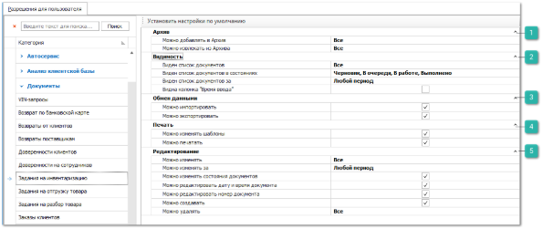

Группа разрешений для доступа к документам **Задания на инвентаризацию**.

 **Архив**

Позволяет определить возможность для пользователя архивировать данный вид документа и извлекать из архива. Доступные разрешения: 

- **Можно добавлять в Архив** - ограничение доступа на работу с архивом. Доступные значения:

    - **Все** – пользователю доступно добавление в архив;

    - **Только** **свои** – пользователю доступно добавление в архив документов, в которых он является автором, и документы, где указан клиент, для которого пользователь является ответственным менеджером.

    - **Только** **авторов своих подразделений** – пользователю доступно добавление в архив документов, где он является автором, и документы, где авторами являются сотрудники его подразделений.

    - **Только авторов и ответственных менеджеров своих подразделений** – пользователю доступно добавление в архив документов, где автором, или ответственным менеджером по клиенту, является он или сотрудники его подразделений.

    - **Запрещено** – добавление в архив всех документов запрещено. 

- **Можно извлекать из Архива** - ограничение доступа на работу с архивом. Доступные значения:

    - **Все** – пользователю доступно извлечение из архива;

    - **Только** **свои** – пользователю доступно извлечение из архива документов, в которых он является автором, и документы, где указан клиент, для которого пользователь является ответственным менеджером.

    - **Только** **авторов своих подразделений** – пользователю доступно извлечение из архива документов, где он является автором, и документы, где авторами являются сотрудники его подразделений.

    - **Только авторов и ответственных менеджеров своих подразделений** – пользователю доступно извлечение из архива документов, где автором, или ответственным менеджером по клиенту, является он или сотрудники его подразделений.

    - **Запрещено** – извлечение из архива всех документов запрещено. 

 **Видимость**

Позволяет определить доступ пользователя на просмотр списка документов данного типа. Доступные разрешения:

- **Виден список документов** – ограничение доступа на просмотр списка документов. Доступные значения:

    - **Все** – пользователю доступны все документы;

    - **Только** **свои** – пользователю доступны документы, в которых он является автором, и документы, где указан клиент, для которого пользователь является ответственным менеджером.

    - **Только** **авторов своих подразделений** – пользователю доступны все документы, где он является автором, и документы, где авторами являются сотрудники его подразделений.

    - **Только авторов и ответственных менеджеров своих подразделений** – пользователю доступны все документы, где автором, или ответственным менеджером по клиенту, является он или сотрудники его подразделений.

    ::: note Заметка

    При указаний значения **Только авторов и ответственных менеджеров своих подразделений** в настройке **Виден список документов** связанные документы продолжают отображаться на вкладке **Документы** карточки контрагента, но становятся недоступны для редактирования.

    :::

    - **Запрещено** – видимость всех документов запрещена.

::: note Заметка

Основное и дополнительные подразделения задаются в карточке сотрудника в меню **Управление ► Справочники ► Сотрудники**.

:::

- **Виден список документов за** – пользователю можно установить ограничение для доступа к документам только за определенный период.

- **Виден список документов в состояниях** – позволяет ограничить пользователю просмотр документов в определенных состояниях;

- **Видна колонка** "**Время ввода**" – определяет видимость данной колонки в позициях документа **Задания на инвентаризацию**.

::: warning Внимание!

Вывод колонки **Время ввода** в **Задании на инвентаризацию** доступно только, если включена опция **Включить механизм фиксации времени ввода по позициям задания** в разделе меню **Управление ► Настройки программы ► Настройки ► Склад и закупки ► Задания на склад**.

:::

 **Обмен данными**

Позволяет определить доступность пользователю экспорта и импорта данных из документа. Доступные разрешения: 

- **Можно импортировать**,** 

- **Можно экспортировать**.

::: info Примечание

При отключении опции **Можно экспортировать** применяется запрет на массовое копирование записей (выделение множества записей в таблицах "CTRL+A" и их последующее копирование (CTRL+C)).

:::

 **Печать**

Позволяет установить ограничения на печать и изменение печатных форм для документа. Доступные разрешения:

- **Можно изменять шаблоны** – доступность изменения печатных форм для документа (кнопка **Изменить** в окне печати);

- **Можно печатать** – определяет доступность вывода печатных форм по документу при наличии кнопки **Печать** в панели управления и доступных печатных форм.

 **Редактирование**

Позволяет установить следующие разрешения:

- **Можно изменять** – определяет возможность пользователю изменять существующие документы;

- **Можно изменять за** – определяет возможность пользователю изменять существующие документы за определенный период;

- **Можно изменять состояния документов** – позволяет включить/отключить возможность смены состояния у документа **Задание на инвентаризацию**;

- **Можно редактировать дату и время документа** – определяет возможность изменять дату и время создания в параметрах документа;

- **Можно редактировать номер документа** – определяет возможность изменять номер в параметрах документа;

- **Можно создавать** – определяет возможность добавлять новые документы данного вида;

- **Можно удалять –** определяет доступ пользователя на удаления документов в зависимости от автора.

