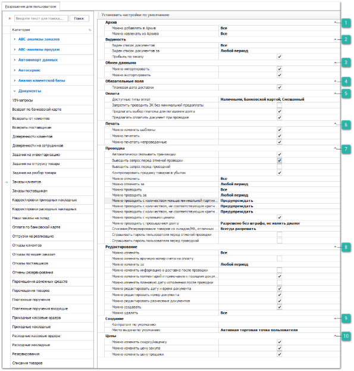
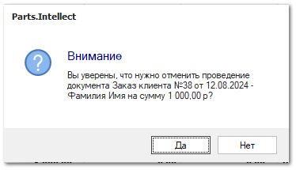
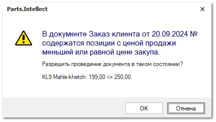
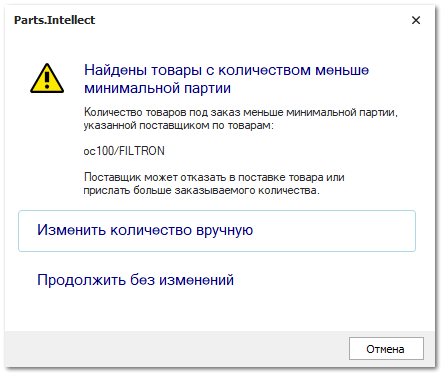
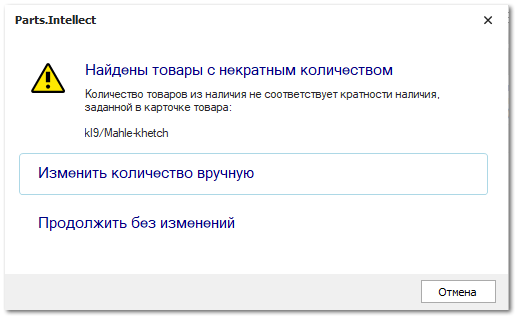
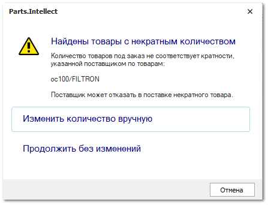

Группа разрешений для доступа к документам **Заказы клиентов**.

 **Архив**

Позволяет определить возможность для пользователя архивировать данный вид документа и извлекать из архива. Доступные разрешения: 

- **Можно добавлять в Архив** - ограничение доступа на работу с архивом. Доступные значения:

   - **Все** – пользователю доступно добавление в архив;

   - **Только** **свои** – пользователю доступно добавление в архив документов, в которых он является автором, и документы, где указан клиент, для которого пользователь является ответственным менеджером.

   - **Только** **авторов своих подразделений** – пользователю доступно добавление в архив документов, где он является автором, и документы, где авторами являются сотрудники его подразделений.

   - **Только авторов и ответственных менеджеров своих подразделений** – пользователю доступно добавление в архив документов, где автором, или ответственным менеджером по клиенту, является он или сотрудники его подразделений.

   - **Запрещено** – добавление в архив всех документов запрещено. 

- **Можно извлекать из Архива** - ограничение доступа на работу с архивом. Доступные значения:

   - **Все** – пользователю доступно извлечение из архива;

   - **Только** **свои** – пользователю доступно извлечение из архива документов, в которых он является автором, и документы, где указан клиент, для которого пользователь является ответственным менеджером.

   - **Только** **авторов своих подразделений** – пользователю доступно извлечение из архива документов, где он является автором, и документы, где авторами являются сотрудники его подразделений.

   - **Только авторов и ответственных менеджеров своих подразделений** – пользователю доступно извлечение из архива документов, где автором, или ответственным менеджером по клиенту, является он или сотрудники его подразделений.

   - **Запрещено** – извлечение из архива всех документов запрещено. 

 **Видимость**

Позволяет определить доступ пользователя на просмотр списка документов данного типа. Доступные разрешения:

- **Виден список документов** – ограничение доступа на просмотр списка документов. Доступные значения:

   - **Все** – пользователю доступны все документы;

   - **Только** **свои** – пользователю доступны документы, в которых он является автором, и документы, где указан клиент, для которого пользователь является ответственным менеджером.

   - **Только** **авторов своих подразделений** – пользователю доступны все документы, где он является автором, и документы, где авторами являются сотрудники его подразделений.

   - **Только авторов и ответственных менеджеров своих подразделений** – пользователю доступны все документы, где автором, или ответственным менеджером по клиенту, является он или сотрудники его подразделений.

   ::: note Заметка

   При указаний значения **Только авторов и ответственных менеджеров своих подразделений** в настройке **Виден список документов** связанные документы продолжают отображаться на вкладке **Документы** карточки контрагента, но становятся недоступны для редактирования.

   :::

   - **Запрещено** – видимость всех документов запрещена.

::: note Заметка

Основное и дополнительные подразделения задаются в карточке сотрудника в меню **Управление ► Справочники ► Сотрудники**.

:::

- **Виден список документов за** – пользователю можно установить ограничение для доступа к документам только за определенный период.

- **Прибыль по возврату** – ограничение доступа на просмотр **Прибыль по возврату** в информационной строке табличной части **Товары**.

 **Обмен данными**

Позволяет определить доступность пользователю экспорта и импорта данных из документа. Доступные разрешения: 

- **Можно импортировать**,** 

- **Можно экспортировать**.

::: info Примечание

При отключении опции **Можно экспортировать** применяется запрет на массовое копирование записей (выделение множества записей в таблицах "CTRL+A" и их последующее копирование (CTRL+C)).

:::

 **Обязательные поля**

Позволяет задать значение параметра **Плановая дата доставки** – программа не даст сохранить или провести документ без указания значений **Плановой даты доставки** по позициям документа.

 **Оплата**

Позволяет задать значения параметров:

- **Доступные типы оплат** – определяет список типов оплат, которые будут предложены пользователю при внесении оплаты/ предоплаты по документу **Заказ клиента**;

- **Запретить проводить ЗК без минимальной предоплаты** – при активном значении настройки проведение документа **Заказ клиента** без внесения **Минимальной предоплаты** будет недоступно;

::: note Заметка

Сумма минимальной предоплаты определяется настройкой **Минимальный % предоплаты по ЗК** в разделе **Управление** **►** **Настройки программы ►** **Настройки**, блок **CRM** **► Контрагенты**, а также с помощью аналогичной настройки в карточке клиента в разделе **CRM** **►** **Клиенты**, вкладка **Финансы**. Полученная сумма предоплаты округляется до целого в большую сторону.

:::

- **Предлагать выбор платежа для погашения долга** – при проведении документа программа проверит наличие не разнесенных платежных документов, которые можно связать с текущим заказом, и предложит данные платежи для оплаты документа;

- **Предлагать оплатить документ при проводке** – при проведении документа будет осуществляться автоматический вызов интерфейса оплаты.

 **Печать**

Позволяет установить ограничения на печать и изменение печатных форм для документа. Доступные разрешения:

- **Можно изменять шаблоны** – доступность изменения печатных форм для документа (кнопка **Изменить** в окне печати);

- **Можно печатать** – определяет доступность вывода печатных форм по документу при наличии кнопки **Печать** в панели управления и доступных печатных форм;

- **Можно печатать непроведенные** – разрешает вывод печатных форм по документу независимо от значения признака документа **Проведен.**

 **Проводка**

Позволяет установить разрешения на выполнение действий **Провести** и **Отменить проводку** над документом, а также дополнительные связанные действия. Доступные разрешения:

- **Автоматически связывать транзакции** – пытается определить цепочку всех подчиненных и последующих документов, связанных с текущим (если документ создавался не на основании);

- **Выводить запрос перед отменой проводки** – при отмене проводки документа выйдет окно с запросом на подтверждение отмены проводки;

- **Выводить запрос перед проводкой** – при проводке документа выйдет окно с запросом на подтверждение проведения;

- **Контролировать продажу товаров в убыток** – при проведении документа, если цена продажи будет ниже цены закупа для позиций в связанных **Приходных накладных**, то программа выведет соответствующее уведомление:

- **Можно отменять** – доступность на отмену проводки документов данного вида, в зависимости от автора: **Все**, **Только свои**, **Только авторов своих подразделений**, **Только авторов и ответственных менеджеров своих подразделений**, **Запрещено**;

- **Можно отменять за** – определяет временной период, за который можно отменять проводку документов;

- **Можно проводить** – доступность на проведение документов данного вида, в зависимости от автора: **Все**, **Только свои**, **Только авторов своих подразделений**, **Только авторов и ответственных менеджеров своих подразделений**, **Запрещено**;

- **Можно проводить за** – определяет временной период, за который можно проводить документы;

- **Можно проводить с количеством меньше минимальной партии от поставщика** – определяет способ проверки количества заказываемого на склад товара на соответствие ограничению на минимальное количество заказываемых единиц позиции от поставщика:

   - **Предупреждать** – значение по умолчанию. При количестве меньше минимальной партии поле **Кол-во** подсвечивается желтым цветом, а при проводке документа отображается диалоговое окно с доступными действиями:

      

      ::: note Заметка

      Если товар добавлен в документ несколькими строками, то проверка будет проводиться по сумме количества товара во всех строках. Подсветка будет применена ко всем строкам товара.

      :::

      - **изменить количество вручную** – произойдет отмена проводки и возврат к инспектору документа для исправления данных вручную;

      ::: note Заметка

      В документе будет применена фильтрация по позициям с недостаточным количеством. При указании подходящего количества позиции также будут отфильтрованы. При этом фильтрация может быть сброшена вручную или при повторном проведении документа.

      :::

      - **продолжить без изменений** – проводка документа без изменений количества;

   - **Запрещено** – при количестве меньше минимальной партии поле **Кол-во** подсвечивается желтым цветом, а при проводке документа выходит диалоговое окно с доступными действиями:

      ::: note Заметка

      Если товар добавлен в документ несколькими строками, то проверка будет проводиться по сумме количества товара во всех строках. Подсветка будет применена ко всем строкам товара.

      :::

      - **изменить количество вручную** – произойдет отмена проводки и возврат к инспектору документа для исправления данных вручную;

      ::: note Заметка

      В документе будет применена фильтрация по позициям с недостаточным количеством. При указании подходящего количества позиции также будут отфильтрованы. При этом фильтрация может быть сброшена вручную или при повторном проведении документа.

      :::

   - **Разрешено** – проверка на кратность не выполняется. Документ может быть проведен в любом виде;

- **Можно проводить с количеством, не соответствующим кратности наличия** – определяет способ проверки количества заказываемого товара из наличия на кратность в рамках всего документа:

   - **Предупреждать** – значение по умолчанию. При несоответствии кратности поле **Кол-во** подсвечивается желтым цветом, а при проводке документа выходит диалоговое окно с доступными действиями:

      

      ::: note Заметка

      Если товар добавлен в документ несколькими строками, то проверка на кратность будет проводиться по сумме количества товара во всех строках. Подсветка будет применена ко всем строкам товара.

      :::

      - **изменить количество вручную** – отмена проводки и возврат к инспектору документа для исправления данных вручную;

      ::: note Заметка

      В документе будет применена фильтрация по позициям с некорректной кратностью. При указании корректного значения кратности позиции также будут отфильтрованы. При этом фильтрация может быть сброшена вручную или при повторном проведении документа.

      :::

      - **продолжить без изменений** – проводка документа без изменений;

   - **Запрещено** – при несоответствии кратности поле **Кол-во** подсвечивается желтым цветом, а при проводке документа выходит диалоговое окно с доступными действиями:

      ::: note Заметка

      Если товар добавлен в документ несколькими строками, то проверка на кратность будет проводиться по сумме количества товара во всех строках. Подсветка будет применена ко всем строкам товара.

      :::

      - **изменить количество товара вручную** – отмена проводки и возврат к инспектору документа для исправления данных вручную;

      ::: note Заметка

      В документе будет применена фильтрация по позициям с некорректной кратностью. При указании корректного значения кратности позиции также будут отфильтрованы. При этом фильтрация может быть сброшена вручную или при повторном проведении документа.

      :::

   - **Разрешено** – проверка на кратность не выполняется. Документ может быть проведен в любом виде;

- **Можно проводить с количеством, не соответствующим кратности от поставщика** – определяет способ проверки количества заказываемого товара от поставщика на кратность в рамках всего документа:

   - **Предупреждать** – значение по умолчанию. При несоответствии кратности поле **Кол-во** подсвечивается желтым цветом, а при проводке документа выходит диалоговое окно с доступными действиями:

      

      ::: note Заметка

      Если товар добавлен в документ несколькими строками, то проверка на кратность будет проводиться по сумме количества товара во всех строках. Подсветка будет применена ко всем строкам товара.

      :::

      - **изменить количество товара вручную** – отмена проводки и возврат к инспектору документа для исправления данных вручную;

      ::: note Заметка

      В документе будет применена фильтрация по позициям с некорректной кратностью. При указании корректного значения кратности, позиции также будут отфильтрованы. При этом фильтрация может быть сброшена вручную или при повторном проведении документа.

      :::

      - **продолжить без изменений** – проводка документа без изменений;

      - **округлить количество в большую сторону** – количество товара с некорректной кратностью автоматически округляется до ближайшего большего кратного значения. Данные передаются в **Наш заказ на склад**;

      ::: note Заметка

      Вариант **Округлить количество в большую сторону** доступен только для мастера заказов по минимальным остаткам.

      :::

   - **Запрещено** – при несоответствии кратности поле **Кол-во** подсвечивается желтым цветом, а при проводке документа выходит диалоговое окно с доступными действиями:

      ::: note Заметка

      Если товар добавлен в документ несколькими строками, то проверка на кратность будет проводиться по сумме количества товара во всех строках. Подсветка будет применена ко всем строкам товара.

      :::

      - **изменить количество товара вручную** – отмена проводки и возврат к инспектору документа для исправления данных вручную;

      ::: note Заметка

      В документе будет применена фильтрация по позициям с некорректной кратностью. При указании корректного значения кратности, позиции также будут отфильтрованы. При этом фильтрация может быть сброшена вручную или при повторном проведении документа.

      :::

      - **округлить количество в большую сторону** – количество товара с некорректной кратностью автоматически округляется до ближайшего большего кратного значения. Данные передаются в **Наш заказ на склад**;

      ::: note Заметка

      Вариант **Округлить количество в большую сторону** доступен только для мастера заказов по минимальным остаткам.

      :::

   - **Разрешено** – проверка на кратность не выполняется. Документ может быть проведен в любом виде;

- **Можно проводить с нулевыми ценами –** разрешает проводить заказ клиента с нулевыми ценами продажи по позициям;

- **Можно проводить с превышением долга** – контролирует наличие задолженности у клиента с учетом установленного **Лимита по заказам** в карточке клиента. Доступные значения опции:

   - **Запрещено** (значение по умолчанию) – если лимит нарушен, то проведение документа по контрагенту будет запрещено, о чем выйдет соответствующее уведомление;

   - **Разрешено только со штрафом, являть диалог** – документ проводится только с назначением штрафа. Размер штрафа определяется как процент наценки на весь документ или на цену каждого товара в документе;

   - **Разрешено без штрафа, являть диалог** – разрешается проводить документ с назначением штрафа или без него. Действие, которое необходимо произвести, выбирается на форме диалога, который возникает при проводке документа;

   - **Разрешено без штрафа, не являть диалог** – документ проведется, независимо от долга контрагента и установленных лимитов.

::: note Заметка

Способ начисления и размер штрафа определяется настройками **Способ начисления штрафа** и **Размер штрафа за наличие просроченной задолженности или выхода за лимиты балансов, %** в разделе **Управление** **►** **Настройки программы ►** **Настройки**, блок **CRM** **► Контрагенты**.

:::

- **Списание/резервирование товаров со складов/МХ, отличных от приоритетного** – при проводке документа программа проверит доступное количество товара на складе, установленном в качестве **Приоритетного склада для списания** по позиции. Если количество товара из наличия в заказе недостаточно, то программа выдаст уведомление в зависимости от настройки:

   - **Всегда разрешать –** при отсутствии достаточного количества товара на приоритетном складе, недостающий товар спишется с другого доступного для пользователя склада;

   - **Спросить** – выйдет диалоговое окно с запросом на отмену проводки документа или списания с других доступных складов;

   - **Всегда запрещать** – если на приоритетном складе нет достаточного количества товара, то программа не даст провести документ.

::: note Заметка

Списание осуществляется по действующему в системе принципу **ФИФО/ЛИФО** среди доступных складов. Выбрать принцип списания можно в разделе **Управление ► Настройки программы ► Настройки ►** группа **Склад и закупки** **► Движение товара** настройка **Способ списания товара ЛИФО/ФИФО**.

:::

- **Спрашивать пароль пользователя перед отменой проводки** – при выполнении отмены проводки документа пользователю потребуется ввести свой пароль от базы данных;

- **Спрашивать пароль пользователя перед проводкой** – при выполнении проведения документа пользователю потребуется ввести свой пароль от базы данных.

 **Редактирование**

Позволяет установить следующие разрешения:

- **Можно изменять** – определяет возможность пользователю изменять существующие документы;

- **Можно изменять вручную номер счета на оплату** – позволяет пользователю вручную задавать и/или изменять значение поля **Номер счета на оплату** в параметрах документа;

::: note Заметка

Настройки автоматической нумерации счетов на оплату расположены в разделе меню **Управление ► Справочники ► Счетчик номеров документов**.

:::

- **Можно изменять за** – определяет возможность пользователю изменять существующие документы за определенный период;

- **Можно изменять информацию о доставке после проводки –** позволяет разрешить/запретить пользователю изменять информацию о доставке после проводки документа. Информация о доставке изменяется в инспекторе документа **Заказ клиента** и с помощью команды **Изменить доставку**. По умолчанию опция выключена.

- **Можно изменять комментарий и примечания к позициям документа** – если разрешение включено, комментарий и примечания к позициям можно изменять независимо от разрешения на редактирование **Заказа клиента**. Если разрешение выключено, проверяется разрешение на редактирование документа;

- **Можно изменять плановую дату исполнения после проводки** – если разрешение включено, плановую дату исполнения можно изменять независимо от того, проведен документ **Заказ клиента** или нет. Если разрешение выключено, плановая дата исполнения меняется только для не проведенных документов.

- **Можно редактировать дату и время документа** – определяет возможность изменять дату и время создания в параметрах документа;

- **Можно редактировать номер документа** – определяет возможность изменять номер в параметрах документа;

- **Можно редактировать разнесение документов** – определяет возможность изменения отбора документов, добавления/удаления документов для разнесения (вкладка **Разнесение документа**);

- **Можно создавать** – определяет возможность добавлять новые документы данного вида;

- **Можно удалять –** определяет доступ пользователя на удаления документов в зависимости от автора.

 **Создание**

Позволяет установить следующие разрешения:

- **Контрагент по умолчанию** **–** позволяет задать значение контрагента, который будет подставляться автоматически при создании нового документа данного вида.

- **Место выдачи по умолчанию** – позволяет выбрать один из вариантов для заполнения поля **Место выдачи** при создании нового документа:

   - **Не указано** – поле **Место выдачи** в документе останется не заполненным;

   - **Активная торговая точка пользователя** – в поле **Место выдачи** подставится **Активная торговая точка** пользователя.

 **Цены**

Позволяют определить доступ пользователя на изменение разного типа цен:

- **Можно изменять скидку/наценку** – возможность указывать и изменять значение поля **Скидка, %** в параметрах документа;

- **Можно изменять цену закупа –** изменение закупочной цены на товар в документе;

- **Можно изменять цену продажи** – изменение цены продажи на товар в документе.

