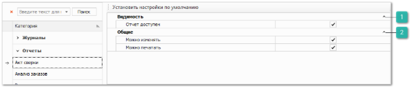
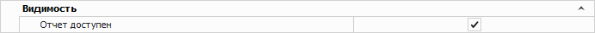
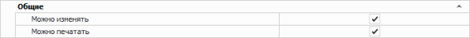

Группа разрешений для доступа к различным отчетам в программе. 

В данной категории следующие типы разрешений, одинаковые для большинства отчетов: 

 **Видимость**

Позволяет задать параметр:

- **Отчет доступен –** определяет доступность просмотра этого отчета для пользователя.

 **Общие**

Позволяет задать параметры:

- **Можно изменять** – доступность редактирования печатной формы отчета (кнопка **Изменить**);

- **Можно печатать** – доступность кнопки **Печать** для отчета.

