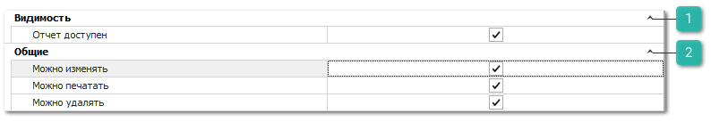

Группа разрешений для доступа к различным отчетам в программе. 

В данной категории следующие типы разрешений, одинаковые для большинства отчетов: 

 **Видимость**

Позволяет задать параметр:

- **Отчет доступен** – определяет доступность просмотра этого отчета для пользователя.

 **Общие**

Позволяет задать параметры:

- **Можно изменять** – определяет доступность команд: **Изменить**, **Копировать**, **Импорт** и **Переименовать** в окне **Мастера печати**;

- **Можно печатать** – определяет доступность команды **Печать** в окне **Мастера печати**;

- **Можно удалять** – определяет доступность команды **Удалить** в окне **Мастера печати**.

::: details Читайте также

- [Отчеты **Дашборд**](../../../../../work/otchety/dashbord/parametry_formirovaniya_vidzhetov.md)

:::