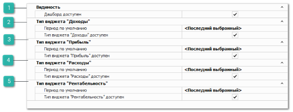
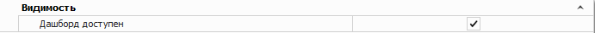
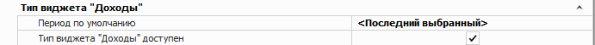
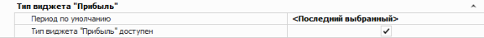
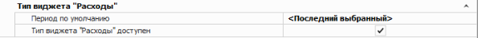
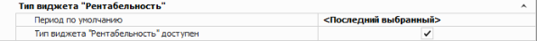

Группа разрешений для доступа отчетам **Дашборд**:

 **Видимость**

Позволяет задать параметр:

- **Дашборд доступен** – определяет доступность просмотра этого отчета для пользователя.

 **Тип виджета "Доходы"**

Позволяет задать параметры:

- **Период по умолчанию** – позволяет задать период, за который будет отображена информация в виджете;

- **Тип виджета "Доходы" доступен** – позволяет указать, будет ли отображаться виджет на вкладке **Дашборды**.

 **Тип виджета "Прибыль"**

Позволяет задать параметры:

- **Период по умолчанию** – позволяет задать период, за который будет отображена информация в виджете;

- **Тип виджета "Прибыль" доступен** – позволяет указать, будет ли отображаться виджет на вкладке **Дашборды**.

 **Тип виджета "Расходы"**

Позволяет задать параметры:

- **Период по умолчанию** – позволяет задать период, за который будет отображена информация в виджете;

- **Тип виджета "Расходы" доступен** – позволяет указать, будет ли отображаться виджет на вкладке **Дашборды**.

 **Тип виджета "Рентабельность"**

Позволяет задать параметры:

- **Период по умолчанию** – позволяет задать период, за который будет отображена информация в виджете;

- **Тип виджета "Рентабельность" доступен** – позволяет указать, будет ли отображаться виджет на вкладке **Дашборды**.

