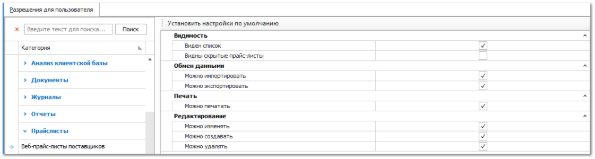

Группа разрешений для доступа к прайс-листам и записям в них, а также к инструментам для работы с прайс-листами. В данной категории содержатся разрешения для всех прайс-листов, которые имеют идентичные для всех данных типы разрешений: **Видимость**, **Обмен данными**, **Редактирование** описаны в разделе **Автосервис**, кроме настроек для прайс-листов из наличия на разных схемах ценообразования.

Отдельно рассмотрим разрешения для **Прайс-листов из наличия** на примере **Расширенной схемы ценообразования**.

::: details Читайте также

- [Автосервис](../avtoservis/README.md)

:::