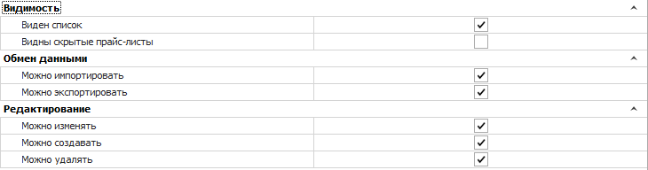

Группа настроек содержит блоки:

 **Видимость**

Позволяет задать параметры:

- **Виден список** – видимость перечня прайс-листов для пользователя;

- **Видны скрытые прайс-листы** – видимость в списке прайс-листов, а также данных из скрытых прайс-листов в результатах проценки.

 **Обмен данными**

Позволяет ограничить доступ пользователя на экспорт и импорт записей.

::: info Примечание

При отключении опции **Можно экспортировать** применяется запрет на массовое копирование записей (выделение множества записей в таблицах (CTRL+A) и их последующее копирование (CTRL+C)).

:::

 **Редактирование**

Позволяет задать параметры:

- **Можно изменять** – определяет возможность пользователю изменять существующие записи;

- **Можно создавать** – определяет возможность создавать новые веб-прайс-листы, а также подключать веб-поставщиков;

- **Можно удалять** – определяет доступ пользователя на удаление веб-прайс-листов.