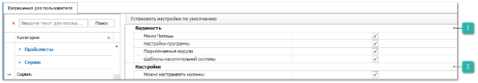

Содержит настройки ограничений на доступ к некоторым сервисным функциям программы.

 **Видимость**

Содержит параметры: 

- **Меню** **Помощь** – видимость пункта **Помощь** в **Главном меню** программы;

- **Настройки программы** – видимость пункта меню **Настройки пользователя** в пункте меню **Управление**;

- **Подключаемые модули** – доступ пользователя к различным модулям программы;

- **Шаблоны накопительной системы** – видимость пункта меню **Шаблоны накопительной системы**.

 **Настройки** 

Содержит пункт **Можно настраивать колонки** – регулирующий возможность пользователя настраивать колонки в рабочих окнах программы.

