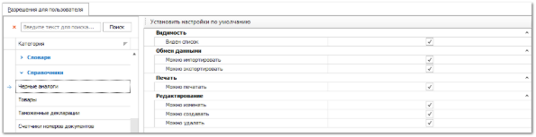

Группа разрешений для доступа к данным справочников в программе. Большинство справочников имеют идентичные типы разрешений (Видимость, Обмен данными, Редактирование), которые описаны в разделе **Автосервис**. Справочники **Контрагенты**, **Группы товаров**, **Товары**, **Счета и кассы**, **Справочник торгового оборудования**, **Сотрудники**, **Печатные шаблоны** и **Автомобили** имеют свои дополнительные разрешения.

::: details Читайте также

- [Автосервис](../avtoservis/README.md)

:::