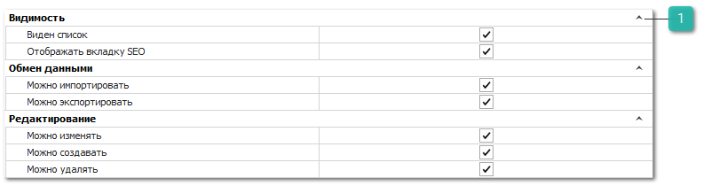

Группа разрешений для справочника **Группы товаров** определяет ряд ограничений на работу пользователя с данными справочника.

Категория настроек содержит разрешения, описанные в разделе **Автосервис**, а также дополнительное разрешение блока **Видимость**.

 **Видимость**

Дополнительный пункт блока позволяет задать опцию:

- **Отображать вкладку SEO** – отвечает за отображение вкладки SEO в карточке Групп товаров. Вкладка **SEO** содержит поля которые выгружаются вместе с каталогами товаров на сайт интернет-магазина, используемые для поисковой оптимизации. Вкладка **SEO** доступна только на версиях БД MS SQL.

::: details Читайте также

- [Автосервис](../avtoservis/README.md)

:::