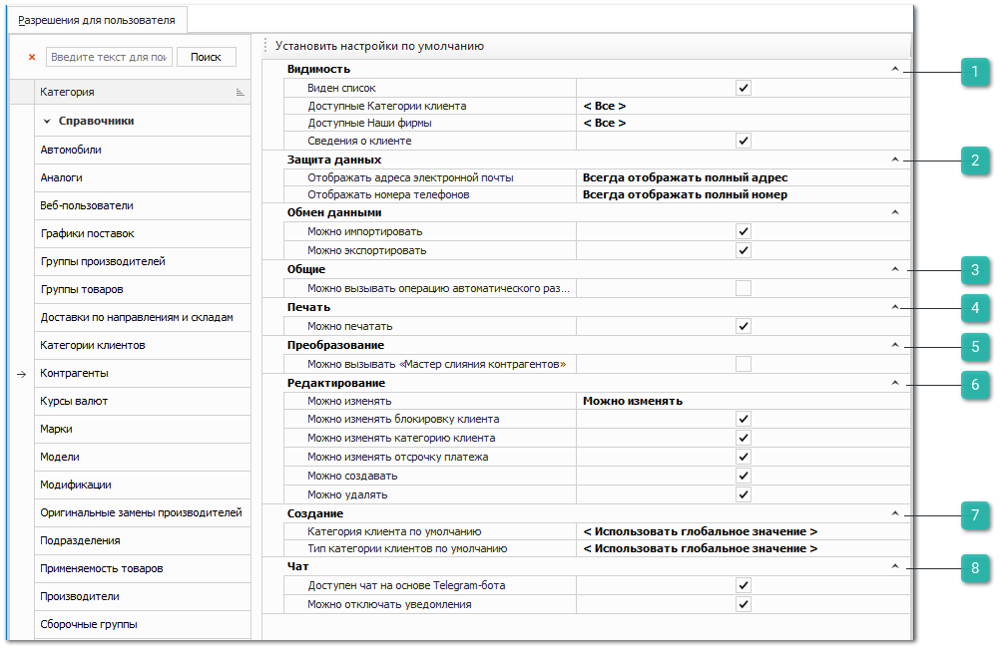

Группа разрешений для справочника **Контрагенты** определяет ряд ограничений на работу пользователя с данными справочника **Контрагенты**.

Категория настроек содержит разрешения, описанные в разделе **Автосервис**, а также дополнительные блоки.

 **Видимость**

Дополнительные пункты блока позволяют задать опции:

**Виден список** – видимость справочника **Контрагенты** для пользователя;

- **Доступные категории клиента** – определяет список категории, клиенты которых будут доступны пользователю для просмотра и работы (формирование документов и отчетов, просмотр цен в проценке);

::: note Заметка

Если клиент относится к недоступной для пользователя категории, но при этом данный пользователь является **Ответственным менеджером** данного клиента, то такой клиент будет доступен для пользователя в списке контрагентов для формирования документов, просмотра цен в проценке и т.п.

:::

- **Доступные Наши фирмы** – список организаций из справочника контрагентов, которые доступны пользователю для выбора в документах, фильтрах, отчетах и т.д. Если список пуст – доступны все;

::: note Заметка

Товар, оприходованный на недоступную **Нашу фирму**, может быть доступным пользователю для продажи при выключенной настройке **Контролировать движение по нашей фирме**.

:::

- **Сведения о клиенте –** доступность видимости сведений о контрагентах.

 **Защита данных**

Позволяет задать значения параметров:

- **Отображать номера телефонов** – определяет формат отображения номеров телефонов (поля **Мобильный телефон**, **Телефон** и **Рабочий телефон**) во всех разделах программы при просмотре, копировании, экспорте и редактировании номеров телефонов. Доступны значения:

    - **Всегда отображать полный номер** – значение по умолчанию, номер телефона будет отображаться полностью во всех разделах программы;

    - **Отображать полный номер только при редактировании** – номер телефона будет отображаться во всех разделах программы в формате \*\*\*\*ХХХХ, где ХХХХ последние 4 цифры номера. Однако при редактировании в карточке клиента (раздел **CRM ► Клиенты**) номер будет отображаться полностью;

    - **Всегда отображать только последние 4 цифры** – номер телефона будет отображаться во всех разделах программы в формате \*\*\*\*ХХХХ, , где ХХХХ последние 4 цифры номера. При этом пользователь при редактировании номера не будет видеть текущий, но сможет указать новый.

::: note Заметка

Если номер телефона содержит менее 4х символов, то будет отображаться только последний символ.

:::

- **Отображать адреса электронной почты** – определяет формат отображения электронных почт во всех разделах программы при просмотре, копировании, экспорте и редактировании номеров телефонов. Доступны значения:

    - **Всегда отображать полный адрес** – email будет отображаться полностью во всех разделах программы;

    - **Отображать полный адрес только при редактировании** – email будет отображаться во всех разделах программы в формате ХХХ\*\*\*@домен, где ХХХ первые 3 символа адреса. Однако при редактировании в карточке клиента (раздел **CRM ► Клиенты**) email будет отображаться полностью;

    - **Всегда отображать только первые 3 символа** – email будет отображаться во всех разделах программы в формате ХХХ\*\*\*@домен, где ХХХ первые 3 символа адреса. При этом пользователь при редактировании email не будет видеть текущий, но сможет указать новый.

::: note Заметка

Если email содержит менее 4х символов, то будет отображаться только первый символ.

:::
::: warning Внимание!

Для применения изменений в настройках блока **Защита данных** необходима перезагрузка программы **Parts.Intellect**.

:::

 **Общие**

Содержит пункт **Можно вызывать операцию автоматического разнесений платежей**, который управляет доступом к действию **Разнесение платежей** на панели инструментов в справочнике **Контрагентов**.

 **Печать**

Блок содержит разрешения:

- **Можно печатать** – позволяет определить доступность печати данных из справочника, при наличии кнопки Печать в панели управления и доступных печатных форм.

 **Преобразование**

Позволяет задать значения параметров:

- **Можно вызывать** "**Мастер слияния контрагентов**" **–** определяет доступность команды **Мастер слияния контрагентов** на панели инструментов в справочнике **Контрагентов**;

- **Можно вызывать команду** "**Сформировать учетную запись для ВВ**" – определяет доступность кнопки **Сформировать учетную запись для ВВ** на панели инструментов в справочнике **Контрагентов**.

 **Редактирование**

Дополнительные пункты блока позволяют задать опции:

- **Можно изменять категорию клиента** – определяет доступность изменять значения на вкладке **Категория клиента** в карточке контрагента;

- **Можно изменять блокировку клиента** – определяет доступность команды **Блокировка** клиента;

- **Можно изменять отсрочку платежа** – возможность изменять значение поля **Отсрочка платежа** в карточке контрагента.

 **Создание**

Позволяет задать значения параметров:

- **Категория клиента по умолчанию** (из списка настройки **Доступные категории клиента**) – выбранное значение по умолчанию будет подставляться в поле **Категория клиента** при создании контрагента;

- **Тип категории клиентов по умолчанию** (из списка настройки **Доступные категории клиента**) – выбранное значение по умолчанию будет подставляться в поле **Тип** к**атегории** при создании контрагента.

::: note Заметка

Если для пользователя не выбраны **Категория клиента по умолчанию** и **Тип категории клиентов по умолчанию**, то будут срабатывать значения одноименных опций из раздела **Управление ►** **Настройки программы ► Настройки** блок **CRM** **►** **Накопительная система скидок**.

:::

 **Чат**

- **Доступен чат на основе Telegram-бота** – задает доступность к чату с клиентами на основе Telegram-бота

- **Можно отключать уведомления** – задает возможность отключать уведомления о новых сообщениях в чате с клиентами.

::: info Примечание

Для работы сервиса отправки уведомлений и сообщений через Telegram-бота необходимо:

- подключение дополнительной услуги. За подключением услуги обратитесь в отдел продаж Компании Tradesoft;

- созданный и настроенный Telegram-бот;

- установленный и подключенный сервер приложения. Подробнее в разделе [Подключение к серверу](../../../../../work/server/podklyuchenie_k_serveru.md).

Подробнее о работе модуля читайте в [руководстве пользователя](https://product-doc.tradesoft.ru/ai/telegram/index.htm).

:::