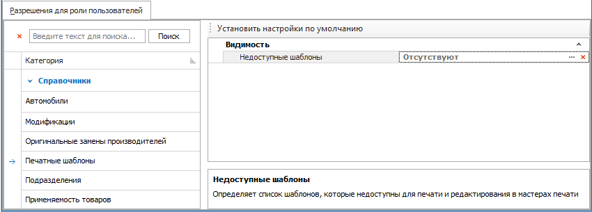
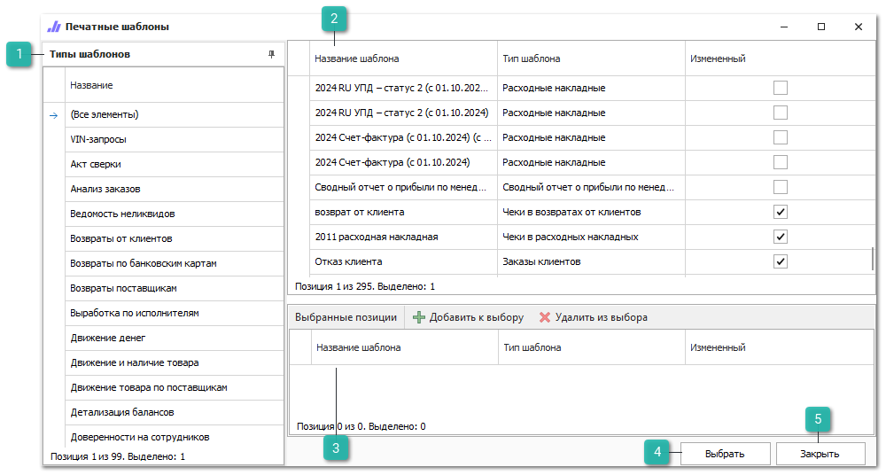
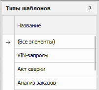
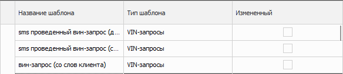
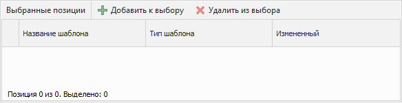
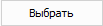
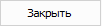

Группа разрешений для справочника **Печатные шаблоны** содержит разрешение **Недоступные шаблоны**, которое определяет ограничение доступа пользователей к печатным шаблонам в **Мастере печати**.

При нажатии в разрешении на  в поле **Недоступные шаблоны** отображается окно **Печатные шаблоны**:

::: info Примечание

Справочник **Печатные шаблоны** не имеет собственного раздела меню, но доступен при выборе печатных шаблонов в настройках событий отправки уведомлений контрагентов, общих настройках событий отправки уведомлений и настройках печати чеков. Также печатные шаблоны отображаются в **Мастере печати** в разделах, где предусмотрена печать документа (команда **Печать** на панели действий).

:::

 **Типы шаблонов**

Блок содержит все типы шаблонов имеющиеся в базе данных и позволяет отобразить все шаблоны в табличной части **Печатные шаблоны**, с фильтрацией по конкретному типу. Тип **(Все элементы)** позволяет отобразить полный перечень шаблонов без фильтрации по типу.

Табличная часть содержит колонку **Название**, которая отображает наименование типа.

 **Печатные шаблоны**

Отображает печатные шаблоны базы данных в зависимости от выбранного типа шаблона.

Табличная часть содержит колонки:

- **Название шаблона** – отображает наименование шаблона в базе данных;

- **Тип шаблона** – обозначает раздел, в котором применяется шаблон;

- **Измененный** – указывает признак, что шаблон не является стандартным. Например: скопированный или импортированный шаблон.

::: info Примечание

Стандартными являются те шаблоны, которые были установлены вместе с дистрибутивом программы.

:::

 **Выбранные позиции**

Содержит список выбранных печатных шаблонов, которые недоступны для пользователя.

Панель действий табличной части содержит:

- **Добавить к выбору** – позволяет добавить выбранные шаблоны в табличную часть;

- **Удалить из выбора** – удаляет из табличной части выбранные шаблоны;

Табличная часть содержит колонки:

- **Название шаблона** – отображает наименование шаблона в базе данных;

- **Тип шаблона** – обозначает раздел, в котором применяется шаблон;

- **Измененный** – указывает признак, что шаблон не является стандартным. Например: был скопирован или импортирован.

::: info Примечание

Стандартными являются те шаблоны, которые были установлены вместе с дистрибутивом программы.

:::

 **Выбрать**

Позволяет применить ограничения на доступность выбранных шаблонов для пользователя. Все шаблоны, находящиеся в блоке **Выбранные позиции**, будут недоступны для пользователя.

 **Закрыть**

Закрывает окно выбора недоступных шаблонов без сохранения.