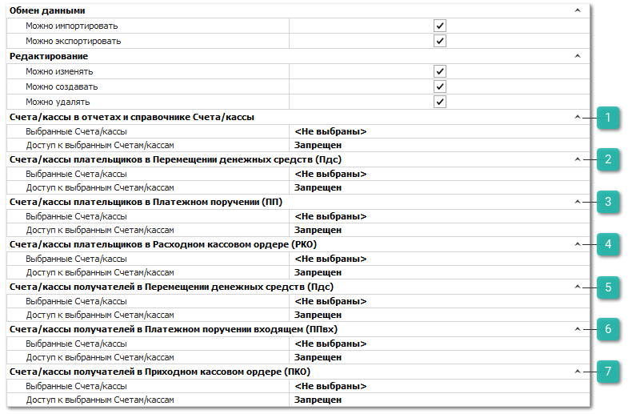

Группа разрешений для справочника **Счета и Кассы** определяет ряд ограничений на использование пользователем счетов и касс в финансовых документах.

Категория настроек содержит разрешения, описанные в разделе **Автосервис**, а также дополнительные блоки.

::: info Примечание

Ограничение и настройка некоторых параметров недоступны для пользователя с ролью **Администратор**.

:::

 **Счета/кассы в отчетах и справочнике Счета/кассы**

Настройки блока определяют список **Разрешенных** или **Запрещенных** счетов, доступных пользователю для выбора в отчетах и просмотра в справочнике. Блок содержит следующие опции:

- **Выбранные Счета/кассы** – указывается список счетов, которые требуется запретить или разрешить. Если стоит значение <Не выбраны> – правила запрета/разрешения применяется ко всем счетам;

- **Доступ к выбранным Счетам/кассам** – указывается стратегия работы с выбранными счетами: выбранные счета запрещены или разрешены:

    - при значении **Запрещен** – пользователю не доступен список выбранных счетов. Если список счетов не выбран – пользователю доступны все счета;

    - при значении **Разрешен** – пользователю доступен список выбранных счетов. Если список счетов не выбран – все счета пользователю не доступны.

::: note Заметка

Список опций и принцип их работы аналогичен для всех нижеприведенных блоков.

:::

 **Счета/кассы плательщиков в Перемещении денежных средств (Пдс)**

Настройки блока определяют список **Разрешенных** или **Запрещенных** счетов, доступных пользователю для выбора в документах **Перемещение денежных средств**.

 **Счета/кассы плательщиков в Платежном поручении (ПП)**

Настройки блока определяют список **Разрешенных** или **Запрещенных** счетов, доступных пользователю для выбора в документах **Платежные поручение**.

 **Счета/кассы плательщиков в Расходном кассовом ордере (РКО)** 

Настройки блока определяют список **Разрешенных** или **Запрещенных** счетов, доступных пользователю для выбора в документах **Расходные кассовые ордера**.

 **Счета/кассы получателей в Перемещении денежных средств (Пдс)**

Настройки блока определяют список **Разрешенных** или **Запрещенных** счетов, доступных пользователю для выбора в документах **Перемещение денежных средств**.

 **Счета/кассы получателей в Приходном поручении входящем (ППвх)** 

Настройки блока определяют список **Разрешенных** или **Запрещенных** счетов доступных пользователю для выбора в входящих **Платежных поручений** от клиентов.

 **Счета/кассы получателей в Приходном кассовом ордере (ПКО)** 

Настройки блока определяют список **Разрешенных** или **Запрещенных** счетов, доступных пользователю для выбора в документах **Приходные кассовые ордера**.