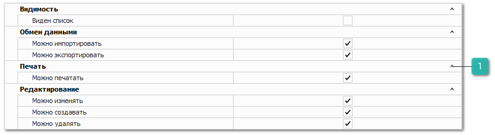

Группа разрешений **Сотрудники** определяет разрешения на редактирование справочника **Сотрудники** (раздел **Управление ► Справочник ► Сотрудники**)

Группа разрешений содержит основные разрешения, которые описаны в разделе [**Автосервис**](../avtoservis/README.md), а также дополнительные опции:

 **Печать**

Блок содержит разрешение **Можно печатать**, которое позволяет определить доступность печати данных из справочника, при наличии кнопки **Печать** в панели управления и доступных печатных форм.