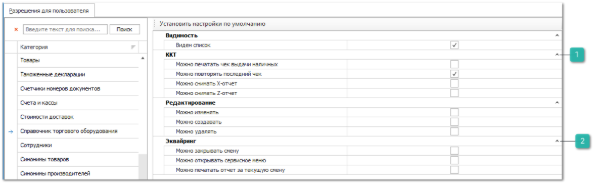

Группа разрешений для справочника **Торговое оборудование** определяет ряд ограничений на работу пользователя с данными справочника.

Категория настроек содержит разрешения, описанные в разделе **Автосервис**, а также дополнительные блоки.

::: info Примечание

Ограничение и настройка некоторых параметров недоступны для пользователя с ролью admin.

:::

 **ККТ**

Позволяет задать значения параметров:

- **Можно печатать чек выдачи наличных** – определяет возможность выполнения пользователем команды **Чек выдачи наличных** в разделе **Расходные кассовые ордера**;

- **Можно повторять последний чек** – определяет возможность выполнения команды **Сервис** – **Повторить последний чек** пользователем;

- **Можно снимать Х-отчет** – определяет возможность выполнения команды **Сервис** – **Снять отчет без гашения (Х-отчет)** пользователем;

- **Можно снимать Z-отчет** – определяет возможность выполнения команды **Сервис** – **Снять отчет с гашением (Z-отчет)** пользователем.

 **Эквайринг**

Позволяет задать значения параметров:

- **Можно закрывать смену** – определяет возможность выполнения команды **Сервис** – **Закрыть смену** пользователем;

- **Можно открывать сервисное меню** – определяет возможность выполнения команды **Сервис** – **Открыть сервисное меню на устройстве** пользователем;

- **Можно печатать отчет за текущую смену** – определяет возможность выполнения команды **Сервис** – **Печать отчет за текущую смену** пользователем.

