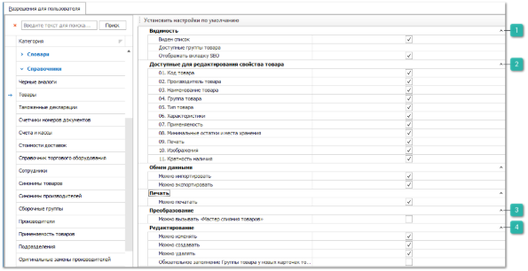

Группа разрешений для справочника **Товары** определяет ряд ограничений на работу пользователя с данными справочника.

Категория настроек содержит разрешения, описанные в разделе **Автосервис**, а также дополнительные блоки.

::: info Примечание

Ограничение и настройка некоторых параметров недоступны для пользователя с ролью admin.

:::

 **Видимость**

Дополнительные пункты блока позволяют задать опции:

- **Доступные группы товара** – определяет список доступных групп, товары из которых будут разрешены пользователю для просмотра и работы;

- **Отображать вкладку SEO** – отвечает за отображение вкладки **SEO** в карточке **Товара**. Вкладка **SEO** содержит поля, которые выгружаются вместе с каталогом товаров на сайт интернет-магазина, используемые для поисковой оптимизации. Вкладка SEO доступна только на версиях БД MS SQL.

 **Доступные для редактирования свойства товара**

Блок определяет возможность пользователя изменять некоторые свойства товара в карточке, такие как: **Код товара, Производитель товар, Наименование товара, Группа товара, Тип товара, Характеристики, Применяемость, Минимальные остатки и места хранения, Печать**, **Изображения и Кратность наличия**.

::: info Примечание

Разрешение **Минимальные остатки и места хранения** определяет доступность кнопки **Мастер заказов** во всех разделах программы.

В **ABC-анализе продаж По товарам** для возможности заполнения колонки **МЗ-ТЗ** необходимо предварительно в блоке **Фильтр** установить значение параметра **Склад**, для которого будет заполняться МЗ-ТЗ.

:::

 **Преобразование**

Содержит настройку **Можно вызывать** "**Мастер слияния товаров**" – которая определяет доступность команды **Мастер слияния товаров** на панели инструментов в справочнике **Товары**.

 **Редактирование**

Дополнительный пункт блока позволяет задать опцию **Обязательное заполнение Группы товара у новых карточек товаров** – которая определяет обязательность заполнения группы в карточке товара.

