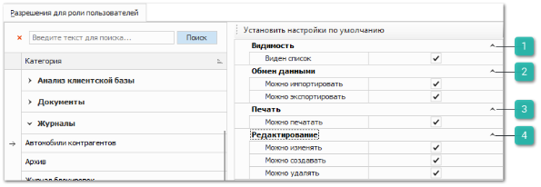
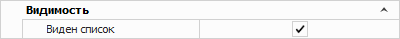
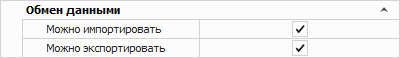
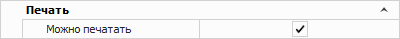
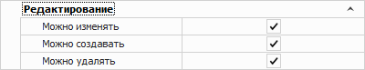

Разрешения для типов журналов **Автомобили контрагентов** (регулирует доступ к таблице **Владельцы автомобиля** в разделе **CRM** **►** **Автомобили**), **Минимальные запасы товаров** (регулирует доступ к соответствующему журналу в разделе **Управление ► Журналы**), **Задачи** и **Корзина** (регулируют доступ к **Корзине** в нижнем меню программы), содержат идентичные блоки настроек.

 **Видимость**

Позволяет задать следующую опцию:

- **Виден список** – определяет доступность просмотра этого журнала для пользователя.

 **Обмен данными**

Определяет доступность пользователю экспорта и импорта журнала. 

Доступные значения: 

- **Можно импортировать**;

- **Можно экспортировать**.

::: info Примечание

При отключении опции **Можно экспортировать** применяется запрет на массовое копирование записей (выделение множества записей в таблицах (CTRL+A) и их последующее копирование (CTRL+C)).

:::

 **Печать**

Позволяет задать следующую опцию:

- **Можно печатать –** определяет доступность вывода на печать журнала при наличии кнопки **Печать** в панели управления и доступных печатных форм.

 **Редактирование**

Содержит следующие разрешения:

- **Можно изменять** – определяет возможность пользователю изменять существующие записи;

- **Можно создавать** – определяет возможность добавлять новые документы записи;

- **Можно удалять –** определяет доступ пользователя на удаления записей.

Разрешения для типов журналов **Архив** **документов**, **Блокировки**, **Внутренние резервы**, **Действия**, **Звонки**, **Отметки**,  **Сессии пользователей**, **Журнал слип-чеков**, **Журнал уведомлений**, **Журнал учета чека**, **Журнал маркировок** содержат блок **Видимость**.

