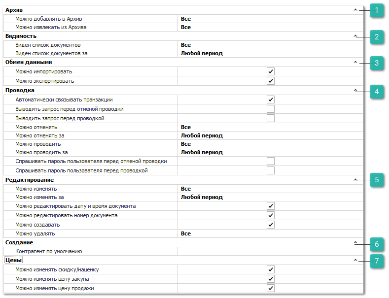

Разрешения для типов документов **Журнал товарных транзакций**, **Журнал финансовых транзакций** и **Общий журнал** (регулируют доступы к соответствующим журналам в разделе **Управление ► Журналы**)  содержат идентичные блоки настроек:

 **Архив**

Позволяет определить возможность для пользователя архивировать виды документов и извлекать из архива. 

Доступные разрешения: 

- **Можно добавлять в Архив** - ограничение доступа на перемещение в архив списка документов. Доступные значения:

    - **Все** – пользователю доступно добавление в архив всех документов;

    - **Только** **свои** – пользователю доступно добавление в архив документов, в которых он является автором, и документов, где указан клиент, для которого пользователь является ответственным менеджером.

    - **Только** **авторов своих подразделений** – пользователю доступно добавление в архив всех документов, где он является автором, и документов, где авторами являются сотрудники его подразделений.

    - **Только авторов и ответственных менеджеров своих подразделений** – пользователю доступно добавление в архив всех документы, где автором, или ответственным менеджером по клиенту, является он или сотрудники его подразделений.

    - **Запрещено** – добавление в архив всех документов запрещено.

- **Можно извлекать из Архива** - ограничение доступа на извлечение из архива списка документов. Доступные значения:

    - **Все** – пользователю доступно извлечение из архива всех документов;

    - **Только** **свои** – пользователю доступно извлечение из архива документов, в которых он является автором, и документов, где указан клиент, для которого пользователь является ответственным менеджером.

    - **Только** **авторов своих подразделений** – пользователю доступно извлечение из архива всех документов, где он является автором, и документов, где авторами являются сотрудники его подразделений.

    - **Только авторов и ответственных менеджеров своих подразделений** – пользователю доступно извлечение из архива всех документы, где автором, или ответственным менеджером по клиенту, является он или сотрудники его подразделений.

    - **Запрещено** – извлечение из архива всех документов запрещено.

 **Видимость**

Позволяет определить доступ пользователя на просмотр списка документов данного типа. 

Доступные разрешения:

- **Виден список документов** – ограничение доступа на просмотр списка документов. Доступные значения:

    - **Все** – пользователю доступны все документы;

    - **Только** **свои** – пользователю доступны документы, в которых он является автором, и документы, где указан клиент, для которого пользователь является ответственным менеджером.

    - **Только** **авторов своих подразделений** – пользователю доступны все документы, где он является автором, и документы, где авторами являются сотрудники его подразделений.

    - **Только авторов и ответственных менеджеров своих подразделений** – пользователю доступны все документы, где автором, или ответственным менеджером по клиенту, является он или сотрудники его подразделений.

    - **Запрещено** – видимость всех документов запрещена.

    ::: note Заметка

    Основное и дополнительные подразделения задаются в карточке сотрудника в меню **Управление ► Справочники ► Сотрудники**.

    :::

- **Виден список документов за** – пользователю можно установить ограничение для доступа к документам только за определенный период.

 **Обмен данными**

Позволяет определить доступность пользователю экспорта и импорта данных из справочника. 

Доступные разрешения: 

- **Можно импортировать**,** 

- **Можно экспортировать**.

::: info Примечание

При отключении опции **Можно экспортировать** применяется запрет на массовое копирование записей (выделение множества записей в таблицах "CTRL+A" и их последующее копирование (CTRL+C)).

:::

 **Проводка**

Позволяет установить разрешения на выполнение действий **Провести** и **Отменить проводку** над документом. 

Доступные разрешения:

- **Автоматически связывать транзакции** – пытается определить цепочку всех подчиненных и последующих документов, связанных с текущим (если документ создавался не на основании);

- **Выводить запрос перед отменой проводки** – при отмене проводки документа отобразится окно с запросом на подтверждение отмены проводки;

- **Выводить запрос перед проведением** – при проводке документа отобразится окно с запросом на подтверждение проведения;

- **Можно отменять** – доступность на отмену проводки документов данного вида, в зависимости от автора.** Доступные значения:** 

    - **Все**  – пользователю доступна отмена проводки на все документы;

    - **Только свои**  – пользователю доступна отмена проводки на документы, в которых он является автором, и документы, где указан клиент, для которого пользователь является ответственным менеджером.

    - **Только авторов своих подразделений**  – пользователю доступна отмена проводки на все документы, где он является автором, и документы, где авторами являются сотрудники его подразделений.

    - **Только авторов и ответственных менеджеров своих подразделений**  – пользователю доступна отмена проводки на все документы, где автором, или ответственным менеджером по клиенту, является он или сотрудники его подразделений.

    - **Запрещено** - отмена проводки для всех документов запрещена.

- **Можно отменять за** – определяет временной период, за который можно отменять проводку документов;

- **Можно проводить** – доступность на проведение документов данного вида, в зависимости от автора.** Доступные значения:** 

    - **Все** – пользователю доступна проводка на все документы;

    - **Только свои** – пользователю доступна проводка на документы, в которых он является автором, и документы, где указан клиент, для которого пользователь является ответственным менеджером.

    - **Только авторов своих подразделений** – пользователю доступна проводка на все документы, где он является автором, и документы, где авторами являются сотрудники его подразделений.

    - **Только авторов и ответственных менеджеров своих подразделений** – пользователю доступна проводка на все документы, где автором, или ответственным менеджером по клиенту, является он или сотрудники его подразделений.

    - **Запрещено** – проводка для всех документов запрещена.

- **Можно проводить за** – определяет временной период, за который можно проводить документы;

- **Спрашивать пароль пользователя перед отменой проводки** – при выполнении отмены проводки документа пользователю потребуется ввести свой пароль от базы данных;

- **Спрашивать пароль пользователя перед проведением** – при выполнении проведения документа пользователю потребуется ввести свой пароль от базы данных.

 **Редактирование**

Позволяет установить следующие разрешения:

- **Можно изменять** – определяет возможность пользователю изменять существующие документы;

- **Можно изменять за** – определяет возможность пользователю изменять существующие документы за определенный период;

- **Можно редактировать дату и время документа** – определяет возможность изменять дату и время создания в параметрах документа;

- **Можно редактировать номер документа** – определяет возможность изменять номер в параметрах документа;

- **Можно создавать** – определяет возможность добавлять новые документы данного вида;

- **Можно удалять** – определяет доступ пользователя на удаления документов.

 **Создание**

Позволяет задать значение **Контрагент по умолчанию**, который будет подставляться автоматически при создании нового документа.

 **Цены**

Позволяют определить доступ пользователя на изменение разного типа цен:

- **Можно изменять скидку/наценку** – возможность указывать и изменять значение поля **Скидка, %** в параметрах документа;

- **Можно изменять цену закупа** – изменение закупочной цены на товар в документе;

- **Можно изменять цену продажи** – изменение цены продажи на товар в документе.

::: note Заметка

Разрешения на действия в журналах не гарантируют фактического наличия таких действий в самом журнале.

:::