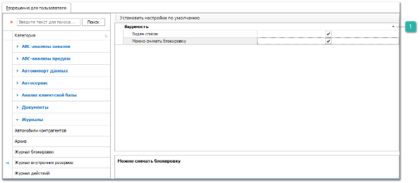

Разрешения для типа журнала **Журнал внутренних резервов** (регулирует доступ к таблице **Журнал внутренних резервов** в разделе **Управление** **►** **Журналы ► Внутренние резервы**) содержит блок настроек:

 **Видимость**

Позволяет определить доступ пользователя на просмотр списка записей данного типа. 

Доступные разрешения:

- **Виден список** – позволяет настроить видимость списка внутренних резервов. Если поле для установки отметки не будет заполнено, то в разделе **Управление ►** **Журналы** журнал **Внутренние резервы** не будет отображен для пользователя;

- **Можно снимать блокировку** – позволяет установить доступ к команде **Удалить** в выпадающем списке команды **Действие**.

