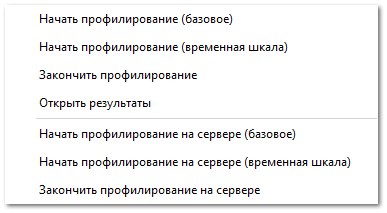

Раздел предназначен для профилирования программы. При профилировании осуществляется сбор характеристик работы программы и сервера, а также выполнения отдельных действий в программе и на сервере. Результатом сбора данных является лог-файл, а также DLL-файл, который открывается с помощью специализированной программы.

::: note Заметка

Если в момент работы **Профилирования быстродействия** запустить **Профилирование оперативной памяти**, то появляется диалоговое окно, которое позволяет завершить ранее запущенное профилирование и запустить запрошенное.

:::

::: warning Внимание!

Запуск сбора данных осуществляется только по запросу специалистов техподдержки Tradesoft.

:::

Доступные действия:

- **Начать профилирование (базовое)** – включение профилирования, которое позволяет определить количество пауз, произошедших во время выполнения какого-либо действия и количество попыток запуска этого действия. Позволяет определить производительность программы;

- **Начать профилирование (временная шкала)** – включение профилирования, которое позволяет определить какие вызовы были сделаны программой в ходе выполнения какого-либо действия, а также как эти вызовы были распределены во времени. Это позволяет определить причины зависания пользовательского интерфейса, обнаружить нерегулярное распределение работы, конфликты блокировок и т.д.;

- **Закончить профилирование** – позволяет завершить выполнение профилирования;

- **Открыть результаты** – открытие папки с результатами профилирования (логи записываются по пути: C:\ProgramData\Tradesoft\Parts.Intellect\Profile\ProfileTrace);

- **Начать профилирование на сервере (базовое)** – включение профилирования, которое позволяет определить количество пауз, произошедших во время выполнения какого-либо действия и количество попыток запуска этого действия. Позволяет определить производительность сервера;

- **Начать профилирование на сервере (временная шкала)** – включение профилирования, которое позволяет определить какие вызовы были сделаны сервером в ходе выполнения какого-либо действия, а также как эти вызовы были распределены во времени. Это позволяет определить причины зависания, обнаружить нерегулярное распределение работы, конфликты блокировок и т.д. Запуск профилирования с временной шкалы возможен только в случае запуска службы сервера с правами администратора Windows;

- **Закончить профилирование** **на сервере** – позволяет завершить выполнение профилирования.

::: note Заметка

После завершения выполнения профилирования результаты профилирования быстродействия сохраняются по путям: **C:\ProgramData\Tradesoft\Parts.Intellect\Profile\ProfileTrace** для программы и **C:\ProgramData\Tradesoft\Server\Profile\ProfileTrace** для сервера.

Также доступен запуск профилирования работы bat-файлов с помощью ключа **/profile** в теле файла. Параметр timeline позволяет запустить профилирование (временная шкала). Результаты профилирования записываются по пути: C:\ProgramData\Tradesoft\Parts.Intellect\Profile\ProfileTrace.

:::

::: warning Внимание!

После запуска профилирование не останавливается самостоятельно до закрытия программы, поэтому после выполнения записи необходимых данных его необходимо завершить, выполнив команду **Закончить профилирование**.

:::