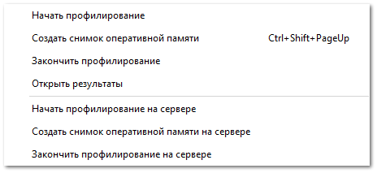

Раздел предназначен для профилирования сервера программы. При профилировании осуществляется сбор характеристик работы оперативной памяти, а также выполнения отдельных действий в оперативной памяти. Результатом сбора данных является лог-файл, а также DLL-файл, который открывается с помощью специализированной программы.

::: warning Внимание!

Запуск сбора данных осуществляется только по запросу специалистов техподдержки Tradesoft.

:::

::: note Заметка

Если в момент работы **Профилирования оперативной памяти** запустить **Профилирование быстродействия**, то появляется диалоговое окно, которое позволяет завершить ранее запущенное профилирование и запустить запрошенное.

:::

Доступные действия:

- **Начать профилирование** – включение профилирования, которое позволяет определить потребление оперативной памяти в ходе работы программы;

- **Создать снимок оперативной памяти** – создание снимка оперативной памяти, который отображает, что загружено в оперативную память, и позволяет анализировать, на что уходит оперативная память;

- **Закончить профилирование** – завершение процесса профилирования;

- **Открыть результаты** – позволяет открыть папку с результатами профилирования;

- **Начать профилирование на сервере** – включение профилирования на компьютере с установленным сервером приложения, которое позволяет определить потребление оперативной памяти в ходе работы сервера приложения;

- **Создать снимок оперативной памяти на сервере** – создание снимка оперативной памяти, который отображает что загружено в оперативную память сервера, и позволяет анализировать, на что уходит оперативная память сервера;

- **Закончить профилирование на сервере** – завершение процесса профилирования.

::: note Заметка

После завершения выполнения профилирования результаты профилирования оперативной памяти сохраняются по путям: **C:\ProgramData\Tradesoft\Parts.Intellect\Profile\ProfileMemory** для программы и **C:\ProgramData\Tradesoft\Server\Profile\ProfileMemory** для сервера.

:::

::: warning Внимание!

После запуска профилирование не останавливается самостоятельно до закрытия программы, поэтому после выполнения записи необходимых данных его необходимо завершить, выполнив команду **Закончить профилирование**.

:::

