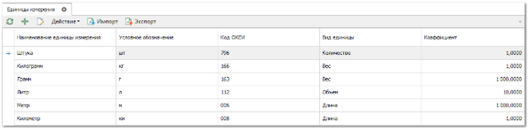

Словарь **Единицы измерения** содержит список единиц измерения, используемых в программе.

Табличная часть содержит колонки:

- **Наименование** **единицы измерения** – полное название единицы измерения;

- **Условное обозначение** – сокращенное обозначение (например, шт., литр и т.д.);

- **Вид единицы** – вид измерения (например, вес, объем и т.д.);

- **Коэффициент** – для каждой единицы измерения задается коэффициент, используемый для перевода одной единицы измерения в другую в рамках одного **Вида единицы** измерения.

Например: 

::: note Пример

Задав для единицы измерения "***кг***" коэффициент 1, для "**ПУД**" необходимо задать коэффициент 1/16= 0,0625.|

:::

- **Код ОКЕИ** – код из "Общероссийского классификатора единиц измерения".