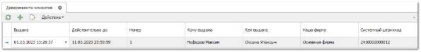

Доверенность на клиента выдается сотруднику фирмы-клиента для получения у Вашей фирмы товарно-материальных ценностей. Для учета данных доверенностей существует возможность сохранить их в программе.

Для документов **Расходная накладная** и **Отгрузка на реализацию** в настройках **Наших фирм** может быть установлено требование обязательного заполнения доверенности. В этом случае в шапке **Расходной накладной** и **Отгрузки на реализацию в** поле **Доверенность** становится обязательным для заполнения.