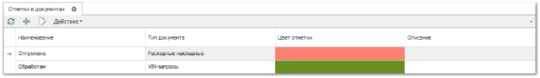

Справочник **Отметки в документах** содержит список статусов, которые можно присваивать документам, исходя из индивидуальных требований к жизненным циклам документов организации.

- **Табличная часть** содержит следующие колонки:

- **Наименование** – название отметки;

- **Тип документа** – тип документа, к которому может быть применяться отметка;

- **Цвет отметки** – используется при отображении отметки в списке документов (не влияет на окрашивание всей строки с документом);

- **Описание** – поле может содержать правила применения отметки или любую другую информацию, которая будет полезна для пользователя при выборе отметки.

::: info Примечание

Для одного типа документа не может быть двух отметок с одинаковым наименованием.

:::

