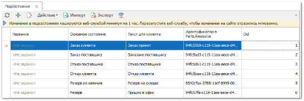

Справочник **Подсостояния** содержит статусы, которые можно присваивать позициям в документах, дополнительно к основным состояниям.

- **Табличная часть** содержит следующие колонки:

- **Название** – наименование подсостояния, которое будет отображаться в колонке **Состояние** по позиции документа;

- **Основное состояние** – состояние для позиций документов из списка системных;

- **Текст для клиента** – альтернативное наименование подсостояния. Может использоваться на сайте интернет-магазина и в печатных формах;

- **Oid** – уникальный номер позиции документа в базе данных. Присваивается после проведения документа;

- **Идентификатор в Parts.Resource** – уникальный номер подсостояния в Parts.Resource. Присваивается после проведения синхронизации.

Подсостояния позволяют присвоить позициям документов дополняющие сведения к основному состоянию. Например, можно для состояния "Заказ Поставщику" завести подсостояния "Заказ отправлен поставщику", "Получено подтверждение на заказ", "В пути", "На таможне" и т.д.

Устанавливать и управлять подсостояниями можно в списке позиций по документу, в **Контроле заказов поставщиков** и журнале **Смены подсостояний**.

