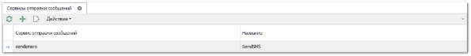
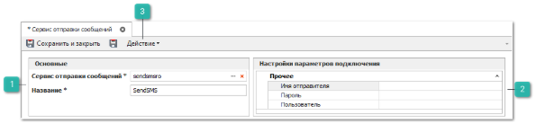
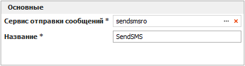
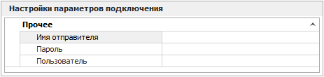
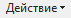

Для отправки SMS-сообщений с помощью сторонних сервисов используется подключение к их сервисам отправки SMS непосредственно из программы. Для подключения необходимо самостоятельно получить данные для доступа у представителей SMS-поставщика и указать их в данном справочнике.

Добавление сервиса отправки SMS-сообщений осуществляется нажатием стандартной команды **Править**, на панели действий, после чего откроется форма добавления сервиса отправки сообщений.

Форма добавления сервиса отправки сообщений состоит из:

 **Основные**

Позволяет выбрать необходимый сервис отправки из открывающегося справочника и задать ему название.

 **Настройки параметров подключения**

Позволяет задать для выбранного сервиса индивидуальные настройки подключения, перечень настрое формируется автоматически исходя из параметров, заданных в сервисе SMS-поставщика.

Панель действий содержит стандартные команды и некоторые уникальные.

 **Действие**

При вызове команды **Действие** доступны новые пункты:

- **Открыть описание сервиса** – позволяет открыть диалоговое окно с описанием преимуществ подключаемого сервиса;

- **Открыть условия сервиса** – позволяет открыть диалоговое окно с перечнем условий, необходимых для подключения выбранного **Сервиса отправки сообщений**;

- **Отправить тестовое сообщение** – позволяет осуществить отправку тестового сообщения с помощью выбранного сервиса.

::: info Примечание

Сервисы отправки сообщений доступны только при подключении соответствующей услуги.

:::

